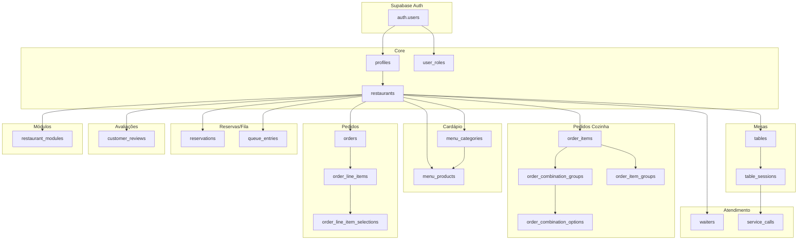
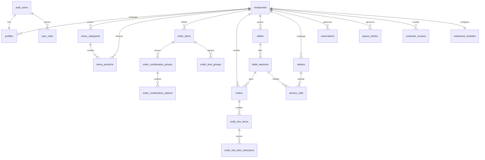

# 📊 Documentação Completa do Banco de Dados

**Projeto**: Plataforma Ativa  
**Plataforma**: Supabase (PostgreSQL)  
**Última atualização**: 2026-01-03

---

## 1. Visão Geral do Banco

### Objetivo
O banco de dados da Plataforma Ativa é responsável por armazenar e gerenciar todos os dados de um sistema SaaS multi-tenant para gestão de restaurantes. Ele suporta:

- **Gestão de cardápio** (categorias, produtos, personalizações)
- **Pedidos de cozinha** com combinações customizáveis
- **Controle de mesas e sessões**
- **Reservas e fila de espera**
- **Chamadas de garçom**
- **Avaliações de clientes**
- **Configurações modulares por restaurante**

### Características Principais

| Característica | Descrição |
|----------------|-----------|
| **SGBD** | PostgreSQL 15+ (via Supabase) |
| **Arquitetura** | Multi-tenant com isolamento por `restaurant_id` |
| **Segurança** | Row Level Security (RLS) em todas as tabelas |
| **Autenticação** | Supabase Auth (integrado com `auth.users`) |
| **Armazenamento** | Supabase Storage para imagens |

### Diagrama de Arquitetura



---

## 2. Diagrama de Relacionamentos (ER)



---

## 3. Tabelas e Estrutura Detalhada

### 3.1 Core - Tabelas Principais

---

#### 3.1.1 `restaurants`

**Finalidade**: Armazena as configurações principais de cada restaurante no sistema multi-tenant.

| Campo | Tipo | Descrição | Obrigatório | Valor Padrão |
|-------|------|-----------|-------------|--------------|
| `id` | `uuid` | Identificador único do restaurante | ✅ | `gen_random_uuid()` |
| `name` | `text` | Nome do restaurante | ✅ | - |
| `slug` | `text` | Slug único para URL | ✅ | - |
| `logo_url` | `text` | URL do logotipo | ❌ | `NULL` |
| `banner_url` | `text` | URL do banner | ❌ | `NULL` |
| `description` | `text` | Descrição do restaurante | ❌ | `NULL` |
| `address` | `text` | Endereço completo | ❌ | `NULL` |
| `phone` | `text` | Telefone de contato | ❌ | `NULL` |
| `email` | `text` | E-mail de contato | ❌ | `NULL` |
| `wifi_network` | `text` | Nome da rede Wi-Fi | ❌ | `NULL` |
| `wifi_password` | `text` | Senha do Wi-Fi | ❌ | `NULL` |
| `social_instagram` | `text` | URL do Instagram | ❌ | `NULL` |
| `social_facebook` | `text` | URL do Facebook | ❌ | `NULL` |
| `social_whatsapp` | `text` | Número WhatsApp | ❌ | `NULL` |
| `identification_type` | `text` | Tipo de identificação (`table`, `room`, `phone`) | ✅ | `'table'` |
| `identification_label` | `text` | Label customizado | ❌ | `NULL` |
| `identification_placeholder` | `text` | Placeholder do campo | ❌ | `NULL` |
| `business_hours` | `jsonb` | Horários de funcionamento por dia | ❌ | `NULL` |
| `timezone` | `text` | Fuso horário | ✅ | `'America/Sao_Paulo'` |
| `is_open` | `boolean` | Status manual de abertura | ❌ | `NULL` |
| `theme_colors` | `jsonb` | Cores personalizadas do tema | ❌ | `NULL` |
| `enable_kitchen_orders` | `boolean` | Habilita módulo de pedidos de cozinha | ✅ | `true` |
| `created_at` | `timestamptz` | Data de criação | ✅ | `now()` |
| `updated_at` | `timestamptz` | Data de atualização | ✅ | `now()` |

**Índices**:
- `PRIMARY KEY (id)`
- `UNIQUE (slug)`

**Estrutura JSON - `business_hours`**:
```json
{
  "monday": { "open": "08:00", "close": "22:00" },
  "tuesday": { "open": "08:00", "close": "22:00" },
  "wednesday": { "open": "08:00", "close": "22:00" },
  "thursday": { "open": "08:00", "close": "22:00" },
  "friday": { "open": "08:00", "close": "23:00" },
  "saturday": { "open": "10:00", "close": "23:00" },
  "sunday": { "open": null, "close": null }
}
```

**Estrutura JSON - `theme_colors`**:
```json
{
  "primary": "220 90% 56%",
  "secondary": "280 60% 50%",
  "accent": "45 100% 50%"
}
```

**SQL**:
```sql
CREATE TABLE public.restaurants (
    id UUID PRIMARY KEY DEFAULT gen_random_uuid(),
    name TEXT NOT NULL,
    slug TEXT NOT NULL UNIQUE,
    logo_url TEXT,
    banner_url TEXT,
    description TEXT,
    address TEXT,
    phone TEXT,
    email TEXT,
    wifi_network TEXT,
    wifi_password TEXT,
    social_instagram TEXT,
    social_facebook TEXT,
    social_whatsapp TEXT,
    identification_type TEXT NOT NULL DEFAULT 'table',
    identification_label TEXT,
    identification_placeholder TEXT,
    business_hours JSONB,
    timezone TEXT NOT NULL DEFAULT 'America/Sao_Paulo',
    is_open BOOLEAN,
    theme_colors JSONB,
    enable_kitchen_orders BOOLEAN NOT NULL DEFAULT true,
    created_at TIMESTAMPTZ NOT NULL DEFAULT now(),
    updated_at TIMESTAMPTZ NOT NULL DEFAULT now()
);

ALTER TABLE public.restaurants ENABLE ROW LEVEL SECURITY;
```

**Políticas RLS**:
```sql
-- Leitura pública (para clientes acessarem o cardápio)
CREATE POLICY "Public can view restaurants" ON public.restaurants
FOR SELECT USING (true);

-- Admins e managers podem atualizar
CREATE POLICY "Admins can update restaurants" ON public.restaurants
FOR UPDATE USING (public.has_role(auth.uid(), 'admin') OR public.has_role(auth.uid(), 'manager'));
```

---

#### 3.1.2 `profiles`

**Finalidade**: Armazena informações do perfil de usuários autenticados, vinculados ao restaurante.

| Campo | Tipo | Descrição | Obrigatório | Valor Padrão |
|-------|------|-----------|-------------|--------------|
| `id` | `uuid` | ID do usuário (FK para `auth.users`) | ✅ | - |
| `restaurant_id` | `uuid` | FK para `restaurants` | ❌ | `NULL` |
| `full_name` | `text` | Nome completo | ❌ | `NULL` |
| `avatar_url` | `text` | URL do avatar | ❌ | `NULL` |
| `created_at` | `timestamptz` | Data de criação | ✅ | `now()` |
| `updated_at` | `timestamptz` | Data de atualização | ✅ | `now()` |

**Relacionamentos**:
- `id` → `auth.users.id` (1:1, ON DELETE CASCADE)
- `restaurant_id` → `restaurants.id` (N:1, ON DELETE SET NULL)

**Índices**:
- `PRIMARY KEY (id)`
- `INDEX idx_profiles_restaurant_id (restaurant_id)`

**SQL**:
```sql
CREATE TABLE public.profiles (
    id UUID PRIMARY KEY REFERENCES auth.users(id) ON DELETE CASCADE,
    restaurant_id UUID REFERENCES public.restaurants(id) ON DELETE SET NULL,
    full_name TEXT,
    avatar_url TEXT,
    created_at TIMESTAMPTZ NOT NULL DEFAULT now(),
    updated_at TIMESTAMPTZ NOT NULL DEFAULT now()
);

CREATE INDEX idx_profiles_restaurant_id ON public.profiles(restaurant_id);

ALTER TABLE public.profiles ENABLE ROW LEVEL SECURITY;
```

**Políticas RLS**:
```sql
-- Usuários podem ver todos os perfis do mesmo restaurante
CREATE POLICY "Users can view profiles in same restaurant" ON public.profiles
FOR SELECT USING (
    restaurant_id = public.get_user_restaurant_id(auth.uid())
    OR id = auth.uid()
);

-- Usuários podem atualizar seu próprio perfil
CREATE POLICY "Users can update own profile" ON public.profiles
FOR UPDATE USING (id = auth.uid());
```

---

#### 3.1.3 `user_roles`

**Finalidade**: Armazena os papéis (roles) dos usuários para controle de acesso. **CRÍTICO**: Tabela separada para evitar ataques de escalação de privilégios.

| Campo | Tipo | Descrição | Obrigatório | Valor Padrão |
|-------|------|-----------|-------------|--------------|
| `id` | `uuid` | Identificador único | ✅ | `gen_random_uuid()` |
| `user_id` | `uuid` | FK para `auth.users` | ✅ | - |
| `role` | `app_role` | Papel do usuário | ✅ | - |
| `created_at` | `timestamptz` | Data de criação | ✅ | `now()` |

**Enum `app_role`**:
```sql
CREATE TYPE public.app_role AS ENUM ('admin', 'manager', 'staff');
```

**Relacionamentos**:
- `user_id` → `auth.users.id` (N:1, ON DELETE CASCADE)

**Restrições**:
- `UNIQUE (user_id, role)` - Cada usuário pode ter cada role apenas uma vez

**SQL**:
```sql
CREATE TYPE public.app_role AS ENUM ('admin', 'manager', 'staff');

CREATE TABLE public.user_roles (
    id UUID PRIMARY KEY DEFAULT gen_random_uuid(),
    user_id UUID NOT NULL REFERENCES auth.users(id) ON DELETE CASCADE,
    role app_role NOT NULL,
    created_at TIMESTAMPTZ NOT NULL DEFAULT now(),
    UNIQUE (user_id, role)
);

ALTER TABLE public.user_roles ENABLE ROW LEVEL SECURITY;
```

**Políticas RLS**:
```sql
-- Apenas admins podem gerenciar roles
CREATE POLICY "Admins can manage roles" ON public.user_roles
FOR ALL USING (public.has_role(auth.uid(), 'admin'));

-- Usuários podem ver suas próprias roles
CREATE POLICY "Users can view own roles" ON public.user_roles
FOR SELECT USING (user_id = auth.uid());
```

---

### 3.2 Cardápio

---

#### 3.2.1 `menu_categories`

**Finalidade**: Categorias do cardápio (ex: Entradas, Pratos Principais, Bebidas).

| Campo | Tipo | Descrição | Obrigatório | Valor Padrão |
|-------|------|-----------|-------------|--------------|
| `id` | `uuid` | Identificador único | ✅ | `gen_random_uuid()` |
| `restaurant_id` | `uuid` | FK para `restaurants` | ✅ | - |
| `name` | `text` | Nome da categoria | ✅ | - |
| `description` | `text` | Descrição | ❌ | `NULL` |
| `image_url` | `text` | URL da imagem | ❌ | `NULL` |
| `display_order` | `integer` | Ordem de exibição | ✅ | `0` |
| `is_active` | `boolean` | Categoria ativa | ✅ | `true` |
| `created_at` | `timestamptz` | Data de criação | ✅ | `now()` |
| `updated_at` | `timestamptz` | Data de atualização | ✅ | `now()` |

**Relacionamentos**:
- `restaurant_id` → `restaurants.id` (N:1, ON DELETE CASCADE)

**Índices**:
- `PRIMARY KEY (id)`
- `INDEX idx_menu_categories_restaurant_id (restaurant_id)`
- `INDEX idx_menu_categories_display_order (display_order)`

**SQL**:
```sql
CREATE TABLE public.menu_categories (
    id UUID PRIMARY KEY DEFAULT gen_random_uuid(),
    restaurant_id UUID NOT NULL REFERENCES public.restaurants(id) ON DELETE CASCADE,
    name TEXT NOT NULL,
    description TEXT,
    image_url TEXT,
    display_order INTEGER NOT NULL DEFAULT 0,
    is_active BOOLEAN NOT NULL DEFAULT true,
    created_at TIMESTAMPTZ NOT NULL DEFAULT now(),
    updated_at TIMESTAMPTZ NOT NULL DEFAULT now()
);

CREATE INDEX idx_menu_categories_restaurant_id ON public.menu_categories(restaurant_id);
CREATE INDEX idx_menu_categories_display_order ON public.menu_categories(display_order);

ALTER TABLE public.menu_categories ENABLE ROW LEVEL SECURITY;
```

**Políticas RLS**:
```sql
-- Leitura pública para o cardápio
CREATE POLICY "Public can view active categories" ON public.menu_categories
FOR SELECT USING (is_active = true);

-- Admins/managers podem gerenciar
CREATE POLICY "Staff can manage categories" ON public.menu_categories
FOR ALL USING (
    public.has_role(auth.uid(), 'admin') 
    OR public.has_role(auth.uid(), 'manager')
);
```

---

#### 3.2.2 `menu_products`

**Finalidade**: Produtos do cardápio com preços e opções de personalização.

| Campo | Tipo | Descrição | Obrigatório | Valor Padrão |
|-------|------|-----------|-------------|--------------|
| `id` | `uuid` | Identificador único | ✅ | `gen_random_uuid()` |
| `restaurant_id` | `uuid` | FK para `restaurants` | ✅ | - |
| `category_id` | `uuid` | FK para `menu_categories` | ❌ | `NULL` |
| `name` | `text` | Nome do produto | ✅ | - |
| `description` | `text` | Descrição | ❌ | `NULL` |
| `price` | `numeric(10,2)` | Preço | ✅ | - |
| `image_url` | `text` | URL da imagem | ❌ | `NULL` |
| `is_available` | `boolean` | Disponível para venda | ✅ | `true` |
| `is_featured` | `boolean` | Produto em destaque | ✅ | `false` |
| `display_order` | `integer` | Ordem de exibição | ✅ | `0` |
| `preparation_time` | `integer` | Tempo de preparo (min) | ❌ | `NULL` |
| `calories` | `integer` | Calorias | ❌ | `NULL` |
| `allergens` | `text[]` | Lista de alérgenos | ❌ | `NULL` |
| `tags` | `text[]` | Tags (vegano, sem glúten) | ❌ | `NULL` |
| `created_at` | `timestamptz` | Data de criação | ✅ | `now()` |
| `updated_at` | `timestamptz` | Data de atualização | ✅ | `now()` |

**Relacionamentos**:
- `restaurant_id` → `restaurants.id` (N:1, ON DELETE CASCADE)
- `category_id` → `menu_categories.id` (N:1, ON DELETE SET NULL)

**Restrições**:
```sql
CHECK (price >= 0)
```

**Índices**:
- `PRIMARY KEY (id)`
- `INDEX idx_menu_products_restaurant_id (restaurant_id)`
- `INDEX idx_menu_products_category_id (category_id)`
- `INDEX idx_menu_products_is_available (is_available)`

**SQL**:
```sql
CREATE TABLE public.menu_products (
    id UUID PRIMARY KEY DEFAULT gen_random_uuid(),
    restaurant_id UUID NOT NULL REFERENCES public.restaurants(id) ON DELETE CASCADE,
    category_id UUID REFERENCES public.menu_categories(id) ON DELETE SET NULL,
    name TEXT NOT NULL,
    description TEXT,
    price NUMERIC(10,2) NOT NULL CHECK (price >= 0),
    image_url TEXT,
    is_available BOOLEAN NOT NULL DEFAULT true,
    is_featured BOOLEAN NOT NULL DEFAULT false,
    display_order INTEGER NOT NULL DEFAULT 0,
    preparation_time INTEGER,
    calories INTEGER,
    allergens TEXT[],
    tags TEXT[],
    created_at TIMESTAMPTZ NOT NULL DEFAULT now(),
    updated_at TIMESTAMPTZ NOT NULL DEFAULT now()
);

CREATE INDEX idx_menu_products_restaurant_id ON public.menu_products(restaurant_id);
CREATE INDEX idx_menu_products_category_id ON public.menu_products(category_id);
CREATE INDEX idx_menu_products_is_available ON public.menu_products(is_available);

ALTER TABLE public.menu_products ENABLE ROW LEVEL SECURITY;
```

---

### 3.3 Pedidos de Cozinha (Customização)

---

#### 3.3.1 `order_items`

**Finalidade**: Itens base para pedidos de cozinha com opções de personalização.

| Campo | Tipo | Descrição | Obrigatório | Valor Padrão |
|-------|------|-----------|-------------|--------------|
| `id` | `uuid` | Identificador único | ✅ | `gen_random_uuid()` |
| `restaurant_id` | `uuid` | FK para `restaurants` | ✅ | - |
| `name` | `text` | Nome do item | ✅ | - |
| `description` | `text` | Descrição | ❌ | `NULL` |
| `base_price` | `numeric(10,2)` | Preço base | ✅ | `0` |
| `image_url` | `text` | URL da imagem | ❌ | `NULL` |
| `is_active` | `boolean` | Item ativo | ✅ | `true` |
| `display_order` | `integer` | Ordem de exibição | ✅ | `0` |
| `created_at` | `timestamptz` | Data de criação | ✅ | `now()` |
| `updated_at` | `timestamptz` | Data de atualização | ✅ | `now()` |

**Relacionamentos**:
- `restaurant_id` → `restaurants.id` (N:1, ON DELETE CASCADE)

**SQL**:
```sql
CREATE TABLE public.order_items (
    id UUID PRIMARY KEY DEFAULT gen_random_uuid(),
    restaurant_id UUID NOT NULL REFERENCES public.restaurants(id) ON DELETE CASCADE,
    name TEXT NOT NULL,
    description TEXT,
    base_price NUMERIC(10,2) NOT NULL DEFAULT 0,
    image_url TEXT,
    is_active BOOLEAN NOT NULL DEFAULT true,
    display_order INTEGER NOT NULL DEFAULT 0,
    created_at TIMESTAMPTZ NOT NULL DEFAULT now(),
    updated_at TIMESTAMPTZ NOT NULL DEFAULT now()
);

ALTER TABLE public.order_items ENABLE ROW LEVEL SECURITY;
```

---

#### 3.3.2 `order_combination_groups`

**Finalidade**: Grupos de opções de personalização (ex: "Escolha o tamanho", "Adicionar extras").

| Campo | Tipo | Descrição | Obrigatório | Valor Padrão |
|-------|------|-----------|-------------|--------------|
| `id` | `uuid` | Identificador único | ✅ | `gen_random_uuid()` |
| `order_item_id` | `uuid` | FK para `order_items` | ✅ | - |
| `name` | `text` | Nome do grupo | ✅ | - |
| `description` | `text` | Descrição | ❌ | `NULL` |
| `is_required` | `boolean` | Seleção obrigatória | ✅ | `false` |
| `min_selections` | `integer` | Mínimo de seleções | ✅ | `0` |
| `max_selections` | `integer` | Máximo de seleções | ✅ | `1` |
| `display_order` | `integer` | Ordem de exibição | ✅ | `0` |
| `created_at` | `timestamptz` | Data de criação | ✅ | `now()` |
| `updated_at` | `timestamptz` | Data de atualização | ✅ | `now()` |

**Relacionamentos**:
- `order_item_id` → `order_items.id` (N:1, ON DELETE CASCADE)

**Restrições**:
```sql
CHECK (min_selections >= 0)
CHECK (max_selections >= min_selections)
```

**SQL**:
```sql
CREATE TABLE public.order_combination_groups (
    id UUID PRIMARY KEY DEFAULT gen_random_uuid(),
    order_item_id UUID NOT NULL REFERENCES public.order_items(id) ON DELETE CASCADE,
    name TEXT NOT NULL,
    description TEXT,
    is_required BOOLEAN NOT NULL DEFAULT false,
    min_selections INTEGER NOT NULL DEFAULT 0 CHECK (min_selections >= 0),
    max_selections INTEGER NOT NULL DEFAULT 1,
    display_order INTEGER NOT NULL DEFAULT 0,
    created_at TIMESTAMPTZ NOT NULL DEFAULT now(),
    updated_at TIMESTAMPTZ NOT NULL DEFAULT now(),
    CHECK (max_selections >= min_selections)
);

ALTER TABLE public.order_combination_groups ENABLE ROW LEVEL SECURITY;
```

---

#### 3.3.3 `order_combination_options`

**Finalidade**: Opções individuais dentro de um grupo de personalização.

| Campo | Tipo | Descrição | Obrigatório | Valor Padrão |
|-------|------|-----------|-------------|--------------|
| `id` | `uuid` | Identificador único | ✅ | `gen_random_uuid()` |
| `combination_group_id` | `uuid` | FK para `order_combination_groups` | ✅ | - |
| `name` | `text` | Nome da opção | ✅ | - |
| `price_modifier` | `numeric(10,2)` | Modificador de preço | ✅ | `0` |
| `is_default` | `boolean` | Opção padrão | ✅ | `false` |
| `is_available` | `boolean` | Disponível | ✅ | `true` |
| `display_order` | `integer` | Ordem de exibição | ✅ | `0` |
| `created_at` | `timestamptz` | Data de criação | ✅ | `now()` |
| `updated_at` | `timestamptz` | Data de atualização | ✅ | `now()` |

**Relacionamentos**:
- `combination_group_id` → `order_combination_groups.id` (N:1, ON DELETE CASCADE)

**SQL**:
```sql
CREATE TABLE public.order_combination_options (
    id UUID PRIMARY KEY DEFAULT gen_random_uuid(),
    combination_group_id UUID NOT NULL REFERENCES public.order_combination_groups(id) ON DELETE CASCADE,
    name TEXT NOT NULL,
    price_modifier NUMERIC(10,2) NOT NULL DEFAULT 0,
    is_default BOOLEAN NOT NULL DEFAULT false,
    is_available BOOLEAN NOT NULL DEFAULT true,
    display_order INTEGER NOT NULL DEFAULT 0,
    created_at TIMESTAMPTZ NOT NULL DEFAULT now(),
    updated_at TIMESTAMPTZ NOT NULL DEFAULT now()
);

ALTER TABLE public.order_combination_options ENABLE ROW LEVEL SECURITY;
```

---

#### 3.3.4 `order_item_groups`

**Finalidade**: Agrupamento de itens de pedido para categorização na interface.

| Campo | Tipo | Descrição | Obrigatório | Valor Padrão |
|-------|------|-----------|-------------|--------------|
| `id` | `uuid` | Identificador único | ✅ | `gen_random_uuid()` |
| `order_item_id` | `uuid` | FK para `order_items` | ✅ | - |
| `name` | `text` | Nome do grupo | ✅ | - |
| `display_order` | `integer` | Ordem de exibição | ✅ | `0` |
| `created_at` | `timestamptz` | Data de criação | ✅ | `now()` |
| `updated_at` | `timestamptz` | Data de atualização | ✅ | `now()` |

**Relacionamentos**:
- `order_item_id` → `order_items.id` (N:1, ON DELETE CASCADE)

**SQL**:
```sql
CREATE TABLE public.order_item_groups (
    id UUID PRIMARY KEY DEFAULT gen_random_uuid(),
    order_item_id UUID NOT NULL REFERENCES public.order_items(id) ON DELETE CASCADE,
    name TEXT NOT NULL,
    display_order INTEGER NOT NULL DEFAULT 0,
    created_at TIMESTAMPTZ NOT NULL DEFAULT now(),
    updated_at TIMESTAMPTZ NOT NULL DEFAULT now()
);

ALTER TABLE public.order_item_groups ENABLE ROW LEVEL SECURITY;
```

---

### 3.4 Pedidos

---

#### 3.4.1 `orders`

**Finalidade**: Pedidos realizados pelos clientes.

| Campo | Tipo | Descrição | Obrigatório | Valor Padrão |
|-------|------|-----------|-------------|--------------|
| `id` | `uuid` | Identificador único | ✅ | `gen_random_uuid()` |
| `restaurant_id` | `uuid` | FK para `restaurants` | ✅ | - |
| `table_session_id` | `uuid` | FK para `table_sessions` | ❌ | `NULL` |
| `order_number` | `serial` | Número sequencial do pedido | ✅ | auto |
| `status` | `text` | Status do pedido | ✅ | `'pending'` |
| `customer_name` | `text` | Nome do cliente | ❌ | `NULL` |
| `customer_phone` | `text` | Telefone do cliente | ❌ | `NULL` |
| `identification_value` | `text` | Mesa/quarto/telefone | ❌ | `NULL` |
| `notes` | `text` | Observações | ❌ | `NULL` |
| `total_amount` | `numeric(10,2)` | Valor total | ✅ | `0` |
| `created_at` | `timestamptz` | Data de criação | ✅ | `now()` |
| `updated_at` | `timestamptz` | Data de atualização | ✅ | `now()` |

**Status possíveis**:
- `pending` - Aguardando confirmação
- `confirmed` - Confirmado
- `preparing` - Em preparo
- `ready` - Pronto para entrega
- `delivered` - Entregue
- `cancelled` - Cancelado

**Relacionamentos**:
- `restaurant_id` → `restaurants.id` (N:1, ON DELETE CASCADE)
- `table_session_id` → `table_sessions.id` (N:1, ON DELETE SET NULL)

**Índices**:
- `PRIMARY KEY (id)`
- `INDEX idx_orders_restaurant_id (restaurant_id)`
- `INDEX idx_orders_table_session_id (table_session_id)`
- `INDEX idx_orders_status (status)`
- `INDEX idx_orders_created_at (created_at DESC)`

**SQL**:
```sql
CREATE TABLE public.orders (
    id UUID PRIMARY KEY DEFAULT gen_random_uuid(),
    restaurant_id UUID NOT NULL REFERENCES public.restaurants(id) ON DELETE CASCADE,
    table_session_id UUID REFERENCES public.table_sessions(id) ON DELETE SET NULL,
    order_number SERIAL,
    status TEXT NOT NULL DEFAULT 'pending',
    customer_name TEXT,
    customer_phone TEXT,
    identification_value TEXT,
    notes TEXT,
    total_amount NUMERIC(10,2) NOT NULL DEFAULT 0,
    created_at TIMESTAMPTZ NOT NULL DEFAULT now(),
    updated_at TIMESTAMPTZ NOT NULL DEFAULT now()
);

CREATE INDEX idx_orders_restaurant_id ON public.orders(restaurant_id);
CREATE INDEX idx_orders_table_session_id ON public.orders(table_session_id);
CREATE INDEX idx_orders_status ON public.orders(status);
CREATE INDEX idx_orders_created_at ON public.orders(created_at DESC);

ALTER TABLE public.orders ENABLE ROW LEVEL SECURITY;
```

---

#### 3.4.2 `order_line_items`

**Finalidade**: Itens individuais dentro de um pedido.

| Campo | Tipo | Descrição | Obrigatório | Valor Padrão |
|-------|------|-----------|-------------|--------------|
| `id` | `uuid` | Identificador único | ✅ | `gen_random_uuid()` |
| `order_id` | `uuid` | FK para `orders` | ✅ | - |
| `order_item_id` | `uuid` | FK para `order_items` | ✅ | - |
| `quantity` | `integer` | Quantidade | ✅ | `1` |
| `unit_price` | `numeric(10,2)` | Preço unitário | ✅ | - |
| `total_price` | `numeric(10,2)` | Preço total (qty × unit) | ✅ | - |
| `notes` | `text` | Observações do item | ❌ | `NULL` |
| `created_at` | `timestamptz` | Data de criação | ✅ | `now()` |

**Relacionamentos**:
- `order_id` → `orders.id` (N:1, ON DELETE CASCADE)
- `order_item_id` → `order_items.id` (N:1, ON DELETE RESTRICT)

**Restrições**:
```sql
CHECK (quantity > 0)
CHECK (unit_price >= 0)
CHECK (total_price >= 0)
```

**SQL**:
```sql
CREATE TABLE public.order_line_items (
    id UUID PRIMARY KEY DEFAULT gen_random_uuid(),
    order_id UUID NOT NULL REFERENCES public.orders(id) ON DELETE CASCADE,
    order_item_id UUID NOT NULL REFERENCES public.order_items(id) ON DELETE RESTRICT,
    quantity INTEGER NOT NULL DEFAULT 1 CHECK (quantity > 0),
    unit_price NUMERIC(10,2) NOT NULL CHECK (unit_price >= 0),
    total_price NUMERIC(10,2) NOT NULL CHECK (total_price >= 0),
    notes TEXT,
    created_at TIMESTAMPTZ NOT NULL DEFAULT now()
);

ALTER TABLE public.order_line_items ENABLE ROW LEVEL SECURITY;
```

---

#### 3.4.3 `order_line_item_selections`

**Finalidade**: Opções selecionadas para cada item do pedido (personalizações).

| Campo | Tipo | Descrição | Obrigatório | Valor Padrão |
|-------|------|-----------|-------------|--------------|
| `id` | `uuid` | Identificador único | ✅ | `gen_random_uuid()` |
| `order_line_item_id` | `uuid` | FK para `order_line_items` | ✅ | - |
| `combination_group_id` | `uuid` | FK para `order_combination_groups` | ✅ | - |
| `combination_option_id` | `uuid` | FK para `order_combination_options` | ✅ | - |
| `price_modifier` | `numeric(10,2)` | Modificador de preço aplicado | ✅ | `0` |
| `created_at` | `timestamptz` | Data de criação | ✅ | `now()` |

**Relacionamentos**:
- `order_line_item_id` → `order_line_items.id` (N:1, ON DELETE CASCADE)
- `combination_group_id` → `order_combination_groups.id` (N:1, ON DELETE RESTRICT)
- `combination_option_id` → `order_combination_options.id` (N:1, ON DELETE RESTRICT)

**SQL**:
```sql
CREATE TABLE public.order_line_item_selections (
    id UUID PRIMARY KEY DEFAULT gen_random_uuid(),
    order_line_item_id UUID NOT NULL REFERENCES public.order_line_items(id) ON DELETE CASCADE,
    combination_group_id UUID NOT NULL REFERENCES public.order_combination_groups(id) ON DELETE RESTRICT,
    combination_option_id UUID NOT NULL REFERENCES public.order_combination_options(id) ON DELETE RESTRICT,
    price_modifier NUMERIC(10,2) NOT NULL DEFAULT 0,
    created_at TIMESTAMPTZ NOT NULL DEFAULT now()
);

ALTER TABLE public.order_line_item_selections ENABLE ROW LEVEL SECURITY;
```

---

### 3.5 Mesas e Sessões

---

#### 3.5.1 `tables`

**Finalidade**: Cadastro de mesas/lugares do restaurante.

| Campo | Tipo | Descrição | Obrigatório | Valor Padrão |
|-------|------|-----------|-------------|--------------|
| `id` | `uuid` | Identificador único | ✅ | `gen_random_uuid()` |
| `restaurant_id` | `uuid` | FK para `restaurants` | ✅ | - |
| `number` | `text` | Número/identificação da mesa | ✅ | - |
| `capacity` | `integer` | Capacidade de pessoas | ❌ | `NULL` |
| `location` | `text` | Localização (área interna, externa) | ❌ | `NULL` |
| `qr_code` | `text` | Código QR único | ❌ | `NULL` |
| `is_active` | `boolean` | Mesa ativa | ✅ | `true` |
| `created_at` | `timestamptz` | Data de criação | ✅ | `now()` |
| `updated_at` | `timestamptz` | Data de atualização | ✅ | `now()` |

**Relacionamentos**:
- `restaurant_id` → `restaurants.id` (N:1, ON DELETE CASCADE)

**Restrições**:
- `UNIQUE (restaurant_id, number)` - Número único por restaurante

**SQL**:
```sql
CREATE TABLE public.tables (
    id UUID PRIMARY KEY DEFAULT gen_random_uuid(),
    restaurant_id UUID NOT NULL REFERENCES public.restaurants(id) ON DELETE CASCADE,
    number TEXT NOT NULL,
    capacity INTEGER,
    location TEXT,
    qr_code TEXT,
    is_active BOOLEAN NOT NULL DEFAULT true,
    created_at TIMESTAMPTZ NOT NULL DEFAULT now(),
    updated_at TIMESTAMPTZ NOT NULL DEFAULT now(),
    UNIQUE (restaurant_id, number)
);

ALTER TABLE public.tables ENABLE ROW LEVEL SECURITY;
```

---

#### 3.5.2 `table_sessions`

**Finalidade**: Sessões ativas de ocupação de mesas.

| Campo | Tipo | Descrição | Obrigatório | Valor Padrão |
|-------|------|-----------|-------------|--------------|
| `id` | `uuid` | Identificador único | ✅ | `gen_random_uuid()` |
| `table_id` | `uuid` | FK para `tables` | ✅ | - |
| `session_code` | `text` | Código único da sessão | ✅ | - |
| `customer_name` | `text` | Nome do cliente | ❌ | `NULL` |
| `customer_count` | `integer` | Número de pessoas | ❌ | `NULL` |
| `status` | `text` | Status da sessão | ✅ | `'active'` |
| `started_at` | `timestamptz` | Início da sessão | ✅ | `now()` |
| `ended_at` | `timestamptz` | Fim da sessão | ❌ | `NULL` |
| `created_at` | `timestamptz` | Data de criação | ✅ | `now()` |
| `updated_at` | `timestamptz` | Data de atualização | ✅ | `now()` |

**Status possíveis**:
- `active` - Sessão ativa
- `closed` - Sessão encerrada

**Relacionamentos**:
- `table_id` → `tables.id` (N:1, ON DELETE CASCADE)

**SQL**:
```sql
CREATE TABLE public.table_sessions (
    id UUID PRIMARY KEY DEFAULT gen_random_uuid(),
    table_id UUID NOT NULL REFERENCES public.tables(id) ON DELETE CASCADE,
    session_code TEXT NOT NULL,
    customer_name TEXT,
    customer_count INTEGER,
    status TEXT NOT NULL DEFAULT 'active',
    started_at TIMESTAMPTZ NOT NULL DEFAULT now(),
    ended_at TIMESTAMPTZ,
    created_at TIMESTAMPTZ NOT NULL DEFAULT now(),
    updated_at TIMESTAMPTZ NOT NULL DEFAULT now()
);

ALTER TABLE public.table_sessions ENABLE ROW LEVEL SECURITY;
```

---

### 3.6 Atendimento

---

#### 3.6.1 `waiters`

**Finalidade**: Cadastro de garçons/atendentes.

| Campo | Tipo | Descrição | Obrigatório | Valor Padrão |
|-------|------|-----------|-------------|--------------|
| `id` | `uuid` | Identificador único | ✅ | `gen_random_uuid()` |
| `restaurant_id` | `uuid` | FK para `restaurants` | ✅ | - |
| `name` | `text` | Nome do garçom | ✅ | - |
| `code` | `text` | Código do garçom | ❌ | `NULL` |
| `is_active` | `boolean` | Garçom ativo | ✅ | `true` |
| `created_at` | `timestamptz` | Data de criação | ✅ | `now()` |
| `updated_at` | `timestamptz` | Data de atualização | ✅ | `now()` |

**Relacionamentos**:
- `restaurant_id` → `restaurants.id` (N:1, ON DELETE CASCADE)

**SQL**:
```sql
CREATE TABLE public.waiters (
    id UUID PRIMARY KEY DEFAULT gen_random_uuid(),
    restaurant_id UUID NOT NULL REFERENCES public.restaurants(id) ON DELETE CASCADE,
    name TEXT NOT NULL,
    code TEXT,
    is_active BOOLEAN NOT NULL DEFAULT true,
    created_at TIMESTAMPTZ NOT NULL DEFAULT now(),
    updated_at TIMESTAMPTZ NOT NULL DEFAULT now()
);

ALTER TABLE public.waiters ENABLE ROW LEVEL SECURITY;
```

---

#### 3.6.2 `service_calls`

**Finalidade**: Chamadas de garçom realizadas pelos clientes.

| Campo | Tipo | Descrição | Obrigatório | Valor Padrão |
|-------|------|-----------|-------------|--------------|
| `id` | `uuid` | Identificador único | ✅ | `gen_random_uuid()` |
| `table_session_id` | `uuid` | FK para `table_sessions` | ✅ | - |
| `waiter_id` | `uuid` | FK para `waiters` (atendente) | ❌ | `NULL` |
| `call_type` | `text` | Tipo de chamada | ✅ | `'general'` |
| `status` | `text` | Status da chamada | ✅ | `'pending'` |
| `notes` | `text` | Observações | ❌ | `NULL` |
| `created_at` | `timestamptz` | Data de criação | ✅ | `now()` |
| `responded_at` | `timestamptz` | Data de atendimento | ❌ | `NULL` |

**Tipos de chamada (`call_type`)**:
- `general` - Chamada geral
- `bill` - Pedir conta
- `water` - Pedir água
- `help` - Ajuda

**Status possíveis**:
- `pending` - Aguardando atendimento
- `acknowledged` - Visualizado
- `completed` - Atendido
- `cancelled` - Cancelado

**Relacionamentos**:
- `table_session_id` → `table_sessions.id` (N:1, ON DELETE CASCADE)
- `waiter_id` → `waiters.id` (N:1, ON DELETE SET NULL)

**SQL**:
```sql
CREATE TABLE public.service_calls (
    id UUID PRIMARY KEY DEFAULT gen_random_uuid(),
    table_session_id UUID NOT NULL REFERENCES public.table_sessions(id) ON DELETE CASCADE,
    waiter_id UUID REFERENCES public.waiters(id) ON DELETE SET NULL,
    call_type TEXT NOT NULL DEFAULT 'general',
    status TEXT NOT NULL DEFAULT 'pending',
    notes TEXT,
    created_at TIMESTAMPTZ NOT NULL DEFAULT now(),
    responded_at TIMESTAMPTZ
);

ALTER TABLE public.service_calls ENABLE ROW LEVEL SECURITY;
```

---

### 3.7 Reservas e Fila de Espera

---

#### 3.7.1 `reservations`

**Finalidade**: Reservas de mesas feitas pelos clientes.

| Campo | Tipo | Descrição | Obrigatório | Valor Padrão |
|-------|------|-----------|-------------|--------------|
| `id` | `uuid` | Identificador único | ✅ | `gen_random_uuid()` |
| `restaurant_id` | `uuid` | FK para `restaurants` | ✅ | - |
| `reservation_code` | `text` | Código único da reserva | ✅ | - |
| `customer_name` | `text` | Nome do cliente | ✅ | - |
| `customer_phone` | `text` | Telefone do cliente | ✅ | - |
| `customer_email` | `text` | E-mail do cliente | ❌ | `NULL` |
| `party_size` | `integer` | Número de pessoas | ✅ | - |
| `reservation_date` | `date` | Data da reserva | ✅ | - |
| `reservation_time` | `time` | Hora da reserva | ✅ | - |
| `status` | `text` | Status da reserva | ✅ | `'pending'` |
| `notes` | `text` | Observações | ❌ | `NULL` |
| `created_at` | `timestamptz` | Data de criação | ✅ | `now()` |
| `updated_at` | `timestamptz` | Data de atualização | ✅ | `now()` |

**Status possíveis**:
- `pending` - Aguardando confirmação
- `confirmed` - Confirmada
- `seated` - Cliente sentado
- `completed` - Finalizada
- `cancelled` - Cancelada
- `no_show` - Cliente não compareceu

**Relacionamentos**:
- `restaurant_id` → `restaurants.id` (N:1, ON DELETE CASCADE)

**Restrições**:
```sql
CHECK (party_size > 0)
```

**Índices**:
- `PRIMARY KEY (id)`
- `INDEX idx_reservations_restaurant_id (restaurant_id)`
- `INDEX idx_reservations_date (reservation_date)`
- `INDEX idx_reservations_status (status)`
- `UNIQUE (reservation_code)`

**SQL**:
```sql
CREATE TABLE public.reservations (
    id UUID PRIMARY KEY DEFAULT gen_random_uuid(),
    restaurant_id UUID NOT NULL REFERENCES public.restaurants(id) ON DELETE CASCADE,
    reservation_code TEXT NOT NULL UNIQUE,
    customer_name TEXT NOT NULL,
    customer_phone TEXT NOT NULL,
    customer_email TEXT,
    party_size INTEGER NOT NULL CHECK (party_size > 0),
    reservation_date DATE NOT NULL,
    reservation_time TIME NOT NULL,
    status TEXT NOT NULL DEFAULT 'pending',
    notes TEXT,
    created_at TIMESTAMPTZ NOT NULL DEFAULT now(),
    updated_at TIMESTAMPTZ NOT NULL DEFAULT now()
);

CREATE INDEX idx_reservations_restaurant_id ON public.reservations(restaurant_id);
CREATE INDEX idx_reservations_date ON public.reservations(reservation_date);
CREATE INDEX idx_reservations_status ON public.reservations(status);

ALTER TABLE public.reservations ENABLE ROW LEVEL SECURITY;
```

**Políticas RLS (Seguras)**:
```sql
-- Admins e managers têm acesso total
CREATE POLICY "Staff can view all reservations" ON public.reservations
FOR SELECT USING (
    public.has_role(auth.uid(), 'admin') 
    OR public.has_role(auth.uid(), 'manager')
);

-- Inserção pública para criar reservas
CREATE POLICY "Public can create reservations" ON public.reservations
FOR INSERT WITH CHECK (true);

-- Atualização restrita a staff
CREATE POLICY "Staff can update reservations" ON public.reservations
FOR UPDATE USING (
    public.has_role(auth.uid(), 'admin') 
    OR public.has_role(auth.uid(), 'manager')
);
```

**⚠️ IMPORTANTE - Busca Segura**:
Para consultas públicas de reservas (ex: cliente verificando sua reserva), usar a função `search_reservations_by_phone` em vez de consultar diretamente a tabela:

```sql
SELECT * FROM public.search_reservations_by_phone('11999998888');
```

---

#### 3.7.2 `queue_entries`

**Finalidade**: Fila de espera para clientes sem reserva.

| Campo | Tipo | Descrição | Obrigatório | Valor Padrão |
|-------|------|-----------|-------------|--------------|
| `id` | `uuid` | Identificador único | ✅ | `gen_random_uuid()` |
| `restaurant_id` | `uuid` | FK para `restaurants` | ✅ | - |
| `queue_code` | `text` | Código único na fila | ✅ | - |
| `customer_name` | `text` | Nome do cliente | ✅ | - |
| `customer_phone` | `text` | Telefone do cliente | ✅ | - |
| `party_size` | `integer` | Número de pessoas | ✅ | - |
| `status` | `text` | Status na fila | ✅ | `'waiting'` |
| `estimated_wait` | `integer` | Tempo estimado (min) | ❌ | `NULL` |
| `notes` | `text` | Observações | ❌ | `NULL` |
| `called_at` | `timestamptz` | Hora em que foi chamado | ❌ | `NULL` |
| `seated_at` | `timestamptz` | Hora em que sentou | ❌ | `NULL` |
| `created_at` | `timestamptz` | Data de entrada na fila | ✅ | `now()` |
| `updated_at` | `timestamptz` | Data de atualização | ✅ | `now()` |

**Status possíveis**:
- `waiting` - Aguardando
- `called` - Chamado
- `seated` - Sentado
- `cancelled` - Cancelado
- `no_show` - Não compareceu

**Relacionamentos**:
- `restaurant_id` → `restaurants.id` (N:1, ON DELETE CASCADE)

**Restrições**:
```sql
CHECK (party_size > 0)
```

**SQL**:
```sql
CREATE TABLE public.queue_entries (
    id UUID PRIMARY KEY DEFAULT gen_random_uuid(),
    restaurant_id UUID NOT NULL REFERENCES public.restaurants(id) ON DELETE CASCADE,
    queue_code TEXT NOT NULL,
    customer_name TEXT NOT NULL,
    customer_phone TEXT NOT NULL,
    party_size INTEGER NOT NULL CHECK (party_size > 0),
    status TEXT NOT NULL DEFAULT 'waiting',
    estimated_wait INTEGER,
    notes TEXT,
    called_at TIMESTAMPTZ,
    seated_at TIMESTAMPTZ,
    created_at TIMESTAMPTZ NOT NULL DEFAULT now(),
    updated_at TIMESTAMPTZ NOT NULL DEFAULT now()
);

ALTER TABLE public.queue_entries ENABLE ROW LEVEL SECURITY;
```

---

### 3.8 Avaliações

---

#### 3.8.1 `customer_reviews`

**Finalidade**: Avaliações e feedback de clientes.

| Campo | Tipo | Descrição | Obrigatório | Valor Padrão |
|-------|------|-----------|-------------|--------------|
| `id` | `uuid` | Identificador único | ✅ | `gen_random_uuid()` |
| `restaurant_id` | `uuid` | FK para `restaurants` | ✅ | - |
| `customer_name` | `text` | Nome do cliente | ✅ | - |
| `customer_email` | `text` | E-mail do cliente | ❌ | `NULL` |
| `rating` | `integer` | Nota (1-5) | ✅ | - |
| `comment` | `text` | Comentário | ❌ | `NULL` |
| `response` | `text` | Resposta do restaurante | ❌ | `NULL` |
| `responded_at` | `timestamptz` | Data da resposta | ❌ | `NULL` |
| `is_published` | `boolean` | Publicado/visível | ✅ | `false` |
| `created_at` | `timestamptz` | Data de criação | ✅ | `now()` |
| `updated_at` | `timestamptz` | Data de atualização | ✅ | `now()` |

**Relacionamentos**:
- `restaurant_id` → `restaurants.id` (N:1, ON DELETE CASCADE)

**Restrições**:
```sql
CHECK (rating >= 1 AND rating <= 5)
```

**SQL**:
```sql
CREATE TABLE public.customer_reviews (
    id UUID PRIMARY KEY DEFAULT gen_random_uuid(),
    restaurant_id UUID NOT NULL REFERENCES public.restaurants(id) ON DELETE CASCADE,
    customer_name TEXT NOT NULL,
    customer_email TEXT,
    rating INTEGER NOT NULL CHECK (rating >= 1 AND rating <= 5),
    comment TEXT,
    response TEXT,
    responded_at TIMESTAMPTZ,
    is_published BOOLEAN NOT NULL DEFAULT false,
    created_at TIMESTAMPTZ NOT NULL DEFAULT now(),
    updated_at TIMESTAMPTZ NOT NULL DEFAULT now()
);

ALTER TABLE public.customer_reviews ENABLE ROW LEVEL SECURITY;
```

---

### 3.9 Módulos

---

#### 3.9.1 `restaurant_modules`

**Finalidade**: Configuração de módulos habilitados por restaurante.

| Campo | Tipo | Descrição | Obrigatório | Valor Padrão |
|-------|------|-----------|-------------|--------------|
| `id` | `uuid` | Identificador único | ✅ | `gen_random_uuid()` |
| `restaurant_id` | `uuid` | FK para `restaurants` | ✅ | - |
| `menu_enabled` | `boolean` | Módulo de cardápio | ✅ | `true` |
| `orders_enabled` | `boolean` | Módulo de pedidos | ✅ | `true` |
| `waiter_call_enabled` | `boolean` | Chamada de garçom | ✅ | `true` |
| `reservations_enabled` | `boolean` | Reservas | ✅ | `true` |
| `queue_enabled` | `boolean` | Fila de espera | ✅ | `true` |
| `reviews_enabled` | `boolean` | Avaliações | ✅ | `true` |
| `created_at` | `timestamptz` | Data de criação | ✅ | `now()` |
| `updated_at` | `timestamptz` | Data de atualização | ✅ | `now()` |

**Relacionamentos**:
- `restaurant_id` → `restaurants.id` (1:1, ON DELETE CASCADE)

**Restrições**:
- `UNIQUE (restaurant_id)` - Apenas um registro por restaurante

**SQL**:
```sql
CREATE TABLE public.restaurant_modules (
    id UUID PRIMARY KEY DEFAULT gen_random_uuid(),
    restaurant_id UUID NOT NULL UNIQUE REFERENCES public.restaurants(id) ON DELETE CASCADE,
    menu_enabled BOOLEAN NOT NULL DEFAULT true,
    orders_enabled BOOLEAN NOT NULL DEFAULT true,
    waiter_call_enabled BOOLEAN NOT NULL DEFAULT true,
    reservations_enabled BOOLEAN NOT NULL DEFAULT true,
    queue_enabled BOOLEAN NOT NULL DEFAULT true,
    reviews_enabled BOOLEAN NOT NULL DEFAULT true,
    created_at TIMESTAMPTZ NOT NULL DEFAULT now(),
    updated_at TIMESTAMPTZ NOT NULL DEFAULT now()
);

ALTER TABLE public.restaurant_modules ENABLE ROW LEVEL SECURITY;
```

---

## 4. Funções do Banco de Dados

### 4.1 `has_role`

**Finalidade**: Verifica se um usuário possui uma determinada role. Função crítica para RLS.

```sql
CREATE OR REPLACE FUNCTION public.has_role(_user_id uuid, _role app_role)
RETURNS boolean
LANGUAGE sql
STABLE
SECURITY DEFINER
SET search_path = public
AS $$
    SELECT EXISTS (
        SELECT 1
        FROM public.user_roles
        WHERE user_id = _user_id
          AND role = _role
    )
$$;
```

**Uso em RLS**:
```sql
CREATE POLICY "Admins can do everything" ON some_table
FOR ALL USING (public.has_role(auth.uid(), 'admin'));
```

---

### 4.2 `get_user_restaurant_id`

**Finalidade**: Retorna o `restaurant_id` do usuário atual.

```sql
CREATE OR REPLACE FUNCTION public.get_user_restaurant_id(_user_id uuid)
RETURNS uuid
LANGUAGE sql
STABLE
SECURITY DEFINER
SET search_path = public
AS $$
    SELECT restaurant_id
    FROM public.profiles
    WHERE id = _user_id
$$;
```

---

### 4.3 `handle_new_user`

**Finalidade**: Trigger que cria automaticamente um perfil e role ao cadastrar um novo usuário.

```sql
CREATE OR REPLACE FUNCTION public.handle_new_user()
RETURNS trigger
LANGUAGE plpgsql
SECURITY DEFINER
SET search_path = public
AS $$
BEGIN
    -- Criar perfil
    INSERT INTO public.profiles (id, full_name)
    VALUES (NEW.id, NEW.raw_user_meta_data->>'full_name');
    
    -- Atribuir role padrão (staff)
    INSERT INTO public.user_roles (user_id, role)
    VALUES (NEW.id, 'staff');
    
    RETURN NEW;
END;
$$;

-- Trigger
CREATE TRIGGER on_auth_user_created
    AFTER INSERT ON auth.users
    FOR EACH ROW
    EXECUTE FUNCTION public.handle_new_user();
```

---

### 4.4 `update_updated_at_column`

**Finalidade**: Atualiza automaticamente o campo `updated_at` em qualquer tabela.

```sql
CREATE OR REPLACE FUNCTION public.update_updated_at_column()
RETURNS trigger
LANGUAGE plpgsql
AS $$
BEGIN
    NEW.updated_at = now();
    RETURN NEW;
END;
$$;
```

**Uso**:
```sql
CREATE TRIGGER update_restaurants_updated_at
    BEFORE UPDATE ON public.restaurants
    FOR EACH ROW
    EXECUTE FUNCTION public.update_updated_at_column();
```

---

### 4.5 `search_reservations_by_phone`

**Finalidade**: Busca segura de reservas por telefone. Evita exposição de dados sensíveis.

```sql
CREATE OR REPLACE FUNCTION public.search_reservations_by_phone(search_phone text)
RETURNS TABLE (
    id uuid,
    reservation_code text,
    customer_name text,
    party_size integer,
    reservation_date date,
    reservation_time time,
    status text,
    notes text,
    created_at timestamptz
)
LANGUAGE sql
STABLE
SECURITY DEFINER
SET search_path = public
AS $$
    SELECT 
        r.id,
        r.reservation_code,
        r.customer_name,
        r.party_size,
        r.reservation_date,
        r.reservation_time,
        r.status,
        r.notes,
        r.created_at
    FROM public.reservations r
    WHERE r.customer_phone = search_phone
      AND r.status IN ('pending', 'confirmed')
    ORDER BY r.reservation_date DESC, r.reservation_time DESC
$$;
```

**⚠️ IMPORTANTE**: Esta função NÃO retorna o campo `customer_phone` para evitar enumeração de dados.

---

## 5. Triggers Automáticos

| Trigger | Tabela | Evento | Função |
|---------|--------|--------|--------|
| `on_auth_user_created` | `auth.users` | `AFTER INSERT` | `handle_new_user()` |
| `update_restaurants_updated_at` | `restaurants` | `BEFORE UPDATE` | `update_updated_at_column()` |
| `update_profiles_updated_at` | `profiles` | `BEFORE UPDATE` | `update_updated_at_column()` |
| `update_menu_categories_updated_at` | `menu_categories` | `BEFORE UPDATE` | `update_updated_at_column()` |
| `update_menu_products_updated_at` | `menu_products` | `BEFORE UPDATE` | `update_updated_at_column()` |
| `update_orders_updated_at` | `orders` | `BEFORE UPDATE` | `update_updated_at_column()` |
| `update_tables_updated_at` | `tables` | `BEFORE UPDATE` | `update_updated_at_column()` |
| `update_reservations_updated_at` | `reservations` | `BEFORE UPDATE` | `update_updated_at_column()` |
| `update_queue_entries_updated_at` | `queue_entries` | `BEFORE UPDATE` | `update_updated_at_column()` |

---

## 6. Índices de Performance

| Tabela | Índice | Campos | Tipo |
|--------|--------|--------|------|
| `profiles` | `idx_profiles_restaurant_id` | `restaurant_id` | B-tree |
| `menu_categories` | `idx_menu_categories_restaurant_id` | `restaurant_id` | B-tree |
| `menu_categories` | `idx_menu_categories_display_order` | `display_order` | B-tree |
| `menu_products` | `idx_menu_products_restaurant_id` | `restaurant_id` | B-tree |
| `menu_products` | `idx_menu_products_category_id` | `category_id` | B-tree |
| `menu_products` | `idx_menu_products_is_available` | `is_available` | B-tree |
| `orders` | `idx_orders_restaurant_id` | `restaurant_id` | B-tree |
| `orders` | `idx_orders_table_session_id` | `table_session_id` | B-tree |
| `orders` | `idx_orders_status` | `status` | B-tree |
| `orders` | `idx_orders_created_at` | `created_at DESC` | B-tree |
| `reservations` | `idx_reservations_restaurant_id` | `restaurant_id` | B-tree |
| `reservations` | `idx_reservations_date` | `reservation_date` | B-tree |
| `reservations` | `idx_reservations_status` | `status` | B-tree |

---

## 7. Enumerações (Enums)

### `app_role`
```sql
CREATE TYPE public.app_role AS ENUM ('admin', 'manager', 'staff');
```

| Valor | Descrição |
|-------|-----------|
| `admin` | Administrador com acesso total |
| `manager` | Gerente com acesso de gestão |
| `staff` | Funcionário com acesso limitado |

---

## 8. Storage Buckets

### Bucket: `imagens`

**Finalidade**: Armazenamento de imagens do sistema (logos, banners, produtos).

| Configuração | Valor |
|--------------|-------|
| **Nome** | `imagens` |
| **Público** | ✅ Sim |
| **Limite de tamanho** | 5 MB |
| **Tipos permitidos** | `image/jpeg`, `image/png`, `image/webp` |

**Políticas de Acesso**:
```sql
-- Leitura pública
CREATE POLICY "Public can view images" ON storage.objects
FOR SELECT USING (bucket_id = 'imagens');

-- Upload por usuários autenticados
CREATE POLICY "Authenticated users can upload" ON storage.objects
FOR INSERT WITH CHECK (
    bucket_id = 'imagens' 
    AND auth.role() = 'authenticated'
);

-- Deleção por admins
CREATE POLICY "Admins can delete images" ON storage.objects
FOR DELETE USING (
    bucket_id = 'imagens' 
    AND public.has_role(auth.uid(), 'admin')
);
```

---

## 9. Resumo de Relacionamentos

### Diagrama Simplificado

```
restaurants (1) ─────────────────────────────────────────────────────┐
    │                                                                │
    ├──(1:N)── profiles ──(N:1)── auth.users ──(1:N)── user_roles   │
    │                                                                │
    ├──(1:N)── menu_categories ──(1:N)── menu_products              │
    │                                                                │
    ├──(1:N)── order_items ──┬──(1:N)── order_combination_groups    │
    │                        │              │                        │
    │                        │              └──(1:N)── order_combination_options
    │                        │                                       │
    │                        └──(1:N)── order_item_groups           │
    │                                                                │
    ├──(1:N)── orders ──(1:N)── order_line_items                    │
    │              │                 │                               │
    │              │                 └──(1:N)── order_line_item_selections
    │              │                                                 │
    │              └──(N:1)── table_sessions                        │
    │                              │                                 │
    ├──(1:N)── tables ────────────┘                                 │
    │                              │                                 │
    ├──(1:N)── waiters ──(1:N)── service_calls ──(N:1)──────────────┘
    │                                                                │
    ├──(1:N)── reservations                                         │
    │                                                                │
    ├──(1:N)── queue_entries                                        │
    │                                                                │
    ├──(1:N)── customer_reviews                                     │
    │                                                                │
    └──(1:1)── restaurant_modules                                   │
```

---

## 10. Scripts SQL Completos

### Criação Completa do Banco

```sql
-- ============================================
-- ENUMS
-- ============================================
CREATE TYPE public.app_role AS ENUM ('admin', 'manager', 'staff');

-- ============================================
-- FUNÇÕES AUXILIARES
-- ============================================
CREATE OR REPLACE FUNCTION public.update_updated_at_column()
RETURNS trigger
LANGUAGE plpgsql
AS $$
BEGIN
    NEW.updated_at = now();
    RETURN NEW;
END;
$$;

-- ============================================
-- TABELA: restaurants
-- ============================================
CREATE TABLE public.restaurants (
    id UUID PRIMARY KEY DEFAULT gen_random_uuid(),
    name TEXT NOT NULL,
    slug TEXT NOT NULL UNIQUE,
    logo_url TEXT,
    banner_url TEXT,
    description TEXT,
    address TEXT,
    phone TEXT,
    email TEXT,
    wifi_network TEXT,
    wifi_password TEXT,
    social_instagram TEXT,
    social_facebook TEXT,
    social_whatsapp TEXT,
    identification_type TEXT NOT NULL DEFAULT 'table',
    identification_label TEXT,
    identification_placeholder TEXT,
    business_hours JSONB,
    timezone TEXT NOT NULL DEFAULT 'America/Sao_Paulo',
    is_open BOOLEAN,
    theme_colors JSONB,
    enable_kitchen_orders BOOLEAN NOT NULL DEFAULT true,
    created_at TIMESTAMPTZ NOT NULL DEFAULT now(),
    updated_at TIMESTAMPTZ NOT NULL DEFAULT now()
);

ALTER TABLE public.restaurants ENABLE ROW LEVEL SECURITY;

CREATE TRIGGER update_restaurants_updated_at
    BEFORE UPDATE ON public.restaurants
    FOR EACH ROW
    EXECUTE FUNCTION public.update_updated_at_column();

-- ============================================
-- TABELA: profiles
-- ============================================
CREATE TABLE public.profiles (
    id UUID PRIMARY KEY REFERENCES auth.users(id) ON DELETE CASCADE,
    restaurant_id UUID REFERENCES public.restaurants(id) ON DELETE SET NULL,
    full_name TEXT,
    avatar_url TEXT,
    created_at TIMESTAMPTZ NOT NULL DEFAULT now(),
    updated_at TIMESTAMPTZ NOT NULL DEFAULT now()
);

CREATE INDEX idx_profiles_restaurant_id ON public.profiles(restaurant_id);

ALTER TABLE public.profiles ENABLE ROW LEVEL SECURITY;

CREATE TRIGGER update_profiles_updated_at
    BEFORE UPDATE ON public.profiles
    FOR EACH ROW
    EXECUTE FUNCTION public.update_updated_at_column();

-- ============================================
-- TABELA: user_roles
-- ============================================
CREATE TABLE public.user_roles (
    id UUID PRIMARY KEY DEFAULT gen_random_uuid(),
    user_id UUID NOT NULL REFERENCES auth.users(id) ON DELETE CASCADE,
    role app_role NOT NULL,
    created_at TIMESTAMPTZ NOT NULL DEFAULT now(),
    UNIQUE (user_id, role)
);

ALTER TABLE public.user_roles ENABLE ROW LEVEL SECURITY;

-- ============================================
-- FUNÇÃO: has_role (SECURITY DEFINER)
-- ============================================
CREATE OR REPLACE FUNCTION public.has_role(_user_id uuid, _role app_role)
RETURNS boolean
LANGUAGE sql
STABLE
SECURITY DEFINER
SET search_path = public
AS $$
    SELECT EXISTS (
        SELECT 1
        FROM public.user_roles
        WHERE user_id = _user_id
          AND role = _role
    )
$$;

-- ============================================
-- FUNÇÃO: get_user_restaurant_id
-- ============================================
CREATE OR REPLACE FUNCTION public.get_user_restaurant_id(_user_id uuid)
RETURNS uuid
LANGUAGE sql
STABLE
SECURITY DEFINER
SET search_path = public
AS $$
    SELECT restaurant_id
    FROM public.profiles
    WHERE id = _user_id
$$;

-- ============================================
-- FUNÇÃO: handle_new_user (Trigger)
-- ============================================
CREATE OR REPLACE FUNCTION public.handle_new_user()
RETURNS trigger
LANGUAGE plpgsql
SECURITY DEFINER
SET search_path = public
AS $$
BEGIN
    INSERT INTO public.profiles (id, full_name)
    VALUES (NEW.id, NEW.raw_user_meta_data->>'full_name');
    
    INSERT INTO public.user_roles (user_id, role)
    VALUES (NEW.id, 'staff');
    
    RETURN NEW;
END;
$$;

CREATE TRIGGER on_auth_user_created
    AFTER INSERT ON auth.users
    FOR EACH ROW
    EXECUTE FUNCTION public.handle_new_user();

-- ============================================
-- TABELA: menu_categories
-- ============================================
CREATE TABLE public.menu_categories (
    id UUID PRIMARY KEY DEFAULT gen_random_uuid(),
    restaurant_id UUID NOT NULL REFERENCES public.restaurants(id) ON DELETE CASCADE,
    name TEXT NOT NULL,
    description TEXT,
    image_url TEXT,
    display_order INTEGER NOT NULL DEFAULT 0,
    is_active BOOLEAN NOT NULL DEFAULT true,
    created_at TIMESTAMPTZ NOT NULL DEFAULT now(),
    updated_at TIMESTAMPTZ NOT NULL DEFAULT now()
);

CREATE INDEX idx_menu_categories_restaurant_id ON public.menu_categories(restaurant_id);
CREATE INDEX idx_menu_categories_display_order ON public.menu_categories(display_order);

ALTER TABLE public.menu_categories ENABLE ROW LEVEL SECURITY;

CREATE TRIGGER update_menu_categories_updated_at
    BEFORE UPDATE ON public.menu_categories
    FOR EACH ROW
    EXECUTE FUNCTION public.update_updated_at_column();

-- ============================================
-- TABELA: menu_products
-- ============================================
CREATE TABLE public.menu_products (
    id UUID PRIMARY KEY DEFAULT gen_random_uuid(),
    restaurant_id UUID NOT NULL REFERENCES public.restaurants(id) ON DELETE CASCADE,
    category_id UUID REFERENCES public.menu_categories(id) ON DELETE SET NULL,
    name TEXT NOT NULL,
    description TEXT,
    price NUMERIC(10,2) NOT NULL CHECK (price >= 0),
    image_url TEXT,
    is_available BOOLEAN NOT NULL DEFAULT true,
    is_featured BOOLEAN NOT NULL DEFAULT false,
    display_order INTEGER NOT NULL DEFAULT 0,
    preparation_time INTEGER,
    calories INTEGER,
    allergens TEXT[],
    tags TEXT[],
    created_at TIMESTAMPTZ NOT NULL DEFAULT now(),
    updated_at TIMESTAMPTZ NOT NULL DEFAULT now()
);

CREATE INDEX idx_menu_products_restaurant_id ON public.menu_products(restaurant_id);
CREATE INDEX idx_menu_products_category_id ON public.menu_products(category_id);
CREATE INDEX idx_menu_products_is_available ON public.menu_products(is_available);

ALTER TABLE public.menu_products ENABLE ROW LEVEL SECURITY;

CREATE TRIGGER update_menu_products_updated_at
    BEFORE UPDATE ON public.menu_products
    FOR EACH ROW
    EXECUTE FUNCTION public.update_updated_at_column();

-- ============================================
-- TABELA: order_items
-- ============================================
CREATE TABLE public.order_items (
    id UUID PRIMARY KEY DEFAULT gen_random_uuid(),
    restaurant_id UUID NOT NULL REFERENCES public.restaurants(id) ON DELETE CASCADE,
    name TEXT NOT NULL,
    description TEXT,
    base_price NUMERIC(10,2) NOT NULL DEFAULT 0,
    image_url TEXT,
    is_active BOOLEAN NOT NULL DEFAULT true,
    display_order INTEGER NOT NULL DEFAULT 0,
    created_at TIMESTAMPTZ NOT NULL DEFAULT now(),
    updated_at TIMESTAMPTZ NOT NULL DEFAULT now()
);

ALTER TABLE public.order_items ENABLE ROW LEVEL SECURITY;

-- ============================================
-- TABELA: order_combination_groups
-- ============================================
CREATE TABLE public.order_combination_groups (
    id UUID PRIMARY KEY DEFAULT gen_random_uuid(),
    order_item_id UUID NOT NULL REFERENCES public.order_items(id) ON DELETE CASCADE,
    name TEXT NOT NULL,
    description TEXT,
    is_required BOOLEAN NOT NULL DEFAULT false,
    min_selections INTEGER NOT NULL DEFAULT 0 CHECK (min_selections >= 0),
    max_selections INTEGER NOT NULL DEFAULT 1,
    display_order INTEGER NOT NULL DEFAULT 0,
    created_at TIMESTAMPTZ NOT NULL DEFAULT now(),
    updated_at TIMESTAMPTZ NOT NULL DEFAULT now(),
    CHECK (max_selections >= min_selections)
);

ALTER TABLE public.order_combination_groups ENABLE ROW LEVEL SECURITY;

-- ============================================
-- TABELA: order_combination_options
-- ============================================
CREATE TABLE public.order_combination_options (
    id UUID PRIMARY KEY DEFAULT gen_random_uuid(),
    combination_group_id UUID NOT NULL REFERENCES public.order_combination_groups(id) ON DELETE CASCADE,
    name TEXT NOT NULL,
    price_modifier NUMERIC(10,2) NOT NULL DEFAULT 0,
    is_default BOOLEAN NOT NULL DEFAULT false,
    is_available BOOLEAN NOT NULL DEFAULT true,
    display_order INTEGER NOT NULL DEFAULT 0,
    created_at TIMESTAMPTZ NOT NULL DEFAULT now(),
    updated_at TIMESTAMPTZ NOT NULL DEFAULT now()
);

ALTER TABLE public.order_combination_options ENABLE ROW LEVEL SECURITY;

-- ============================================
-- TABELA: order_item_groups
-- ============================================
CREATE TABLE public.order_item_groups (
    id UUID PRIMARY KEY DEFAULT gen_random_uuid(),
    order_item_id UUID NOT NULL REFERENCES public.order_items(id) ON DELETE CASCADE,
    name TEXT NOT NULL,
    display_order INTEGER NOT NULL DEFAULT 0,
    created_at TIMESTAMPTZ NOT NULL DEFAULT now(),
    updated_at TIMESTAMPTZ NOT NULL DEFAULT now()
);

ALTER TABLE public.order_item_groups ENABLE ROW LEVEL SECURITY;

-- ============================================
-- TABELA: tables
-- ============================================
CREATE TABLE public.tables (
    id UUID PRIMARY KEY DEFAULT gen_random_uuid(),
    restaurant_id UUID NOT NULL REFERENCES public.restaurants(id) ON DELETE CASCADE,
    number TEXT NOT NULL,
    capacity INTEGER,
    location TEXT,
    qr_code TEXT,
    is_active BOOLEAN NOT NULL DEFAULT true,
    created_at TIMESTAMPTZ NOT NULL DEFAULT now(),
    updated_at TIMESTAMPTZ NOT NULL DEFAULT now(),
    UNIQUE (restaurant_id, number)
);

ALTER TABLE public.tables ENABLE ROW LEVEL SECURITY;

CREATE TRIGGER update_tables_updated_at
    BEFORE UPDATE ON public.tables
    FOR EACH ROW
    EXECUTE FUNCTION public.update_updated_at_column();

-- ============================================
-- TABELA: table_sessions
-- ============================================
CREATE TABLE public.table_sessions (
    id UUID PRIMARY KEY DEFAULT gen_random_uuid(),
    table_id UUID NOT NULL REFERENCES public.tables(id) ON DELETE CASCADE,
    session_code TEXT NOT NULL,
    customer_name TEXT,
    customer_count INTEGER,
    status TEXT NOT NULL DEFAULT 'active',
    started_at TIMESTAMPTZ NOT NULL DEFAULT now(),
    ended_at TIMESTAMPTZ,
    created_at TIMESTAMPTZ NOT NULL DEFAULT now(),
    updated_at TIMESTAMPTZ NOT NULL DEFAULT now()
);

ALTER TABLE public.table_sessions ENABLE ROW LEVEL SECURITY;

-- ============================================
-- TABELA: waiters
-- ============================================
CREATE TABLE public.waiters (
    id UUID PRIMARY KEY DEFAULT gen_random_uuid(),
    restaurant_id UUID NOT NULL REFERENCES public.restaurants(id) ON DELETE CASCADE,
    name TEXT NOT NULL,
    code TEXT,
    is_active BOOLEAN NOT NULL DEFAULT true,
    created_at TIMESTAMPTZ NOT NULL DEFAULT now(),
    updated_at TIMESTAMPTZ NOT NULL DEFAULT now()
);

ALTER TABLE public.waiters ENABLE ROW LEVEL SECURITY;

-- ============================================
-- TABELA: service_calls
-- ============================================
CREATE TABLE public.service_calls (
    id UUID PRIMARY KEY DEFAULT gen_random_uuid(),
    table_session_id UUID NOT NULL REFERENCES public.table_sessions(id) ON DELETE CASCADE,
    waiter_id UUID REFERENCES public.waiters(id) ON DELETE SET NULL,
    call_type TEXT NOT NULL DEFAULT 'general',
    status TEXT NOT NULL DEFAULT 'pending',
    notes TEXT,
    created_at TIMESTAMPTZ NOT NULL DEFAULT now(),
    responded_at TIMESTAMPTZ
);

ALTER TABLE public.service_calls ENABLE ROW LEVEL SECURITY;

-- ============================================
-- TABELA: orders
-- ============================================
CREATE TABLE public.orders (
    id UUID PRIMARY KEY DEFAULT gen_random_uuid(),
    restaurant_id UUID NOT NULL REFERENCES public.restaurants(id) ON DELETE CASCADE,
    table_session_id UUID REFERENCES public.table_sessions(id) ON DELETE SET NULL,
    order_number SERIAL,
    status TEXT NOT NULL DEFAULT 'pending',
    customer_name TEXT,
    customer_phone TEXT,
    identification_value TEXT,
    notes TEXT,
    total_amount NUMERIC(10,2) NOT NULL DEFAULT 0,
    created_at TIMESTAMPTZ NOT NULL DEFAULT now(),
    updated_at TIMESTAMPTZ NOT NULL DEFAULT now()
);

CREATE INDEX idx_orders_restaurant_id ON public.orders(restaurant_id);
CREATE INDEX idx_orders_table_session_id ON public.orders(table_session_id);
CREATE INDEX idx_orders_status ON public.orders(status);
CREATE INDEX idx_orders_created_at ON public.orders(created_at DESC);

ALTER TABLE public.orders ENABLE ROW LEVEL SECURITY;

CREATE TRIGGER update_orders_updated_at
    BEFORE UPDATE ON public.orders
    FOR EACH ROW
    EXECUTE FUNCTION public.update_updated_at_column();

-- ============================================
-- TABELA: order_line_items
-- ============================================
CREATE TABLE public.order_line_items (
    id UUID PRIMARY KEY DEFAULT gen_random_uuid(),
    order_id UUID NOT NULL REFERENCES public.orders(id) ON DELETE CASCADE,
    order_item_id UUID NOT NULL REFERENCES public.order_items(id) ON DELETE RESTRICT,
    quantity INTEGER NOT NULL DEFAULT 1 CHECK (quantity > 0),
    unit_price NUMERIC(10,2) NOT NULL CHECK (unit_price >= 0),
    total_price NUMERIC(10,2) NOT NULL CHECK (total_price >= 0),
    notes TEXT,
    created_at TIMESTAMPTZ NOT NULL DEFAULT now()
);

ALTER TABLE public.order_line_items ENABLE ROW LEVEL SECURITY;

-- ============================================
-- TABELA: order_line_item_selections
-- ============================================
CREATE TABLE public.order_line_item_selections (
    id UUID PRIMARY KEY DEFAULT gen_random_uuid(),
    order_line_item_id UUID NOT NULL REFERENCES public.order_line_items(id) ON DELETE CASCADE,
    combination_group_id UUID NOT NULL REFERENCES public.order_combination_groups(id) ON DELETE RESTRICT,
    combination_option_id UUID NOT NULL REFERENCES public.order_combination_options(id) ON DELETE RESTRICT,
    price_modifier NUMERIC(10,2) NOT NULL DEFAULT 0,
    created_at TIMESTAMPTZ NOT NULL DEFAULT now()
);

ALTER TABLE public.order_line_item_selections ENABLE ROW LEVEL SECURITY;

-- ============================================
-- TABELA: reservations
-- ============================================
CREATE TABLE public.reservations (
    id UUID PRIMARY KEY DEFAULT gen_random_uuid(),
    restaurant_id UUID NOT NULL REFERENCES public.restaurants(id) ON DELETE CASCADE,
    reservation_code TEXT NOT NULL UNIQUE,
    customer_name TEXT NOT NULL,
    customer_phone TEXT NOT NULL,
    customer_email TEXT,
    party_size INTEGER NOT NULL CHECK (party_size > 0),
    reservation_date DATE NOT NULL,
    reservation_time TIME NOT NULL,
    status TEXT NOT NULL DEFAULT 'pending',
    notes TEXT,
    created_at TIMESTAMPTZ NOT NULL DEFAULT now(),
    updated_at TIMESTAMPTZ NOT NULL DEFAULT now()
);

CREATE INDEX idx_reservations_restaurant_id ON public.reservations(restaurant_id);
CREATE INDEX idx_reservations_date ON public.reservations(reservation_date);
CREATE INDEX idx_reservations_status ON public.reservations(status);

ALTER TABLE public.reservations ENABLE ROW LEVEL SECURITY;

CREATE TRIGGER update_reservations_updated_at
    BEFORE UPDATE ON public.reservations
    FOR EACH ROW
    EXECUTE FUNCTION public.update_updated_at_column();

-- ============================================
-- FUNÇÃO: search_reservations_by_phone (Busca Segura)
-- ============================================
CREATE OR REPLACE FUNCTION public.search_reservations_by_phone(search_phone text)
RETURNS TABLE (
    id uuid,
    reservation_code text,
    customer_name text,
    party_size integer,
    reservation_date date,
    reservation_time time,
    status text,
    notes text,
    created_at timestamptz
)
LANGUAGE sql
STABLE
SECURITY DEFINER
SET search_path = public
AS $$
    SELECT 
        r.id,
        r.reservation_code,
        r.customer_name,
        r.party_size,
        r.reservation_date,
        r.reservation_time,
        r.status,
        r.notes,
        r.created_at
    FROM public.reservations r
    WHERE r.customer_phone = search_phone
      AND r.status IN ('pending', 'confirmed')
    ORDER BY r.reservation_date DESC, r.reservation_time DESC
$$;

-- ============================================
-- TABELA: queue_entries
-- ============================================
CREATE TABLE public.queue_entries (
    id UUID PRIMARY KEY DEFAULT gen_random_uuid(),
    restaurant_id UUID NOT NULL REFERENCES public.restaurants(id) ON DELETE CASCADE,
    queue_code TEXT NOT NULL,
    customer_name TEXT NOT NULL,
    customer_phone TEXT NOT NULL,
    party_size INTEGER NOT NULL CHECK (party_size > 0),
    status TEXT NOT NULL DEFAULT 'waiting',
    estimated_wait INTEGER,
    notes TEXT,
    called_at TIMESTAMPTZ,
    seated_at TIMESTAMPTZ,
    created_at TIMESTAMPTZ NOT NULL DEFAULT now(),
    updated_at TIMESTAMPTZ NOT NULL DEFAULT now()
);

ALTER TABLE public.queue_entries ENABLE ROW LEVEL SECURITY;

CREATE TRIGGER update_queue_entries_updated_at
    BEFORE UPDATE ON public.queue_entries
    FOR EACH ROW
    EXECUTE FUNCTION public.update_updated_at_column();

-- ============================================
-- TABELA: customer_reviews
-- ============================================
CREATE TABLE public.customer_reviews (
    id UUID PRIMARY KEY DEFAULT gen_random_uuid(),
    restaurant_id UUID NOT NULL REFERENCES public.restaurants(id) ON DELETE CASCADE,
    customer_name TEXT NOT NULL,
    customer_email TEXT,
    rating INTEGER NOT NULL CHECK (rating >= 1 AND rating <= 5),
    comment TEXT,
    response TEXT,
    responded_at TIMESTAMPTZ,
    is_published BOOLEAN NOT NULL DEFAULT false,
    created_at TIMESTAMPTZ NOT NULL DEFAULT now(),
    updated_at TIMESTAMPTZ NOT NULL DEFAULT now()
);

ALTER TABLE public.customer_reviews ENABLE ROW LEVEL SECURITY;

-- ============================================
-- TABELA: restaurant_modules
-- ============================================
CREATE TABLE public.restaurant_modules (
    id UUID PRIMARY KEY DEFAULT gen_random_uuid(),
    restaurant_id UUID NOT NULL UNIQUE REFERENCES public.restaurants(id) ON DELETE CASCADE,
    menu_enabled BOOLEAN NOT NULL DEFAULT true,
    orders_enabled BOOLEAN NOT NULL DEFAULT true,
    waiter_call_enabled BOOLEAN NOT NULL DEFAULT true,
    reservations_enabled BOOLEAN NOT NULL DEFAULT true,
    queue_enabled BOOLEAN NOT NULL DEFAULT true,
    reviews_enabled BOOLEAN NOT NULL DEFAULT true,
    created_at TIMESTAMPTZ NOT NULL DEFAULT now(),
    updated_at TIMESTAMPTZ NOT NULL DEFAULT now()
);

ALTER TABLE public.restaurant_modules ENABLE ROW LEVEL SECURITY;
```

---

## 11. Regras de Negócio no Frontend

### 11.1 Horário de Funcionamento e Módulos

O sistema calcula automaticamente se o restaurante está aberto com base nos campos `business_hours` e `timezone` da tabela `restaurants`.

**Módulos dependentes do horário de funcionamento:**

| Módulo | Nome Técnico | Depende do Horário | Comportamento Fechado |
|--------|--------------|-------------------|----------------------|
| Cardápio Digital | `menu` | ❌ Não | Sempre ativo |
| Pedir Atendimento | `waiter_call` | ✅ Sim | Desabilitado |
| Fila de Espera | `queue` | ✅ Sim | Desabilitado |
| Pedido Cozinha | `kitchen_order` | ✅ Sim | Desabilitado |
| Fazer Reserva | `reservations` | ❌ Não | Sempre ativo |
| Avaliar Experiência | `customer_review` | ❌ Não | Sempre ativo |

**Comportamento dos módulos desabilitados:**
- Ficam visíveis na interface (não são ocultados)
- Opacidade reduzida (50%)
- Não são clicáveis (cursor `not-allowed`)
- Descrição alterada para "Disponível no horário de funcionamento"

### 11.2 Cálculo do Status Aberto/Fechado

```typescript
// Lógica implementada em useRestaurantStatus.ts
function calculateIsOpen(businessHours: BusinessHours, timezone: string): boolean {
  const now = new Date();
  const dayOfWeek = getDayInTimezone(now, timezone); // 'monday', 'tuesday', etc.
  const currentTime = getTimeInTimezone(now, timezone); // 'HH:MM'
  
  const dayConfig = businessHours[dayOfWeek];
  
  if (dayConfig.is_closed) return false;
  
  // Suporta horários que atravessam meia-noite (ex: 18:00 - 02:00)
  if (dayConfig.close < dayConfig.open) {
    return currentTime >= dayConfig.open || currentTime < dayConfig.close;
  }
  
  return currentTime >= dayConfig.open && currentTime < dayConfig.close;
}
```

---

## 12. Glossário

| Termo | Descrição |
|-------|-----------|
| **RLS** | Row Level Security - Segurança em nível de linha |
| **SECURITY DEFINER** | Função executada com privilégios do criador |
| **FK** | Foreign Key - Chave estrangeira |
| **PK** | Primary Key - Chave primária |
| **UUID** | Universally Unique Identifier |
| **JSONB** | JSON Binary - JSON otimizado para PostgreSQL |
| **Multi-tenant** | Múltiplos clientes em uma única instância |
| **ActionCard** | Componente UI para módulos do Hub com suporte a estado disabled |

---

**Documento gerado automaticamente**  
**Versão**: 1.1  
**Data**: 2026-01-03
