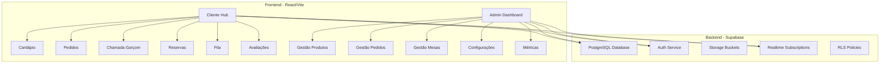
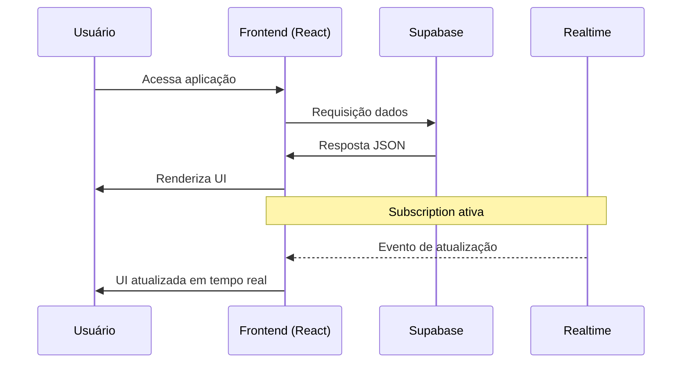
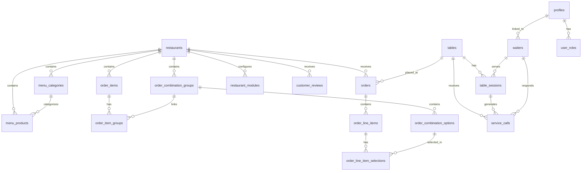
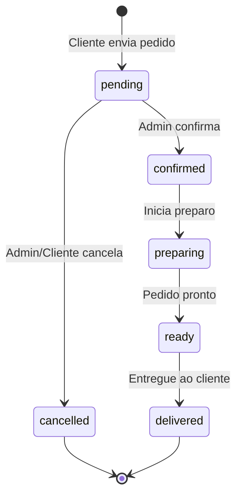
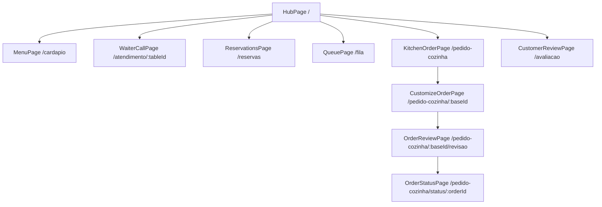
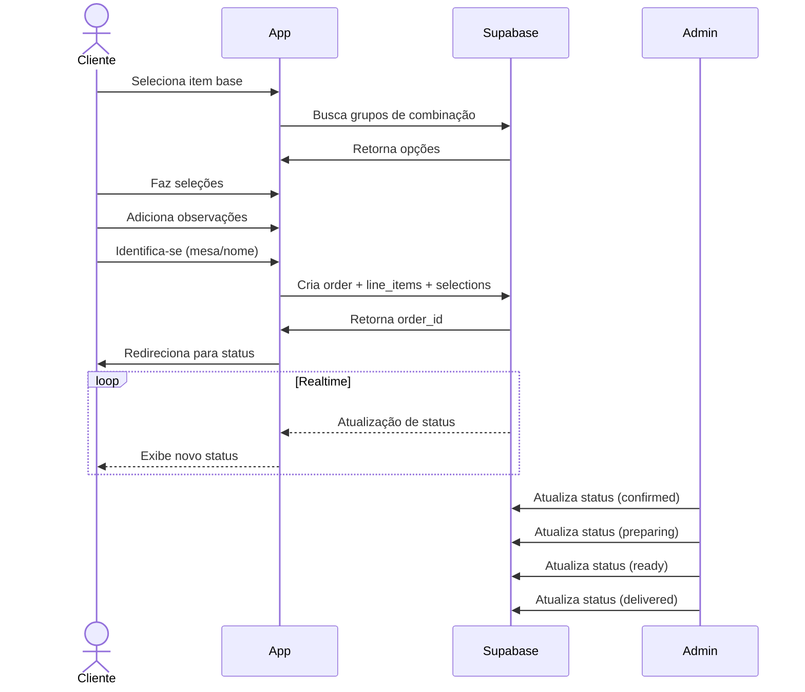
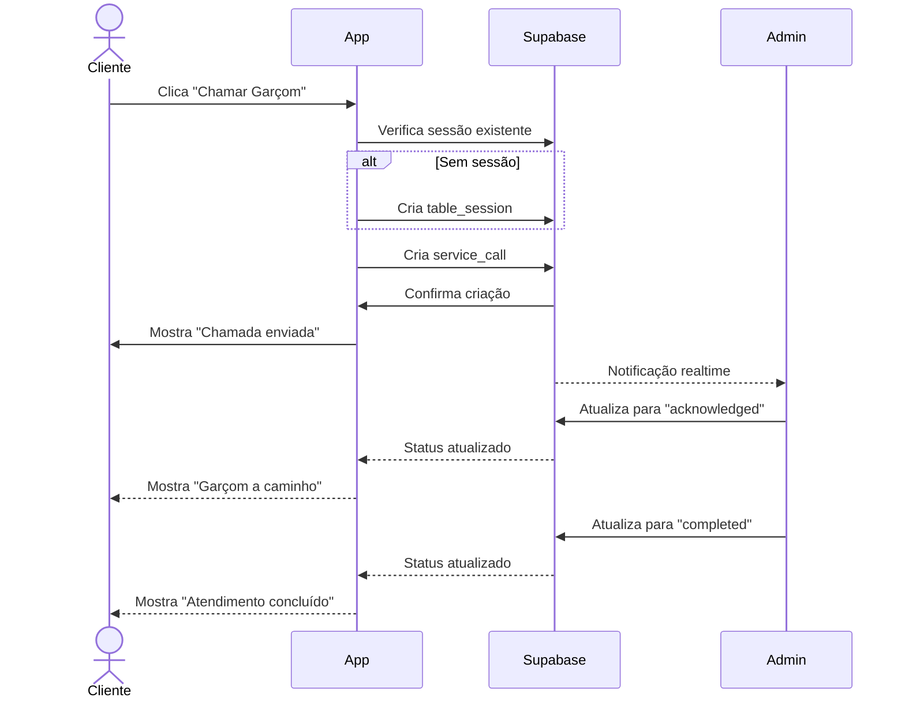
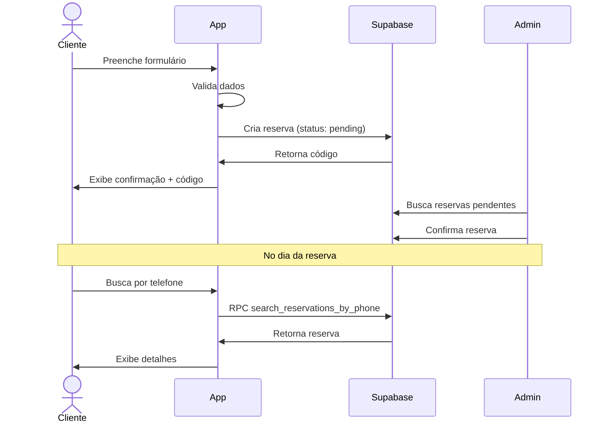
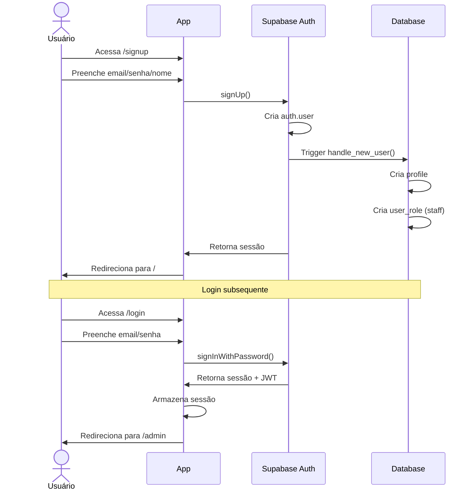

# 📘 Documentação Técnica Completa - RestoPlatform

> Sistema de Gestão para Restaurantes com Interface Dual (Cliente/Admin)

---

## 1. Identificação do Projeto

### Nome do Projeto
**RestoPlatform** - Sistema de Gestão para Restaurantes

### Descrição Resumida
Sistema completo de gestão para restaurantes com interface dual: uma voltada para clientes (Hub) e outra para administração (Dashboard Admin). Oferece módulos para cardápio digital, pedidos de cozinha, chamadas de garçom, reservas, fila de espera e avaliações de clientes.

### Objetivo Principal
Digitalizar e otimizar a operação de restaurantes, proporcionando uma experiência moderna para clientes e ferramentas eficientes de gestão para administradores.

### Público-Alvo
- **Restaurantes, bares, cafeterias e similares** que desejam modernizar seu atendimento
- **Clientes** que frequentam esses estabelecimentos

### Problema que Resolve
- Ineficiência no atendimento manual
- Dificuldade de gestão de reservas e filas
- Falta de visibilidade do status de pedidos
- Ausência de métricas e feedbacks estruturados

### Soluções que Entrega
- **Cardápio digital** com categorias e produtos personalizáveis
- **Sistema de pedidos** com customização de itens (combinações, adicionais)
- **Chamadas de garçom** em tempo real
- **Gestão de reservas** com confirmação e histórico
- **Fila de espera virtual** com notificações
- **Avaliações de clientes** com resposta administrativa
- **Dashboard administrativo** completo com métricas

### Plataformas de Destino
| Plataforma | Status | Tecnologia |
|------------|--------|------------|
| Web (Desktop) | ✅ Implementado | React + Vite |
| Web (Mobile) | ✅ Responsivo | Tailwind CSS |
| Mobile Nativo | ❌ Não suportado | - |
| Desktop App | ❌ Não suportado | - |

---

## 2. Arquitetura Geral

### Componentes Principais



### Tecnologias Utilizadas

| Camada | Tecnologia | Versão | Função |
|--------|------------|--------|--------|
| Framework | React | ^18.3.1 | UI Library |
| Build Tool | Vite | - | Bundler/Dev Server |
| Styling | Tailwind CSS | - | Utility-first CSS |
| UI Components | shadcn/ui | - | Component Library |
| State Management | TanStack Query | ^5.83.0 | Server State |
| Routing | React Router | ^6.30.1 | Client Routing |
| Backend | Supabase | ^2.89.0 | BaaS |
| Forms | React Hook Form | ^7.61.1 | Form Handling |
| Validation | Zod | ^3.25.76 | Schema Validation |
| Icons | Lucide React | ^0.462.0 | Icon Library |
| Date Handling | date-fns | ^3.6.0 | Date Utilities |
| Notifications | Sonner | ^1.7.4 | Toast Notifications |
| QR Code | qrcode.react | ^4.2.0 | QR Generation |

### Estrutura Cliente-Servidor



### Fluxo de Dados Geral

1. **Autenticação**: Supabase Auth com JWT
2. **Autorização**: Row Level Security (RLS) com roles
3. **Persistência**: PostgreSQL via Supabase
4. **Realtime**: Supabase Realtime para atualizações em tempo real
5. **Storage**: Supabase Storage para imagens

---

## 3. Banco de Dados

### Diagrama de Relacionamentos



### Tabelas Detalhadas

#### 3.1 restaurants

**Descrição**: Tabela principal que armazena informações do restaurante.

| Campo | Tipo | Nullable | Default | Descrição |
|-------|------|----------|---------|-----------|
| id | uuid | ❌ | gen_random_uuid() | PK |
| name | text | ❌ | - | Nome do restaurante |
| slug | text | ❌ | - | URL amigável |
| subtitle | text | ✅ | - | Subtítulo/descrição curta |
| logo_url | text | ✅ | - | URL do logo |
| cover_image_url | text | ✅ | - | URL imagem de capa |
| address | text | ✅ | - | Endereço completo |
| phone | text | ✅ | - | Telefone |
| email | text | ✅ | - | Email de contato |
| status | text | ✅ | 'closed' | Status manual (deprecated) |
| opening_time | time | ✅ | - | Horário abertura (deprecated) |
| closing_time | time | ✅ | - | Horário fechamento (deprecated) |
| identification_type | text | ✅ | 'table' | Tipo identificação: table/room/phone |
| timezone | text | ✅ | 'America/Sao_Paulo' | Fuso horário |
| business_hours | jsonb | ✅ | {...} | Horários por dia da semana |
| social_links | jsonb | ✅ | {} | Links redes sociais |
| wifi_info | jsonb | ✅ | {} | Dados WiFi para clientes |
| theme_colors | jsonb | ✅ | {} | Cores personalizadas do tema |
| notification_settings | jsonb | ✅ | {sound_enabled: true} | Config. notificações |
| theme_settings | jsonb | ✅ | {...} | Preferências de tema |
| is_active | boolean | ✅ | true | Ativo/inativo |
| created_at | timestamptz | ✅ | now() | Criação |
| updated_at | timestamptz | ✅ | now() | Atualização |

**Estrutura business_hours (JSONB)**:
```json
{
  "monday": {"open": "11:30", "close": "23:00", "is_closed": false},
  "tuesday": {"open": "11:30", "close": "23:00", "is_closed": false},
  "wednesday": {"open": "11:30", "close": "23:00", "is_closed": false},
  "thursday": {"open": "11:30", "close": "23:00", "is_closed": false},
  "friday": {"open": "11:30", "close": "23:00", "is_closed": false},
  "saturday": {"open": "11:30", "close": "23:00", "is_closed": false},
  "sunday": {"open": "11:30", "close": "22:00", "is_closed": false}
}
```

```sql
CREATE TABLE public.restaurants (
    id uuid NOT NULL DEFAULT gen_random_uuid() PRIMARY KEY,
    name text NOT NULL,
    slug text NOT NULL UNIQUE,
    subtitle text,
    logo_url text,
    cover_image_url text,
    address text,
    phone text,
    email text,
    status text DEFAULT 'closed',
    opening_time time,
    closing_time time,
    identification_type text DEFAULT 'table',
    timezone text DEFAULT 'America/Sao_Paulo',
    business_hours jsonb DEFAULT '{
        "monday": {"open": "11:30", "close": "23:00", "is_closed": false},
        "tuesday": {"open": "11:30", "close": "23:00", "is_closed": false},
        "wednesday": {"open": "11:30", "close": "23:00", "is_closed": false},
        "thursday": {"open": "11:30", "close": "23:00", "is_closed": false},
        "friday": {"open": "11:30", "close": "23:00", "is_closed": false},
        "saturday": {"open": "11:30", "close": "23:00", "is_closed": false},
        "sunday": {"open": "11:30", "close": "22:00", "is_closed": false}
    }'::jsonb,
    social_links jsonb DEFAULT '{}',
    wifi_info jsonb DEFAULT '{}',
    theme_colors jsonb DEFAULT '{}',
    notification_settings jsonb DEFAULT '{"sound_enabled": true}',
    theme_settings jsonb DEFAULT '{"admin_default_theme": "dark", "client_default_theme": "dark"}',
    is_active boolean DEFAULT true,
    created_at timestamptz DEFAULT now(),
    updated_at timestamptz DEFAULT now()
);
```

---

#### 3.2 profiles

**Descrição**: Perfis de usuários autenticados.

| Campo | Tipo | Nullable | Default | Descrição |
|-------|------|----------|---------|-----------|
| id | uuid | ❌ | - | PK (ref auth.users) |
| email | text | ❌ | - | Email do usuário |
| full_name | text | ✅ | - | Nome completo |
| restaurant_id | uuid | ✅ | - | FK restaurante |
| is_active | boolean | ✅ | true | Status ativo |
| created_at | timestamptz | ✅ | now() | Criação |
| updated_at | timestamptz | ✅ | now() | Atualização |

```sql
CREATE TABLE public.profiles (
    id uuid NOT NULL PRIMARY KEY REFERENCES auth.users(id) ON DELETE CASCADE,
    email text NOT NULL,
    full_name text,
    restaurant_id uuid REFERENCES public.restaurants(id),
    is_active boolean DEFAULT true,
    created_at timestamptz DEFAULT now(),
    updated_at timestamptz DEFAULT now()
);
```

---

#### 3.3 user_roles

**Descrição**: Roles/papéis dos usuários (separado de profiles por segurança).

| Campo | Tipo | Nullable | Default | Descrição |
|-------|------|----------|---------|-----------|
| id | uuid | ❌ | gen_random_uuid() | PK |
| user_id | uuid | ❌ | - | FK usuário |
| role | app_role | ❌ | - | Role: admin/manager/staff |
| created_at | timestamptz | ✅ | now() | Criação |

```sql
CREATE TYPE public.app_role AS ENUM ('admin', 'manager', 'staff');

CREATE TABLE public.user_roles (
    id uuid NOT NULL DEFAULT gen_random_uuid() PRIMARY KEY,
    user_id uuid NOT NULL REFERENCES auth.users(id) ON DELETE CASCADE,
    role app_role NOT NULL,
    created_at timestamptz DEFAULT now(),
    UNIQUE(user_id, role)
);
```

---

#### 3.4 menu_categories

**Descrição**: Categorias do cardápio.

| Campo | Tipo | Nullable | Default | Descrição |
|-------|------|----------|---------|-----------|
| id | uuid | ❌ | gen_random_uuid() | PK |
| restaurant_id | uuid | ❌ | - | FK restaurante |
| name | text | ❌ | - | Nome da categoria |
| slug | text | ❌ | - | URL amigável |
| description | text | ✅ | - | Descrição |
| display_order | integer | ✅ | 0 | Ordem de exibição |
| is_active | boolean | ✅ | true | Ativo/inativo |
| created_at | timestamptz | ✅ | now() | Criação |
| updated_at | timestamptz | ✅ | now() | Atualização |

```sql
CREATE TABLE public.menu_categories (
    id uuid NOT NULL DEFAULT gen_random_uuid() PRIMARY KEY,
    restaurant_id uuid NOT NULL REFERENCES public.restaurants(id),
    name text NOT NULL,
    slug text NOT NULL,
    description text,
    display_order integer DEFAULT 0,
    is_active boolean DEFAULT true,
    created_at timestamptz DEFAULT now(),
    updated_at timestamptz DEFAULT now()
);
```

---

#### 3.5 menu_products

**Descrição**: Produtos do cardápio (para visualização).

| Campo | Tipo | Nullable | Default | Descrição |
|-------|------|----------|---------|-----------|
| id | uuid | ❌ | gen_random_uuid() | PK |
| restaurant_id | uuid | ❌ | - | FK restaurante |
| category_id | uuid | ❌ | - | FK categoria |
| name | text | ❌ | - | Nome do produto |
| description | text | ✅ | - | Descrição |
| price | numeric | ❌ | - | Preço normal |
| promotional_price | numeric | ✅ | - | Preço promocional |
| image_url | text | ✅ | - | URL da imagem |
| display_order | integer | ✅ | 0 | Ordem de exibição |
| is_active | boolean | ✅ | true | Ativo/inativo |
| is_highlight | boolean | ✅ | false | Destaque |
| created_at | timestamptz | ✅ | now() | Criação |
| updated_at | timestamptz | ✅ | now() | Atualização |

```sql
CREATE TABLE public.menu_products (
    id uuid NOT NULL DEFAULT gen_random_uuid() PRIMARY KEY,
    restaurant_id uuid NOT NULL REFERENCES public.restaurants(id),
    category_id uuid NOT NULL REFERENCES public.menu_categories(id),
    name text NOT NULL,
    description text,
    price numeric NOT NULL,
    promotional_price numeric,
    image_url text,
    display_order integer DEFAULT 0,
    is_active boolean DEFAULT true,
    is_highlight boolean DEFAULT false,
    created_at timestamptz DEFAULT now(),
    updated_at timestamptz DEFAULT now()
);
```

---

#### 3.6 order_items

**Descrição**: Itens base para pedidos de cozinha (ex: Tapioca, Sanduíche).

| Campo | Tipo | Nullable | Default | Descrição |
|-------|------|----------|---------|-----------|
| id | uuid | ❌ | gen_random_uuid() | PK |
| restaurant_id | uuid | ❌ | - | FK restaurante |
| name | text | ❌ | - | Nome do item |
| description | text | ✅ | - | Descrição |
| price | numeric | ✅ | 0 | Preço base |
| image_url | text | ✅ | - | URL da imagem |
| tags | jsonb | ✅ | [] | Tags/categorias |
| display_order | integer | ✅ | 1 | Ordem |
| is_active | boolean | ✅ | true | Ativo |
| created_at | timestamptz | ✅ | now() | Criação |
| updated_at | timestamptz | ✅ | now() | Atualização |

```sql
CREATE TABLE public.order_items (
    id uuid NOT NULL DEFAULT gen_random_uuid() PRIMARY KEY,
    restaurant_id uuid NOT NULL REFERENCES public.restaurants(id),
    name text NOT NULL,
    description text,
    price numeric DEFAULT 0,
    image_url text,
    tags jsonb DEFAULT '[]',
    display_order integer DEFAULT 1,
    is_active boolean DEFAULT true,
    created_at timestamptz DEFAULT now(),
    updated_at timestamptz DEFAULT now()
);
```

---

#### 3.7 order_combination_groups

**Descrição**: Grupos de combinações (ex: Recheios, Molhos).

| Campo | Tipo | Nullable | Default | Descrição |
|-------|------|----------|---------|-----------|
| id | uuid | ❌ | gen_random_uuid() | PK |
| restaurant_id | uuid | ❌ | - | FK restaurante |
| name | text | ❌ | - | Nome do grupo |
| description | text | ✅ | - | Descrição |
| selection_type | text | ✅ | 'multiple' | single/multiple/quantity |
| min_selections | integer | ✅ | 0 | Mínimo seleções |
| max_selections | integer | ✅ | - | Máximo seleções |
| is_required | boolean | ✅ | false | Obrigatório |
| display_order | integer | ✅ | 1 | Ordem |
| is_active | boolean | ✅ | true | Ativo |
| created_at | timestamptz | ✅ | now() | Criação |
| updated_at | timestamptz | ✅ | now() | Atualização |

```sql
CREATE TABLE public.order_combination_groups (
    id uuid NOT NULL DEFAULT gen_random_uuid() PRIMARY KEY,
    restaurant_id uuid NOT NULL REFERENCES public.restaurants(id),
    name text NOT NULL,
    description text,
    selection_type text DEFAULT 'multiple',
    min_selections integer DEFAULT 0,
    max_selections integer,
    is_required boolean DEFAULT false,
    display_order integer DEFAULT 1,
    is_active boolean DEFAULT true,
    created_at timestamptz DEFAULT now(),
    updated_at timestamptz DEFAULT now()
);
```

---

#### 3.8 order_combination_options

**Descrição**: Opções dentro de um grupo de combinações.

| Campo | Tipo | Nullable | Default | Descrição |
|-------|------|----------|---------|-----------|
| id | uuid | ❌ | gen_random_uuid() | PK |
| group_id | uuid | ❌ | - | FK grupo |
| name | text | ❌ | - | Nome da opção |
| description | text | ✅ | - | Descrição |
| emoji | text | ✅ | - | Emoji ilustrativo |
| additional_price | numeric | ✅ | 0 | Preço adicional |
| display_order | integer | ✅ | 1 | Ordem |
| is_active | boolean | ✅ | true | Ativo |
| created_at | timestamptz | ✅ | now() | Criação |
| updated_at | timestamptz | ✅ | now() | Atualização |

```sql
CREATE TABLE public.order_combination_options (
    id uuid NOT NULL DEFAULT gen_random_uuid() PRIMARY KEY,
    group_id uuid NOT NULL REFERENCES public.order_combination_groups(id) ON DELETE CASCADE,
    name text NOT NULL,
    description text,
    emoji text,
    additional_price numeric DEFAULT 0,
    display_order integer DEFAULT 1,
    is_active boolean DEFAULT true,
    created_at timestamptz DEFAULT now(),
    updated_at timestamptz DEFAULT now()
);
```

---

#### 3.9 order_item_groups

**Descrição**: Vinculação entre itens e grupos de combinações.

| Campo | Tipo | Nullable | Default | Descrição |
|-------|------|----------|---------|-----------|
| id | uuid | ❌ | gen_random_uuid() | PK |
| order_item_id | uuid | ❌ | - | FK item |
| combination_group_id | uuid | ❌ | - | FK grupo |
| is_required | boolean | ✅ | false | Obrigatório |
| display_order | integer | ✅ | 1 | Ordem |
| created_at | timestamptz | ✅ | now() | Criação |

```sql
CREATE TABLE public.order_item_groups (
    id uuid NOT NULL DEFAULT gen_random_uuid() PRIMARY KEY,
    order_item_id uuid NOT NULL REFERENCES public.order_items(id) ON DELETE CASCADE,
    combination_group_id uuid NOT NULL REFERENCES public.order_combination_groups(id) ON DELETE CASCADE,
    is_required boolean DEFAULT false,
    display_order integer DEFAULT 1,
    created_at timestamptz DEFAULT now()
);
```

---

#### 3.10 orders

**Descrição**: Pedidos realizados pelos clientes.

| Campo | Tipo | Nullable | Default | Descrição |
|-------|------|----------|---------|-----------|
| id | uuid | ❌ | gen_random_uuid() | PK |
| order_number | integer | ❌ | auto_increment | Número do pedido |
| restaurant_id | uuid | ❌ | - | FK restaurante |
| table_id | uuid | ✅ | - | FK mesa |
| table_number | text | ✅ | - | Número/nome da mesa |
| customer_name | text | ✅ | - | Nome do cliente |
| status | text | ✅ | 'pending' | Status do pedido |
| observations | text | ✅ | - | Observações gerais |
| total_amount | numeric | ✅ | 0 | Valor total |
| confirmed_at | timestamptz | ✅ | - | Confirmação |
| preparing_at | timestamptz | ✅ | - | Início preparo |
| ready_at | timestamptz | ✅ | - | Pronto |
| delivered_at | timestamptz | ✅ | - | Entregue |
| cancelled_at | timestamptz | ✅ | - | Cancelado |
| created_at | timestamptz | ✅ | now() | Criação |
| updated_at | timestamptz | ✅ | now() | Atualização |

**Status possíveis**: `pending`, `confirmed`, `preparing`, `ready`, `delivered`, `cancelled`

```sql
CREATE TABLE public.orders (
    id uuid NOT NULL DEFAULT gen_random_uuid() PRIMARY KEY,
    order_number integer NOT NULL DEFAULT nextval('orders_order_number_seq'),
    restaurant_id uuid NOT NULL REFERENCES public.restaurants(id),
    table_id uuid REFERENCES public.tables(id),
    table_number text,
    customer_name text,
    status text DEFAULT 'pending',
    observations text,
    total_amount numeric DEFAULT 0,
    confirmed_at timestamptz,
    preparing_at timestamptz,
    ready_at timestamptz,
    delivered_at timestamptz,
    cancelled_at timestamptz,
    created_at timestamptz DEFAULT now(),
    updated_at timestamptz DEFAULT now()
);
```

---

#### 3.11 order_line_items

**Descrição**: Itens de um pedido.

| Campo | Tipo | Nullable | Default | Descrição |
|-------|------|----------|---------|-----------|
| id | uuid | ❌ | gen_random_uuid() | PK |
| order_id | uuid | ❌ | - | FK pedido |
| order_item_id | uuid | ❌ | - | FK item base |
| item_name | text | ❌ | - | Nome do item |
| quantity | integer | ✅ | 1 | Quantidade |
| unit_price | numeric | ✅ | 0 | Preço unitário |
| observations | text | ✅ | - | Observações |
| created_at | timestamptz | ✅ | now() | Criação |

```sql
CREATE TABLE public.order_line_items (
    id uuid NOT NULL DEFAULT gen_random_uuid() PRIMARY KEY,
    order_id uuid NOT NULL REFERENCES public.orders(id) ON DELETE CASCADE,
    order_item_id uuid NOT NULL REFERENCES public.order_items(id),
    item_name text NOT NULL,
    quantity integer DEFAULT 1,
    unit_price numeric DEFAULT 0,
    observations text,
    created_at timestamptz DEFAULT now()
);
```

---

#### 3.12 order_line_item_selections

**Descrição**: Seleções de combinações em um item do pedido.

| Campo | Tipo | Nullable | Default | Descrição |
|-------|------|----------|---------|-----------|
| id | uuid | ❌ | gen_random_uuid() | PK |
| line_item_id | uuid | ❌ | - | FK line item |
| combination_option_id | uuid | ❌ | - | FK opção |
| option_name | text | ❌ | - | Nome da opção |
| additional_price | numeric | ✅ | 0 | Preço adicional |
| quantity | integer | ✅ | 1 | Quantidade |
| created_at | timestamptz | ✅ | now() | Criação |

```sql
CREATE TABLE public.order_line_item_selections (
    id uuid NOT NULL DEFAULT gen_random_uuid() PRIMARY KEY,
    line_item_id uuid NOT NULL REFERENCES public.order_line_items(id) ON DELETE CASCADE,
    combination_option_id uuid NOT NULL REFERENCES public.order_combination_options(id),
    option_name text NOT NULL,
    additional_price numeric DEFAULT 0,
    quantity integer DEFAULT 1,
    created_at timestamptz DEFAULT now()
);
```

---

#### 3.13 tables

**Descrição**: Mesas do restaurante.

| Campo | Tipo | Nullable | Default | Descrição |
|-------|------|----------|---------|-----------|
| id | uuid | ❌ | gen_random_uuid() | PK |
| number | integer | ❌ | - | Número da mesa |
| name | text | ✅ | - | Nome/apelido |
| capacity | integer | ✅ | 4 | Capacidade |
| status | text | ✅ | 'available' | Status |
| is_active | boolean | ✅ | true | Ativo |
| created_at | timestamptz | ✅ | now() | Criação |
| updated_at | timestamptz | ✅ | now() | Atualização |

**Status possíveis**: `available`, `occupied`, `reserved`, `cleaning`

```sql
CREATE TABLE public.tables (
    id uuid NOT NULL DEFAULT gen_random_uuid() PRIMARY KEY,
    number integer NOT NULL,
    name text,
    capacity integer DEFAULT 4,
    status text DEFAULT 'available',
    is_active boolean DEFAULT true,
    created_at timestamptz DEFAULT now(),
    updated_at timestamptz DEFAULT now()
);
```

---

#### 3.14 table_sessions

**Descrição**: Sessões de ocupação das mesas.

| Campo | Tipo | Nullable | Default | Descrição |
|-------|------|----------|---------|-----------|
| id | uuid | ❌ | gen_random_uuid() | PK |
| table_id | uuid | ❌ | - | FK mesa |
| waiter_id | uuid | ✅ | - | FK garçom |
| status | text | ✅ | 'open' | Status |
| customer_count | integer | ✅ | 1 | Qtd clientes |
| notes | text | ✅ | - | Observações |
| opened_at | timestamptz | ✅ | now() | Abertura |
| bill_requested_at | timestamptz | ✅ | - | Pedido conta |
| closed_at | timestamptz | ✅ | - | Fechamento |
| created_at | timestamptz | ✅ | now() | Criação |
| updated_at | timestamptz | ✅ | now() | Atualização |

```sql
CREATE TABLE public.table_sessions (
    id uuid NOT NULL DEFAULT gen_random_uuid() PRIMARY KEY,
    table_id uuid NOT NULL REFERENCES public.tables(id),
    waiter_id uuid REFERENCES public.waiters(id),
    status text DEFAULT 'open',
    customer_count integer DEFAULT 1,
    notes text,
    opened_at timestamptz DEFAULT now(),
    bill_requested_at timestamptz,
    closed_at timestamptz,
    created_at timestamptz DEFAULT now(),
    updated_at timestamptz DEFAULT now()
);
```

---

#### 3.15 waiters

**Descrição**: Garçons do restaurante.

| Campo | Tipo | Nullable | Default | Descrição |
|-------|------|----------|---------|-----------|
| id | uuid | ❌ | gen_random_uuid() | PK |
| user_id | uuid | ✅ | - | FK usuário (opcional) |
| name | text | ❌ | - | Nome |
| is_available | boolean | ✅ | true | Disponível |
| is_active | boolean | ✅ | true | Ativo |
| created_at | timestamptz | ✅ | now() | Criação |
| updated_at | timestamptz | ✅ | now() | Atualização |

```sql
CREATE TABLE public.waiters (
    id uuid NOT NULL DEFAULT gen_random_uuid() PRIMARY KEY,
    user_id uuid REFERENCES public.profiles(id),
    name text NOT NULL,
    is_available boolean DEFAULT true,
    is_active boolean DEFAULT true,
    created_at timestamptz DEFAULT now(),
    updated_at timestamptz DEFAULT now()
);
```

---

#### 3.16 service_calls

**Descrição**: Chamadas de atendimento.

| Campo | Tipo | Nullable | Default | Descrição |
|-------|------|----------|---------|-----------|
| id | uuid | ❌ | gen_random_uuid() | PK |
| table_id | uuid | ❌ | - | FK mesa |
| table_session_id | uuid | ✅ | - | FK sessão |
| waiter_id | uuid | ✅ | - | FK garçom |
| call_type | text | ❌ | - | Tipo da chamada |
| status | text | ✅ | 'pending' | Status |
| called_at | timestamptz | ✅ | now() | Horário chamada |
| acknowledged_at | timestamptz | ✅ | - | Reconhecido |
| completed_at | timestamptz | ✅ | - | Concluído |
| response_time_seconds | integer | ✅ | - | Tempo resposta |
| created_at | timestamptz | ✅ | now() | Criação |
| updated_at | timestamptz | ✅ | now() | Atualização |

**Tipos de chamada**: `waiter`, `bill`, `help`, `water`, `menu`

**Status**: `pending`, `acknowledged`, `in_progress`, `completed`, `cancelled`

```sql
CREATE TABLE public.service_calls (
    id uuid NOT NULL DEFAULT gen_random_uuid() PRIMARY KEY,
    table_id uuid NOT NULL REFERENCES public.tables(id),
    table_session_id uuid REFERENCES public.table_sessions(id),
    waiter_id uuid REFERENCES public.waiters(id),
    call_type text NOT NULL,
    status text DEFAULT 'pending',
    called_at timestamptz DEFAULT now(),
    acknowledged_at timestamptz,
    completed_at timestamptz,
    response_time_seconds integer,
    created_at timestamptz DEFAULT now(),
    updated_at timestamptz DEFAULT now()
);
```

---

#### 3.17 reservations

**Descrição**: Reservas de mesas.

| Campo | Tipo | Nullable | Default | Descrição |
|-------|------|----------|---------|-----------|
| id | uuid | ❌ | gen_random_uuid() | PK |
| reservation_code | text | ❌ | - | Código único |
| customer_name | text | ❌ | - | Nome cliente |
| phone | text | ❌ | - | Telefone |
| party_size | integer | ❌ | 2 | Tamanho grupo |
| reservation_date | date | ❌ | - | Data |
| reservation_time | time | ❌ | - | Horário |
| status | text | ❌ | 'pending' | Status |
| notes | text | ✅ | - | Observações cliente |
| admin_notes | text | ✅ | - | Observações admin |
| confirmed_at | timestamptz | ✅ | - | Confirmação |
| cancelled_at | timestamptz | ✅ | - | Cancelamento |
| completed_at | timestamptz | ✅ | - | Conclusão |
| created_at | timestamptz | ✅ | now() | Criação |
| updated_at | timestamptz | ✅ | now() | Atualização |

**Status**: `pending`, `confirmed`, `cancelled`, `completed`, `no_show`

```sql
CREATE TABLE public.reservations (
    id uuid NOT NULL DEFAULT gen_random_uuid() PRIMARY KEY,
    reservation_code text NOT NULL UNIQUE,
    customer_name text NOT NULL,
    phone text NOT NULL,
    party_size integer NOT NULL DEFAULT 2,
    reservation_date date NOT NULL,
    reservation_time time NOT NULL,
    status text NOT NULL DEFAULT 'pending',
    notes text,
    admin_notes text,
    confirmed_at timestamptz,
    cancelled_at timestamptz,
    completed_at timestamptz,
    created_at timestamptz DEFAULT now(),
    updated_at timestamptz DEFAULT now()
);
```

---

#### 3.18 queue_entries

**Descrição**: Entradas na fila de espera.

| Campo | Tipo | Nullable | Default | Descrição |
|-------|------|----------|---------|-----------|
| id | uuid | ❌ | gen_random_uuid() | PK |
| queue_code | text | ❌ | - | Código fila |
| customer_name | text | ❌ | - | Nome |
| phone | text | ✅ | - | Telefone |
| party_size | integer | ❌ | 2 | Tamanho grupo |
| position | integer | ✅ | - | Posição na fila |
| estimated_wait_minutes | integer | ✅ | - | Espera estimada |
| status | text | ❌ | 'waiting' | Status |
| notes | text | ✅ | - | Observações |
| notifications_enabled | boolean | ✅ | true | Notificações |
| joined_at | timestamptz | ✅ | now() | Entrada |
| called_at | timestamptz | ✅ | - | Chamado |
| seated_at | timestamptz | ✅ | - | Sentado |
| cancelled_at | timestamptz | ✅ | - | Cancelado |
| created_at | timestamptz | ✅ | now() | Criação |
| updated_at | timestamptz | ✅ | now() | Atualização |

**Status**: `waiting`, `called`, `seated`, `cancelled`, `no_show`

```sql
CREATE TABLE public.queue_entries (
    id uuid NOT NULL DEFAULT gen_random_uuid() PRIMARY KEY,
    queue_code text NOT NULL,
    customer_name text NOT NULL,
    phone text,
    party_size integer NOT NULL DEFAULT 2,
    position integer,
    estimated_wait_minutes integer,
    status text NOT NULL DEFAULT 'waiting',
    notes text,
    notifications_enabled boolean DEFAULT true,
    joined_at timestamptz DEFAULT now(),
    called_at timestamptz,
    seated_at timestamptz,
    cancelled_at timestamptz,
    created_at timestamptz DEFAULT now(),
    updated_at timestamptz DEFAULT now()
);
```

---

#### 3.19 customer_reviews

**Descrição**: Avaliações de clientes.

| Campo | Tipo | Nullable | Default | Descrição |
|-------|------|----------|---------|-----------|
| id | uuid | ❌ | gen_random_uuid() | PK |
| restaurant_id | uuid | ❌ | - | FK restaurante |
| customer_name | text | ❌ | - | Nome cliente |
| phone | text | ✅ | - | Telefone |
| overall_rating | numeric | ✅ | - | Nota geral (1-5) |
| comida_rating | integer | ✅ | - | Nota comida |
| atendimento_rating | integer | ✅ | - | Nota atendimento |
| ambiente_rating | integer | ✅ | - | Nota ambiente |
| observations | text | ✅ | - | Comentários |
| status | text | ❌ | 'pending' | Status |
| is_featured | boolean | ✅ | false | Destaque |
| admin_response | text | ✅ | - | Resposta admin |
| responded_at | timestamptz | ✅ | - | Data resposta |
| responded_by | uuid | ✅ | - | Quem respondeu |
| created_at | timestamptz | ✅ | now() | Criação |
| updated_at | timestamptz | ✅ | now() | Atualização |

**Status**: `pending`, `published`, `archived`

```sql
CREATE TABLE public.customer_reviews (
    id uuid NOT NULL DEFAULT gen_random_uuid() PRIMARY KEY,
    restaurant_id uuid NOT NULL REFERENCES public.restaurants(id),
    customer_name text NOT NULL,
    phone text,
    overall_rating numeric,
    comida_rating integer,
    atendimento_rating integer,
    ambiente_rating integer,
    observations text,
    status text NOT NULL DEFAULT 'pending',
    is_featured boolean DEFAULT false,
    admin_response text,
    responded_at timestamptz,
    responded_by uuid,
    created_at timestamptz DEFAULT now(),
    updated_at timestamptz DEFAULT now()
);
```

---

#### 3.20 restaurant_modules

**Descrição**: Módulos habilitados por restaurante.

| Campo | Tipo | Nullable | Default | Descrição |
|-------|------|----------|---------|-----------|
| id | uuid | ❌ | gen_random_uuid() | PK |
| restaurant_id | uuid | ❌ | - | FK restaurante |
| module_name | text | ❌ | - | Nome do módulo |
| is_active | boolean | ✅ | false | Ativo |
| settings | jsonb | ✅ | {} | Configurações |
| created_at | timestamptz | ✅ | now() | Criação |
| updated_at | timestamptz | ✅ | now() | Atualização |

**Módulos disponíveis**: `menu`, `waiter_call`, `reservations`, `queue`, `kitchen_order`, `customer_review`

```sql
CREATE TABLE public.restaurant_modules (
    id uuid NOT NULL DEFAULT gen_random_uuid() PRIMARY KEY,
    restaurant_id uuid NOT NULL REFERENCES public.restaurants(id),
    module_name text NOT NULL,
    is_active boolean DEFAULT false,
    settings jsonb DEFAULT '{}',
    created_at timestamptz DEFAULT now(),
    updated_at timestamptz DEFAULT now(),
    UNIQUE(restaurant_id, module_name)
);
```

---

## 4. Regras de Negócio

### 4.1 Horário de Funcionamento

| Regra | Descrição |
|-------|-----------|
| Cálculo automático | Status "Aberto/Fechado" é calculado em tempo real baseado no `business_hours` e `timezone` |
| Por dia da semana | Cada dia pode ter horário diferente ou estar marcado como fechado |
| Fuso horário | Suporta todos os fusos brasileiros (UTC-2 a UTC-5) |
| Fechamento após meia-noite | Horários como 11:30-02:00 são suportados |
| Exibição no Hub | Badge animado mostra "Aberto até XX:XX" ou "Fechado" na página inicial |

### 4.1.1 Módulos Dependentes do Horário

Alguns módulos dependem da operação presencial do estabelecimento e ficam **desabilitados** quando o restaurante está fechado:

| Módulo | Depende do Horário | Comportamento Quando Fechado |
|--------|-------------------|------------------------------|
| Cardápio Digital | ❌ Não | Sempre ativo (cliente pode visualizar) |
| Pedir Atendimento | ✅ Sim | Visível mas não clicável |
| Fila de Espera | ✅ Sim | Visível mas não clicável |
| Pedido Cozinha | ✅ Sim | Visível mas não clicável |
| Fazer Reserva | ❌ Não | Sempre ativo (pode reservar para outro dia) |
| Avaliar Experiência | ❌ Não | Sempre ativo (pode avaliar após visita) |

**Comportamento visual dos módulos desabilitados:**
- Opacidade reduzida (`opacity-50`)
- Cursor `not-allowed`
- Descrição alterada para "Disponível no horário de funcionamento"
- Sem efeitos de hover
- Não navegável (renderiza `<div>` em vez de `<Link>`)

### 4.2 Pedidos de Cozinha



| Regra | Descrição |
|-------|-----------|
| Grupos obrigatórios | Se um grupo de combinação é `is_required`, cliente deve fazer seleção mínima |
| Limites de seleção | `min_selections` e `max_selections` controlam quantas opções podem ser escolhidas |
| Tipos de seleção | `single` (uma opção), `multiple` (várias), `quantity` (com quantidade) |
| Cálculo de preço | Preço base + soma dos `additional_price` das seleções |

### 4.3 Chamadas de Garçom

| Regra | Descrição |
|-------|-----------|
| Uma chamada ativa | Cliente não pode criar nova chamada do mesmo tipo se já existe uma pendente |
| Sessão automática | Primeira chamada cria automaticamente uma `table_session` |
| Tempo de resposta | Calculado entre `called_at` e `acknowledged_at` |
| Notificação sonora | Configrável via `notification_settings.sound_enabled` |

### 4.4 Reservas

| Regra | Descrição |
|-------|-----------|
| Código único | Gerado automaticamente no formato alfanumérico |
| Busca segura | Cliente busca apenas por telefone, sem expor dados de outros |
| Confirmação | Admin deve confirmar reservas pendentes |
| Cancelamento | Cliente pode cancelar apenas suas próprias reservas |

### 4.5 Fila de Espera

| Regra | Descrição |
|-------|-----------|
| Posição automática | Calculada baseada em quantas pessoas estão aguardando |
| Tempo estimado | Pode ser definido manualmente pelo admin |
| Status sequencial | waiting → called → seated (ou cancelled) |

### 4.6 Avaliações

| Regra | Descrição |
|-------|-----------|
| Anonimato parcial | Nome obrigatório, telefone opcional |
| Publicação | Admin deve aprovar antes de publicar |
| Destaque | Admin pode marcar avaliações como `is_featured` |
| Resposta única | Admin pode responder uma vez por avaliação |

---

## 5. Perfis e Permissões

### Matriz de Permissões

| Recurso | admin | manager | staff | público |
|---------|-------|---------|-------|---------|
| **Restaurante** |
| Ver configurações | ✅ | ✅ | ❌ | ❌ |
| Editar configurações | ✅ | ❌ | ❌ | ❌ |
| **Cardápio** |
| Ver produtos ativos | ✅ | ✅ | ✅ | ✅ |
| Gerenciar produtos | ✅ | ✅ | ❌ | ❌ |
| Gerenciar categorias | ✅ | ✅ | ❌ | ❌ |
| **Pedidos** |
| Criar pedido | ✅ | ✅ | ✅ | ✅ |
| Ver todos pedidos | ✅ | ✅ | ❌ | ❌ |
| Atualizar status | ✅ | ✅ | ❌ | ❌ |
| **Mesas** |
| Ver mesas ativas | ✅ | ✅ | ✅ | ✅ |
| Gerenciar mesas | ✅ | ✅ | ❌ | ❌ |
| **Chamadas** |
| Criar chamada | ✅ | ✅ | ✅ | ✅ |
| Ver todas chamadas | ✅ | ✅ | ❌ | ❌ |
| Atender chamada | ✅ | ✅ | ❌ | ❌ |
| **Reservas** |
| Criar reserva | ✅ | ✅ | ✅ | ✅ |
| Ver todas reservas | ✅ | ✅ | ❌ | ❌ |
| Gerenciar reservas | ✅ | ✅ | ❌ | ❌ |
| **Fila** |
| Entrar na fila | ✅ | ✅ | ✅ | ✅ |
| Gerenciar fila | ✅ | ✅ | ❌ | ❌ |
| **Avaliações** |
| Criar avaliação | ✅ | ✅ | ✅ | ✅ |
| Ver publicadas | ✅ | ✅ | ✅ | ✅ |
| Gerenciar avaliações | ✅ | ✅ | ❌ | ❌ |
| **Usuários** |
| Ver usuários | ✅ | ❌ | ❌ | ❌ |
| Gerenciar roles | ✅ | ❌ | ❌ | ❌ |

### Implementação de Segurança

```sql
-- Função para verificar role (evita recursão RLS)
CREATE OR REPLACE FUNCTION public.has_role(_user_id uuid, _role app_role)
RETURNS boolean
LANGUAGE sql
STABLE
SECURITY DEFINER
SET search_path = public
AS $$
  SELECT EXISTS (
    SELECT 1
    FROM public.user_roles
    WHERE user_id = _user_id
      AND role = _role
  )
$$;

-- Exemplo de policy usando a função
CREATE POLICY "Admins can manage restaurant"
ON public.restaurants
FOR ALL
USING (has_role(auth.uid(), 'admin'))
WITH CHECK (has_role(auth.uid(), 'admin'));
```

---

## 6. Telas e Interfaces

### 6.1 Interface do Cliente (Hub)



| Tela | Rota | Objetivo | Componentes Principais |
|------|------|----------|----------------------|
| Hub | `/` | Página inicial com acesso aos módulos | ActionCard (com suporte a disabled), Logo, StatusBadge animado |
| Cardápio | `/cardapio` | Visualização do menu | Categorias, ProductCard, ProductDetailSheet |
| Atendimento | `/atendimento/:tableId` | Chamadas de garçom | Botões de chamada, Status de chamadas ativas |
| Reservas | `/reservas` | Criar/buscar reservas | Formulário de reserva, Busca por telefone |
| Fila | `/fila` | Entrar na fila de espera | Formulário de entrada, Status na fila |
| Pedido Cozinha | `/pedido-cozinha` | Selecionar item base | Grid de itens, Cards com imagem |
| Customizar | `/pedido-cozinha/:baseId` | Personalizar item | Grupos de opções, Seleções, Contador |
| Revisão | `/pedido-cozinha/:baseId/revisao` | Revisar antes de enviar | Resumo do pedido, Identificação |
| Status | `/pedido-cozinha/status/:orderId` | Acompanhar pedido | Timeline de status, Realtime |
| Avaliação | `/avaliacao` | Avaliar experiência | Estrelas, Categorias, Observações |
| Login | `/login` | Autenticação | Email/Senha, Link para signup |
| Cadastro | `/signup` | Registro | Email/Senha/Nome |

### 6.2 Interface Administrativa

```mermaid
graph TD
    A[AdminDashboard /admin] --> B[AdminProducts /admin/produtos]
    A --> C[AdminCategories /admin/categorias]
    A --> D[AdminOrders /admin/pedidos]
    A --> E[AdminOrderItems /admin/itens-pedido]
    A --> F[AdminCombinationGroups /admin/grupos-combinacao]
    A --> G[AdminTables /admin/mesas]
    A --> H[AdminWaiters /admin/garcons]
    A --> I[AdminWaiterCalls /admin/chamadas]
    A --> J[AdminReservations /admin/reservas]
    A --> K[AdminQueue /admin/fila]
    A --> L[AdminReviews /admin/avaliacoes]
    A --> M[AdminUsers /admin/usuarios]
    A --> N[AdminModules /admin/modulos]
    A --> O[AdminSettings /admin/configuracoes]
    A --> P[AdminMetrics /admin/metricas]
```



| Tela | Rota | Objetivo |
|------|------|----------|
| Dashboard | `/admin` | Visão geral e estatísticas |
| Produtos | `/admin/produtos` | CRUD de produtos do cardápio |
| Categorias | `/admin/categorias` | CRUD de categorias |
| Pedidos | `/admin/pedidos` | Gestão de pedidos com realtime |
| Itens Pedido | `/admin/itens-pedido` | CRUD de itens base para pedidos |
| Grupos Combinação | `/admin/grupos-combinacao` | CRUD de grupos e opções |
| Mesas | `/admin/mesas` | CRUD de mesas |
| Garçons | `/admin/garcons` | CRUD de garçons |
| Chamadas | `/admin/chamadas` | Visualização e atendimento de chamadas |
| Reservas | `/admin/reservas` | Gestão de reservas |
| Fila | `/admin/fila` | Gestão da fila de espera |
| Avaliações | `/admin/avaliacoes` | Moderação de avaliações |
| Usuários | `/admin/usuarios` | Listagem de usuários e roles |
| Módulos | `/admin/modulos` | Ativar/desativar módulos |
| Configurações | `/admin/configuracoes` | Configurações do restaurante |
| Métricas | `/admin/metricas` | Gráficos e estatísticas |

### 6.3 Layout Responsivo

| Breakpoint | Comportamento |
|------------|---------------|
| Mobile (<640px) | Layout em coluna, menu hamburger, cards full-width |
| Tablet (640-1024px) | Grid 2 colunas, sidebar colapsável |
| Desktop (>1024px) | Sidebar fixa, grid 3-4 colunas |

---

## 7. Fluxos Operacionais

### 7.1 Fluxo de Pedido de Cozinha



### 7.2 Fluxo de Chamada de Garçom



### 7.3 Fluxo de Reserva



### 7.4 Fluxo de Autenticação



---

## 8. Integrações e Aplicações Externas

### Integrações Ativas

| Tipo | Serviço | Função | Endpoints |
|------|---------|--------|-----------|
| BaaS | Supabase | Database, Auth, Storage, Realtime | `https://txtgrxwulaqyfxdyxnik.supabase.co` |
| Storage | Supabase Storage | Armazenamento de imagens | Bucket: `imagens` (público) |

### Configuração Supabase

```javascript
// src/integrations/supabase/client.ts
import { createClient } from '@supabase/supabase-js';

const SUPABASE_URL = "https://txtgrxwulaqyfxdyxnik.supabase.co";
const SUPABASE_ANON_KEY = "eyJhbGciOiJIUzI1NiIsInR5cCI6IkpXVCJ9...";

export const supabase = createClient(SUPABASE_URL, SUPABASE_ANON_KEY);
```

### Integrações Potenciais (não implementadas)

| Tipo | Serviço | Função | Comunicação |
|------|---------|--------|-------------|
| Automação | n8n | Fluxos automáticos | Webhook |
| Mensageria | Z-API/Twilio | WhatsApp | REST API |
| Pagamentos | Stripe | Assinaturas | REST API |
| IA | OpenAI | Chatbot | REST API |

---

## 9. Eventos Automáticos

### Triggers de Banco de Dados

| Trigger | Tabela | Evento | Ação |
|---------|--------|--------|------|
| `on_auth_user_created` | `auth.users` | INSERT | Cria profile e user_role |
| `update_*_updated_at` | Várias | UPDATE | Atualiza campo `updated_at` |

```sql
-- Trigger para novos usuários
CREATE OR REPLACE FUNCTION public.handle_new_user()
RETURNS trigger
LANGUAGE plpgsql
SECURITY DEFINER
SET search_path = public
AS $$
BEGIN
  INSERT INTO public.profiles (id, email, full_name)
  VALUES (
    NEW.id,
    NEW.email,
    NEW.raw_user_meta_data ->> 'full_name'
  );
  
  INSERT INTO public.user_roles (user_id, role)
  VALUES (NEW.id, 'staff');
  
  RETURN NEW;
END;
$$;

CREATE TRIGGER on_auth_user_created
  AFTER INSERT ON auth.users
  FOR EACH ROW EXECUTE FUNCTION public.handle_new_user();
```

### Subscriptions Realtime

| Canal | Tabela | Eventos | Uso |
|-------|--------|---------|-----|
| `orders` | orders | UPDATE | Atualização de status de pedidos |
| `service_calls` | service_calls | INSERT, UPDATE | Novas chamadas e atualizações |

```typescript
// Exemplo de subscription
supabase
  .channel('orders')
  .on('postgres_changes', {
    event: 'UPDATE',
    schema: 'public',
    table: 'orders',
    filter: `id=eq.${orderId}`
  }, (payload) => {
    // Atualiza UI
  })
  .subscribe();
```

---

## 10. Segurança e Acesso

### Autenticação

| Método | Status | Detalhes |
|--------|--------|----------|
| Email/Senha | ✅ Ativo | Supabase Auth nativo |
| OAuth (Google) | ❌ Não configurado | Pode ser habilitado |
| Magic Link | ❌ Não configurado | Pode ser habilitado |

### Row Level Security (RLS)

Todas as tabelas possuem RLS habilitado com policies específicas:

```sql
-- Padrão para tabelas públicas (leitura)
CREATE POLICY "Public read access"
ON public.menu_products
FOR SELECT
USING (is_active = true);

-- Padrão para tabelas admin (CRUD completo)
CREATE POLICY "Admins can manage"
ON public.menu_products
FOR ALL
USING (has_role(auth.uid(), 'admin') OR has_role(auth.uid(), 'manager'))
WITH CHECK (has_role(auth.uid(), 'admin') OR has_role(auth.uid(), 'manager'));

-- Padrão para criação pública
CREATE POLICY "Public can create"
ON public.orders
FOR INSERT
WITH CHECK (true);
```

### Função de Busca Segura (Reservas)

```sql
-- Evita exposição de dados de outros clientes
CREATE OR REPLACE FUNCTION public.search_reservations_by_phone(search_phone text)
RETURNS TABLE(...)
LANGUAGE sql
STABLE
SECURITY DEFINER
SET search_path = public
AS $$
  SELECT ... FROM reservations
  WHERE phone = regexp_replace(search_phone, '\D', '', 'g')
  AND status IN ('pending', 'confirmed')
$$;
```

### Boas Práticas Implementadas

- ✅ Roles em tabela separada (não em profiles)
- ✅ Função `has_role()` com SECURITY DEFINER
- ✅ RLS em todas as tabelas
- ✅ Validação de input com Zod
- ✅ Tokens JWT para autenticação
- ✅ Storage bucket público apenas para imagens

---

## 11. Deploy e Infraestrutura

### Ambiente de Hospedagem

| Componente | Plataforma | URL |
|------------|------------|-----|
| Frontend | Lovable | `https://[project].lovable.app` |
| Backend | Supabase | `https://txtgrxwulaqyfxdyxnik.supabase.co` |
| Storage | Supabase Storage | Bucket `imagens` |

### Variáveis de Ambiente

| Variável | Descrição | Onde Configurar |
|----------|-----------|-----------------|
| `SUPABASE_URL` | URL do projeto Supabase | Hardcoded no cliente |
| `SUPABASE_ANON_KEY` | Chave anônima (pública) | Hardcoded no cliente |
| `SUPABASE_SERVICE_ROLE_KEY` | Chave de serviço (privada) | Supabase Secrets |
| `SUPABASE_DB_URL` | URL do banco | Supabase Secrets |

### Backup e Recuperação

- **Banco de Dados**: Backups automáticos do Supabase (diários)
- **Storage**: Replicação automática do Supabase
- **Código**: Versionamento Git via Lovable

---

## 12. Testes e Dados de Exemplo

### Dados de Exemplo - Restaurante

```json
{
  "name": "Tapiocaria Nordestina",
  "slug": "tapiocaria-nordestina",
  "subtitle": "O melhor da culinária nordestina",
  "identification_type": "table",
  "timezone": "America/Recife",
  "business_hours": {
    "monday": {"open": "11:30", "close": "23:00", "is_closed": false},
    "tuesday": {"open": "11:30", "close": "23:00", "is_closed": false},
    "wednesday": {"open": "11:30", "close": "23:00", "is_closed": false},
    "thursday": {"open": "11:30", "close": "23:00", "is_closed": false},
    "friday": {"open": "11:30", "close": "00:30", "is_closed": false},
    "saturday": {"open": "11:30", "close": "00:30", "is_closed": false},
    "sunday": {"open": "11:30", "close": "22:00", "is_closed": false}
  }
}
```

### Dados de Exemplo - Item de Pedido com Combinações

```json
{
  "order_item": {
    "name": "Tapioca",
    "description": "Tapioca artesanal com recheios à escolha",
    "price": 15.00
  },
  "groups": [
    {
      "name": "Recheios",
      "selection_type": "multiple",
      "min_selections": 1,
      "max_selections": 3,
      "is_required": true,
      "options": [
        {"name": "Queijo Coalho", "emoji": "🧀", "additional_price": 0},
        {"name": "Carne de Sol", "emoji": "🥩", "additional_price": 5.00},
        {"name": "Frango", "emoji": "🍗", "additional_price": 3.00}
      ]
    },
    {
      "name": "Molhos",
      "selection_type": "single",
      "is_required": false,
      "options": [
        {"name": "Catupiry", "additional_price": 2.00},
        {"name": "Cheddar", "additional_price": 2.00}
      ]
    }
  ]
}
```

### Casos de Teste Principais

| Fluxo | Cenário | Resultado Esperado |
|-------|---------|-------------------|
| Autenticação | Signup com email válido | Cria usuário, profile e role |
| Autenticação | Login com credenciais corretas | Retorna sessão JWT |
| Autenticação | Login com senha errada | Erro "Invalid credentials" |
| Pedido | Criar pedido com seleções obrigatórias | Pedido criado com status pending |
| Pedido | Criar pedido sem seleção obrigatória | Validação impede envio |
| Reserva | Buscar por telefone existente | Retorna reservas do telefone |
| Reserva | Buscar por telefone inexistente | Retorna lista vazia |
| Admin | Acessar /admin sem autenticação | Redireciona para /login |
| Admin | Usuário staff acessa /admin | Acesso negado |

---

## 13. Glossário e Padrões

### Nomenclatura

| Elemento | Padrão | Exemplo |
|----------|--------|---------|
| Tabelas | snake_case | `order_line_items` |
| Colunas | snake_case | `created_at` |
| Componentes React | PascalCase | `ProductCard` |
| Hooks | camelCase com "use" | `useAdminSettings` |
| Funções SQL | snake_case | `has_role` |
| Arquivos | kebab-case ou PascalCase | `AdminSettings.tsx` |

### Status Padronizados

| Entidade | Status Possíveis |
|----------|------------------|
| orders | `pending`, `confirmed`, `preparing`, `ready`, `delivered`, `cancelled` |
| service_calls | `pending`, `acknowledged`, `in_progress`, `completed`, `cancelled` |
| reservations | `pending`, `confirmed`, `cancelled`, `completed`, `no_show` |
| queue_entries | `waiting`, `called`, `seated`, `cancelled`, `no_show` |
| customer_reviews | `pending`, `published`, `archived` |
| tables | `available`, `occupied`, `reserved`, `cleaning` |
| table_sessions | `open`, `closed` |

### Formatos de Dados

| Tipo | Formato | Exemplo |
|------|---------|---------|
| Data | ISO 8601 | `2026-01-03` |
| Hora | HH:MM | `11:30` |
| Timestamp | ISO 8601 | `2026-01-03T15:30:00Z` |
| UUID | v4 | `123e4567-e89b-12d3-a456-426614174000` |
| Telefone | Digits only | `11999999999` |
| Preço | Numeric (2 decimais) | `15.50` |

### Tokens de Design (CSS Variables)

```css
/* Cores principais */
--primary: 142 85% 42%;        /* Verde principal */
--background: 220 20% 8%;       /* Fundo escuro */
--foreground: 0 0% 98%;         /* Texto claro */
--card: 220 18% 12%;            /* Cards */
--muted: 220 15% 20%;           /* Elementos secundários */
--destructive: 0 72% 51%;       /* Erros/alertas */
--success: 142 76% 36%;         /* Sucesso */
--warning: 38 92% 50%;          /* Avisos */

/* Superfícies (inputs/forms) */
--surface: 220 15% 22%;
--surface-foreground: 220 10% 40%;

/* Sombras e efeitos */
--shadow-glow: 0 0 20px hsl(142 85% 49% / 0.3);
--shadow-card: 0 4px 24px hsl(0 0% 0% / 0.3);
```

---

## 14. Estrutura de Arquivos do Projeto

```
src/
├── components/
│   ├── admin/           # Componentes exclusivos do admin
│   │   ├── OrderCard.tsx
│   │   ├── ProductFormDialog.tsx
│   │   ├── ReservationCard.tsx
│   │   └── ...
│   ├── auth/            # Componentes de autenticação
│   │   └── AuthGuard.tsx
│   ├── layout/          # Layouts
│   │   ├── AdminLayout.tsx
│   │   └── ClientLayout.tsx
│   └── ui/              # Componentes UI (shadcn)
│       ├── button.tsx
│       ├── card.tsx
│       ├── action-card.tsx  # Card de ação com suporte a disabled
│       ├── dialog.tsx
│       └── ...
├── hooks/
│   ├── useAuth.ts       # Autenticação
│   ├── useAdminSettings.ts
│   ├── useAdminOrders.ts
│   ├── useRestaurantStatus.ts
│   └── ...
├── integrations/
│   └── supabase/
│       ├── client.ts    # Cliente Supabase
│       └── types.ts     # Tipos gerados
├── lib/
│   ├── utils.ts         # Utilitários (cn, etc)
│   └── color-utils.ts   # Utilitários de cores
├── pages/
│   ├── admin/           # Páginas administrativas
│   │   ├── AdminDashboard.tsx
│   │   ├── AdminProducts.tsx
│   │   └── ...
│   ├── HubPage.tsx      # Página inicial cliente
│   ├── MenuPage.tsx
│   ├── LoginPage.tsx
│   └── ...
├── types/
│   └── restaurant.ts    # Tipos do domínio
├── App.tsx              # Rotas e providers
├── index.css            # Design system
└── main.tsx             # Entry point

supabase/
├── config.toml          # Configuração do projeto
└── migrations/          # Migrações SQL
    ├── 20260101_initial.sql
    └── ...
```

---

## 15. Considerações Finais

### Pontos Fortes
- ✅ Arquitetura modular e extensível
- ✅ RLS robusto para segurança
- ✅ Realtime para UX fluida
- ✅ Design system consistente
- ✅ Cálculo automático de status operacional

### Melhorias Futuras Sugeridas
- 🔄 Integração com WhatsApp para notificações
- 🔄 Sistema de pagamentos (Stripe)
- 🔄 PWA para instalação mobile
- 🔄 Relatórios e analytics avançados
- 🔄 Múltiplos restaurantes por conta

---

*Documento gerado automaticamente em 03/01/2026*
*Versão: 1.0.0*
