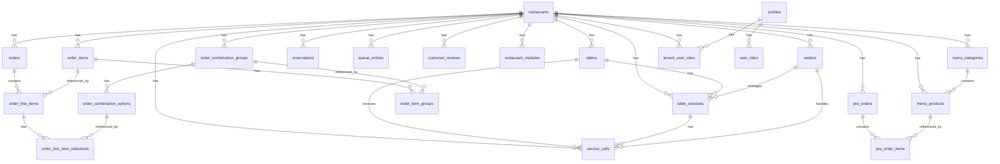
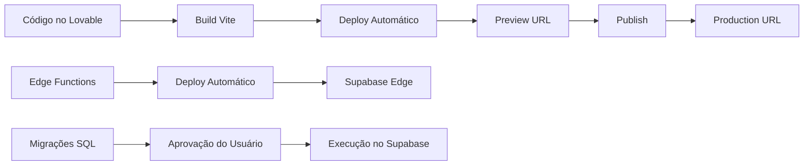

# Documentação Técnica e de Negócio — Chama Atende

> **Última atualização:** 2026-02-21  
> **Versão:** 2.0  
> **Status do projeto:** Produção (MVP+)

---

## Sumário

- [1. Visão Geral do Produto](#1-visão-geral-do-produto)
- [2. Marketing e Posicionamento](#2-marketing-e-posicionamento)
- [3. Funcionalidades](#3-funcionalidades)
- [4. Regras de Negócio](#4-regras-de-negócio)
- [5. Requisitos](#5-requisitos)
- [6. Base de Dados](#6-base-de-dados)
- [7. Tecnologia Utilizada (Stack Técnico)](#7-tecnologia-utilizada-stack-técnico)
- [8. Arquitetura e Estrutura do Projeto](#8-arquitetura-e-estrutura-do-projeto)
- [9. Informações Complementares](#9-informações-complementares)
- [Glossário](#glossário)

---

## 1. Visão Geral do Produto

### 1.1 Identificação

| Campo | Valor |
|-------|-------|
| **Nome** | Chama Atende (anteriormente Plataforma Ativa) |
| **Domínio publicado** | https://chamaatende.lovable.app |
| **Propósito** | Plataforma SaaS multi-tenant para gestão digital de restaurantes |

### 1.2 Proposta de Valor

Digitalizar e otimizar toda a operação de restaurantes — do cardápio digital ao pedido para cozinha, passando por reservas, fila de espera, chamada de atendente e avaliações — em uma única plataforma 100% web, acessível via QR Code na mesa do cliente, sem necessidade de instalar aplicativos.

### 1.3 Público-alvo e Personas

| Persona | Descrição | Necessidade Principal |
|---------|-----------|----------------------|
| **Dono de restaurante (pequeno/médio)** | Proprietário buscando digitalização a baixo custo | Solução acessível e fácil de configurar |
| **Gerente de operações** | Responsável pelo dia-a-dia do restaurante | Painéis de controle, métricas, gestão de equipe |
| **Garçom/Atendente** | Funcionário que atende às mesas | Receber chamados em tempo real, gerir mesas |
| **Cozinheiro/Chef** | Equipe de cozinha | Visualizar e gerenciar pedidos com status |
| **Cliente do restaurante** | Consumidor final na mesa | Acessar cardápio, fazer pedidos, chamar atendente via celular |
| **Redes e franquias** | Operações com múltiplas unidades | Multi-tenant, API, domínio personalizado |

### 1.4 Problema que Resolve

- Cardápios de papel desatualizados e com custo de reimpressão
- Demora no atendimento por falta de visibilidade dos chamados
- Filas desorganizadas sem controle digital
- Reservas por telefone sem registro confiável
- Pedidos com erros de comunicação entre salão e cozinha
- Falta de feedback estruturado dos clientes
- Gestão descentralizada sem métricas

### 1.5 Modelo de Negócio

**SaaS Freemium** com 3 planos:

| Plano | Preço | Usuários | Módulos |
|-------|-------|----------|---------|
| **Starter** | Grátis | 3 | Cardápio Digital, Chamar Atendente |
| **Professional** | R$ 99/mês | 10 | Todos os módulos + Relatórios |
| **Enterprise** | R$ 299/mês | Ilimitado | Todos + API + Domínio próprio + Suporte prioritário |

### 1.6 Estágio Atual

**Produção (MVP+)** — Plataforma funcional com todos os 7 módulos implementados, painel administrativo completo, sistema multi-tenant operacional, autenticação e RLS configurados. Landing page de vendas em `/vendas`. Falta integração de pagamentos real (Stripe), notificações por WhatsApp/SMS, e PWA.

---

## 2. Marketing e Posicionamento

### 2.1 Proposta Única de Valor (UVP)

> "Transforme seu Restaurante com Tecnologia Inteligente — Cardápio digital, pedidos, reservas, fila de espera e muito mais. Tudo em uma única plataforma 100% web, acessível por QR Code."

### 2.2 Principais Diferenciais Competitivos

1. **Hub Centralizado** — Todos os módulos acessíveis por um único QR Code na mesa
2. **100% Web** — Sem instalação de app; funciona em qualquer navegador/dispositivo
3. **Tempo Real** — Atualizações instantâneas via Supabase Realtime (pedidos, chamados, fila)
4. **Multi-Tenant Seguro** — Dados 100% isolados por restaurante com RLS no banco
5. **Setup em 5 minutos** — Onboarding guiado com criação automática de tenant
6. **Freemium** — Plano gratuito com funcionalidades reais, sem cartão de crédito

### 2.3 Tom de Voz e Identidade de Marca

- **Tom:** Profissional mas acessível, tecnológico mas humano
- **Cores principais:** Verde primário (HSL 142 85% 49% dark / 42% light), fundo escuro (HSL 220 20% 8%)
- **Tipografia:** Plus Jakarta Sans (display e body)
- **Identidade visual:** Moderna, clean, com ícones Lucide React e gradientes verdes

### 2.4 Canais de Aquisição Previstos

| Canal | Status |
|-------|--------|
| Landing page `/vendas` | ✅ Implementado |
| SEO orgânico | 🔜 Planejado |
| Google Ads | 🔜 Planejado |
| Redes sociais (Instagram/Facebook) | 🔜 Planejado |
| Indicação/Referral | 🔜 Planejado |
| Parcerias com consultorias de restaurantes | 🔜 Planejado |

### 2.5 Estratégia de Onboarding

1. Usuário acessa `/vendas` ou `/onboarding`
2. Cria conta com email/senha em `/signup`
3. Preenche formulário de onboarding: nome do restaurante, slug (URL), subtítulo, plano
4. Edge Function `create-tenant` provisiona automaticamente: restaurante, módulos padrão, role de owner
5. Usuário é redirecionado ao painel admin `/admin/{slug}`
6. Configura cardápio, horários, logo, e ativa módulos desejados
7. Gera QR Codes para as mesas e distribui

### 2.6 KPIs de Marketing (Planejados)

- Taxa de conversão da landing page (visitante → signup)
- Taxa de ativação (signup → restaurante criado)
- Churn mensal por plano
- NPS dos restaurantes ativos
- Tempo médio de setup (signup até primeiro QR Code gerado)

### 2.7 Copywriting Principal

| Elemento | Texto |
|----------|-------|
| **Headline hero** | "Transforme seu Restaurante com Tecnologia Inteligente" |
| **Sub-headline** | "Cardápio digital, pedidos, reservas, fila de espera e muito mais. Tudo em uma única plataforma acessível por QR Code." |
| **CTA primário** | "Criar Restaurante Grátis" |
| **CTA secundário** | "Ver Demonstração" |
| **Problema** | "Seu restaurante ainda usa papel e caneta?" |
| **Solução** | "O Chama Atende resolve tudo isso com uma plataforma digital completa." |

---

## 3. Funcionalidades

### 3.1 Módulos do Cliente (Hub Público)

Acessados por `/{slug}` → Hub com cards de ação para cada módulo ativo.

#### 3.1.1 Cardápio Digital (`/{slug}/cardapio`)

| Aspecto | Detalhe |
|---------|---------|
| **Descrição** | Exibição interativa do cardápio com categorias, fotos, preços e promoções |
| **Status** | ✅ Implementado |
| **Fluxo do usuário** | Hub → Cardápio → Navega por categorias → Visualiza detalhes do produto |
| **Funcionalidades** | Categorias com ordenação, produtos com imagem/descrição/preço, preço promocional, destaques, busca |

#### 3.1.2 Chamar Atendente (`/{slug}/solicitar-atendimento` ou `/{slug}/atendimento/{tableId}`)

| Aspecto | Detalhe |
|---------|---------|
| **Descrição** | Cliente solicita atendimento na mesa pelo celular |
| **Status** | ✅ Implementado |
| **Fluxo do usuário** | QR Code na mesa → Hub (mesa identificada) → Chamar Atendente → Seleciona tipo (Atendente/Conta/Água) → Chamado enviado |
| **Funcionalidades** | Tipos de chamado, sessão de mesa automática, status em tempo real, histórico |
| **Restrição** | Disponível apenas quando restaurante está aberto |

#### 3.1.3 Sistema de Reservas (`/{slug}/reservas`)

| Aspecto | Detalhe |
|---------|---------|
| **Descrição** | Reservas online com formulário público e código de acompanhamento |
| **Status** | ✅ Implementado |
| **Fluxo do usuário** | Hub → Reservas → Preenche formulário (nome, telefone, data, hora, pessoas) → Recebe código → Consulta por telefone |
| **Funcionalidades** | Criação, consulta por telefone (RPC segura), confirmação/cancelamento pelo admin, notas administrativas |

#### 3.1.4 Fila de Espera (`/{slug}/fila`)

| Aspecto | Detalhe |
|---------|---------|
| **Descrição** | Gestão digital de fila com posição em tempo real |
| **Status** | ✅ Implementado |
| **Fluxo do usuário** | Hub → Fila → Informa nome/telefone/pessoas → Entra na fila → Acompanha posição → Chamado → Sentado |
| **Funcionalidades** | Código de fila, posição em tempo real, estimativa de espera, notificações |
| **Restrição** | Disponível apenas quando restaurante está aberto |

#### 3.1.5 Pedido para Cozinha (`/{slug}/pedido-cozinha`)

| Aspecto | Detalhe |
|---------|---------|
| **Descrição** | Montagem de pedido personalizado com combinações e envio direto para cozinha |
| **Status** | ✅ Implementado |
| **Fluxo do usuário** | Hub → Pedido Cozinha → Seleciona item base → Personaliza (grupos de combinação) → Revisão → Confirma → Acompanha status |
| **Funcionalidades** | Itens base com preço, grupos de combinação (obrigatórios/opcionais), seleção mínima/máxima, preço adicional por opção, observações, status (Pendente → Confirmado → Preparando → Pronto → Entregue) |
| **Restrição** | Disponível apenas quando restaurante está aberto |

#### 3.1.6 Avaliações de Clientes (`/{slug}/avaliacao`)

| Aspecto | Detalhe |
|---------|---------|
| **Descrição** | Formulário de avaliação com notas por categoria |
| **Status** | ✅ Implementado |
| **Fluxo do usuário** | Hub → Avaliar → Preenche nome/telefone → Avalia comida/atendimento/ambiente (1-5 estrelas) → Observações → Envia |
| **Funcionalidades** | Avaliação por categoria, nota geral calculada, observações, status (pending → published), resposta do admin, destaque no hub |

#### 3.1.7 Sistema de Encomendas (`/{slug}/encomendas`)

| Aspecto | Detalhe |
|---------|---------|
| **Descrição** | Encomendas antecipadas com carrinho, escolha de data/hora de retirada |
| **Status** | ✅ Implementado |
| **Fluxo do usuário** | Hub → Encomendas → Catálogo → Adiciona ao carrinho → Checkout (nome, telefone, data, hora, método pagamento) → Acompanha status |
| **Funcionalidades** | Catálogo de produtos (orderable), carrinho persistente, checkout com dados do cliente, status de encomenda, consulta por telefone |

### 3.2 Painel Administrativo (`/admin/{slug}`)

Acesso protegido por `AuthGuard` + verificação de role no tenant.

#### 3.2.1 Dashboard (`/admin/{slug}`)

| Aspecto | Detalhe |
|---------|---------|
| **Descrição** | Visão geral do restaurante com métricas rápidas |
| **Status** | ✅ Implementado |

#### 3.2.2 Gestão de Produtos (`/admin/{slug}/produtos`)

| Aspecto | Detalhe |
|---------|---------|
| **Descrição** | CRUD completo de produtos do cardápio |
| **Status** | ✅ Implementado |
| **Funcionalidades** | Criar/editar/excluir produtos, upload de imagem com crop, preço e preço promocional, ativar/desativar, ordenação, vincular a categoria, marcar como orderable (para encomendas), marcar como destaque |

#### 3.2.3 Gestão de Categorias (`/admin/{slug}/categorias`)

| Aspecto | Detalhe |
|---------|---------|
| **Descrição** | CRUD de categorias do cardápio |
| **Status** | ✅ Implementado |
| **Funcionalidades** | Criar/editar/excluir, slug automático, ordenação, ativar/desativar |

#### 3.2.4 Gestão de Módulos (`/admin/{slug}/modulos`)

| Aspecto | Detalhe |
|---------|---------|
| **Descrição** | Ativação/desativação de módulos da plataforma |
| **Status** | ✅ Implementado |
| **Funcionalidades** | Toggle de ativação por módulo, visibilidade condicional no Hub e no menu admin |

#### 3.2.5 Gestão de Mesas (`/admin/{slug}/mesas`)

| Aspecto | Detalhe |
|---------|---------|
| **Descrição** | CRUD de mesas com QR Code |
| **Status** | ✅ Implementado |
| **Funcionalidades** | Criar/editar/excluir mesas, número, nome, capacidade, status (available/occupied/reserved), gerar QR Code, criação em lote |

#### 3.2.6 Gestão de Atendentes (`/admin/{slug}/atendentes`)

| Aspecto | Detalhe |
|---------|---------|
| **Descrição** | CRUD de garçons/atendentes |
| **Status** | ✅ Implementado |
| **Funcionalidades** | Criar/editar, disponibilidade, vincular a usuário do sistema |

#### 3.2.7 Gestão de Atendimentos (`/admin/{slug}/atendimentos`)

| Aspecto | Detalhe |
|---------|---------|
| **Descrição** | Painel de chamados de serviço em tempo real |
| **Status** | ✅ Implementado |
| **Funcionalidades** | Lista de chamados com status, aceitar/completar chamado, atribuir garçom, tempo de resposta, Realtime |

#### 3.2.8 Gestão de Reservas (`/admin/{slug}/reservas`)

| Aspecto | Detalhe |
|---------|---------|
| **Descrição** | Painel de reservas com confirmação/cancelamento |
| **Status** | ✅ Implementado |

#### 3.2.9 Gestão de Fila (`/admin/{slug}/fila`)

| Aspecto | Detalhe |
|---------|---------|
| **Descrição** | Painel de fila de espera com gestão de posições |
| **Status** | ✅ Implementado |

#### 3.2.10 Gestão de Pedidos (`/admin/{slug}/pedidos`)

| Aspecto | Detalhe |
|---------|---------|
| **Descrição** | Painel de pedidos com fluxo de status |
| **Status** | ✅ Implementado |

#### 3.2.11 Itens do Pedido (`/admin/{slug}/itens-pedido`)

| Aspecto | Detalhe |
|---------|---------|
| **Descrição** | CRUD de itens base que compõem pedidos |
| **Status** | ✅ Implementado |

#### 3.2.12 Combinações (`/admin/{slug}/combinacoes`)

| Aspecto | Detalhe |
|---------|---------|
| **Descrição** | Gestão de grupos de combinação e opções (adicionais/personalizações) |
| **Status** | ✅ Implementado |

#### 3.2.13 Avaliações (`/admin/{slug}/avaliacoes`)

| Aspecto | Detalhe |
|---------|---------|
| **Descrição** | Painel de avaliações com resposta e publicação |
| **Status** | ✅ Implementado |

#### 3.2.14 Encomendas (`/admin/{slug}/encomendas`)

| Aspecto | Detalhe |
|---------|---------|
| **Descrição** | Painel de encomendas com gestão de status |
| **Status** | ✅ Implementado |

#### 3.2.15 Métricas (`/admin/{slug}/metricas`)

| Aspecto | Detalhe |
|---------|---------|
| **Descrição** | Dashboard com gráficos e indicadores |
| **Status** | ✅ Implementado |

#### 3.2.16 Usuários (`/admin/{slug}/usuarios`)

| Aspecto | Detalhe |
|---------|---------|
| **Descrição** | Gestão de usuários e roles do tenant |
| **Status** | ✅ Implementado |

#### 3.2.17 Configurações (`/admin/{slug}/configuracoes`)

| Aspecto | Detalhe |
|---------|---------|
| **Descrição** | Configurações gerais do restaurante |
| **Status** | ✅ Implementado |
| **Funcionalidades** | Nome, subtítulo, logo, imagem de capa, endereço, telefone, email, coordenadas GPS, horários de funcionamento por dia da semana, fuso horário, tipo de identificação (mesa/quarto/telefone), redes sociais (Instagram, Facebook, Website, Spotify playlist), info WiFi, tema (light/dark para admin e cliente), notificações sonoras |

### 3.3 Funcionalidades Globais

#### 3.3.1 Autenticação

| Aspecto | Detalhe |
|---------|---------|
| **Método** | Email/Senha via Supabase Auth |
| **Páginas** | `/login`, `/login/{slug}`, `/signup` |
| **Funcionalidades** | Login, Signup com nome completo, Logout, Redirect após login preservando contexto |
| **OAuth** | Não implementado |
| **Magic Link** | Não implementado |

#### 3.3.2 Seleção de Tenant (`/`)

| Aspecto | Detalhe |
|---------|---------|
| **Descrição** | Página inicial para selecionar restaurante (quando autenticado) ou criar novo |
| **Funcionalidades** | Lista restaurantes do usuário, link para criar novo, link para admin |

#### 3.3.3 Onboarding (`/onboarding`)

| Aspecto | Detalhe |
|---------|---------|
| **Descrição** | Formulário de criação de novo restaurante |
| **Funcionalidades** | Nome, slug com geração automática e verificação de disponibilidade, subtítulo, seleção de plano |

#### 3.3.4 Landing Page (`/vendas`)

| Aspecto | Detalhe |
|---------|---------|
| **Descrição** | Página de vendas da plataforma |
| **Funcionalidades** | Hero, módulos, como funciona, diferenciais, planos e preços, CTAs para onboarding |

### 3.4 Integrações com Serviços Externos

| Integração | Status | Descrição |
|------------|--------|-----------|
| **Supabase Database** | ✅ Ativo | PostgreSQL gerenciado para persistência |
| **Supabase Auth** | ✅ Ativo | Autenticação de usuários |
| **Supabase Storage** | ✅ Ativo | Armazenamento de imagens (bucket `imagens`, público) |
| **Supabase Realtime** | ✅ Ativo | Subscriptions para atualizações em tempo real |
| **Supabase Edge Functions** | ✅ Ativo | `create-tenant` para provisionamento de restaurantes |
| **Google Maps Embed** | ✅ Ativo | Mapa no Hub com coordenadas |
| **Spotify Embed** | ✅ Ativo | Player de música ambiente no painel admin |
| **WhatsApp (link direto)** | ✅ Ativo | Link `wa.me` para chat via telefone |
| **Stripe / Pagamentos** | 🔜 Planejado | Cobrança de planos |
| **WhatsApp API (Z-API/Twilio)** | 🔜 Planejado | Notificações por WhatsApp |
| **Push Notifications** | 🔜 Planejado | Notificações no navegador |
| **n8n / Automações** | 🔜 Planejado | Workflows automatizados |
| **OpenAI** | 🔜 Planejado | Análise de avaliações, sugestões |

### 3.5 Funcionalidades de Notificação

| Tipo | Status | Descrição |
|------|--------|-----------|
| **Toast in-app (Sonner)** | ✅ Implementado | Notificações de sucesso/erro/info no navegador |
| **Realtime subscriptions** | ✅ Implementado | Atualização automática de dados sem refresh |
| **Som de notificação** | ✅ Implementado | Som ao receber novos chamados (configurável) |
| **Email** | ❌ Não implementado | — |
| **SMS** | ❌ Não implementado | — |
| **Push** | ❌ Não implementado | — |
| **WhatsApp** | ❌ Não implementado (apenas link direto) | — |

### 3.6 Sistema de Permissões e Papéis

#### Papéis Globais (`user_roles` table, enum `app_role`)

| Role | Descrição |
|------|-----------|
| `admin` | Acesso total (retrocompatibilidade) |
| `manager` | Gerente com acesso à gestão |
| `staff` | Funcionário com acesso básico |

#### Papéis por Tenant (`tenant_user_roles` table, enum `tenant_role`)

| Role | Descrição | Permissões |
|------|-----------|------------|
| `owner` | Proprietário do restaurante | Controle total |
| `admin` | Administrador do tenant | Gerencia tudo exceto transferir ownership |
| `manager` | Gerente | Gerencia operações do dia-a-dia |
| `staff` | Funcionário | Acesso básico às operações |
| `kitchen` | Cozinha | Visualiza e atualiza pedidos |
| `waiter` | Garçom | Atende chamados e gerencia mesas |

#### Hierarquia de Acesso ao Admin

```
owner > admin > manager > staff/kitchen/waiter
```

O `AuthGuard` verifica:
1. Usuário autenticado?
2. Possui `tenant_user_roles` para o `restaurant_id` do slug atual?
3. Ou possui role global `admin` em `user_roles`? (retrocompatibilidade)

---

## 4. Regras de Negócio

### 4.1 Horário de Funcionamento

- Cada restaurante define horários por dia da semana (`business_hours` JSONB)
- Formato: `{ "monday": { "open": "11:30", "close": "23:00", "is_closed": false } }`
- Fuso horário configurável (`timezone`, padrão: `America/Sao_Paulo`)
- Status calculado em tempo real pelo hook `useRestaurantStatus`
- Módulos sensíveis a horário (Chamar Atendente, Fila, Pedido Cozinha) são desabilitados quando fechado
- Reservas e Avaliações funcionam independentemente do horário

### 4.2 Pedidos para Cozinha

- **Itens base:** Produtos com preço base, imagem, tags
- **Grupos de combinação:** Vinculados a itens via `order_item_groups`
- **Regras de seleção:**
  - `is_required`: se true, cliente deve fazer pelo menos `min_selections` escolhas
  - `min_selections` / `max_selections`: limites de opções selecionáveis
  - `selection_type`: `single` (radio) ou `multiple` (checkbox)
- **Preço final:** preço base + soma dos `additional_price` das opções selecionadas
- **Fluxo de status:** `pending` → `confirmed` → `preparing` → `ready` → `delivered` | `cancelled`
- Cada transição registra timestamp correspondente (`confirmed_at`, `preparing_at`, etc.)

### 4.3 Chamados de Atendente

- Cliente escaneia QR Code da mesa → mesa é identificada
- Ao chamar, cria-se automaticamente uma `table_session` se não existir sessão aberta
- Tipos de chamado: `waiter` (atendente), `bill` (conta), `water` (água)
- Status: `pending` → `acknowledged` → `completed`
- `response_time_seconds` calculado automaticamente
- Chamado só pode ser criado se restaurante estiver aberto

### 4.4 Reservas

- Código de reserva único gerado automaticamente
- Consulta pública por telefone via RPC `search_reservations_by_phone` (SECURITY DEFINER)
- Status: `pending` → `confirmed` → `completed` | `cancelled`
- Cada transição registra timestamp

### 4.5 Fila de Espera

- Código de fila gerado automaticamente
- Posição calculada e atualizada
- Status: `waiting` → `called` → `seated` | `cancelled`
- Estimativa de espera em minutos
- Notificações configuráveis por entrada

### 4.6 Avaliações

- Anônima (nome e telefone opcionais)
- Avaliação por 3 categorias: comida, atendimento, ambiente (1-5 estrelas)
- Nota geral (`overall_rating`) calculada como média
- Status: `pending` → `published` (apenas `published` visível publicamente)
- Admin pode responder (`admin_response`) e destacar (`is_featured`)

### 4.7 Encomendas

- Consulta por telefone via RPC `search_pre_orders_by_phone`
- Número de encomenda sequencial automático
- Status: `pending` → `confirmed` → `preparing` → `ready` → `delivered` | `cancelled`
- Método de pagamento registrado (informativo, sem integração)

### 4.8 Planos e Limites

| Regra | Detalhamento |
|-------|-------------|
| Limite de usuários | `max_users` na tabela `restaurants`, verificado pelo hook `useFeatureGate` |
| Acesso a módulos | Definido pelo plano via `planHasModule()` em `src/types/tenant.ts` |
| Features especiais | `customDomain`, `analytics`, `api`, `whiteLabel`, `prioritySupport` — verificados via `planHasFeature()` |

### 4.9 Multi-Tenancy

- Cada restaurante = 1 tenant, identificado por `restaurant_id` (UUID)
- Identificação por **slug** na URL: `/{slug}` (cliente) ou `/admin/{slug}` (admin)
- Suporte a **subdomínio**: `{slug}.chamaatende.lovable.app` (implementado no TenantProvider, não ativo em produção)
- **Rotas reservadas** que não são tratadas como slug: `login`, `signup`, `onboarding`, `admin`, `vendas`, `api`, `auth`, `settings`, `profile`, `dashboard`, `health`, `status`
- Isolamento de dados via RLS policies com `restaurant_id`

### 4.10 Provisionamento de Tenant

Edge Function `create-tenant`:
1. Valida sessão do usuário
2. Valida slug (formato e unicidade)
3. Cria registro em `restaurants` com plan, features, max_users
4. Cria `tenant_user_roles` com role `owner`
5. Cria `user_roles` com `admin` (se não existir)
6. Provisiona 7 módulos padrão (apenas `digital_menu` ativo por padrão)
7. Rollback automático em caso de erro

---

## 5. Requisitos

### 5.1 Requisitos Funcionais (RF)

| ID | Requisito | Status |
|----|-----------|--------|
| RF01 | O sistema deve permitir cadastro e login com email/senha | ✅ |
| RF02 | O sistema deve permitir criação de novos restaurantes via onboarding | ✅ |
| RF03 | O sistema deve exibir cardápio digital com categorias e produtos | ✅ |
| RF04 | O sistema deve permitir chamada de atendente via QR Code na mesa | ✅ |
| RF05 | O sistema deve permitir reservas online com código de acompanhamento | ✅ |
| RF06 | O sistema deve gerenciar fila de espera digital com posição em tempo real | ✅ |
| RF07 | O sistema deve permitir pedidos personalizados com combinações para cozinha | ✅ |
| RF08 | O sistema deve coletar avaliações de clientes com notas por categoria | ✅ |
| RF09 | O sistema deve permitir encomendas antecipadas com carrinho e checkout | ✅ |
| RF10 | O sistema deve ter painel admin com gestão completa de todos os módulos | ✅ |
| RF11 | O sistema deve controlar acesso via roles por tenant | ✅ |
| RF12 | O sistema deve calcular status do restaurante baseado em horários de funcionamento | ✅ |
| RF13 | O sistema deve gerar QR Codes para mesas | ✅ |
| RF14 | O sistema deve exibir métricas e relatórios no painel admin | ✅ |
| RF15 | O sistema deve permitir upload de imagens com crop | ✅ |
| RF16 | O sistema deve suportar temas light/dark para cliente e admin | ✅ |
| RF17 | O sistema deve ter landing page de vendas | ✅ |
| RF18 | O sistema deve integrar pagamentos recorrentes (Stripe) | 🔜 |
| RF19 | O sistema deve enviar notificações por WhatsApp/SMS | 🔜 |
| RF20 | O sistema deve funcionar como PWA | 🔜 |

### 5.2 Requisitos Não-Funcionais (RNF)

| ID | Requisito | Status |
|----|-----------|--------|
| RNF01 | **Performance:** Tempo de carregamento inicial < 3s (SPA com code splitting) | ✅ |
| RNF02 | **Segurança:** Row Level Security em todas as tabelas | ✅ |
| RNF03 | **Segurança:** Roles em tabela separada, nunca no perfil | ✅ |
| RNF04 | **Segurança:** Functions SECURITY DEFINER para consultas sensíveis | ✅ |
| RNF05 | **Segurança:** Autenticação via Supabase Auth com JWT | ✅ |
| RNF06 | **Responsividade:** Interface adaptativa para mobile/tablet/desktop | ✅ |
| RNF07 | **Acessibilidade:** Tags semânticas HTML, aria-labels nos elementos interativos | ✅ Parcial |
| RNF08 | **Escalabilidade:** Arquitetura multi-tenant com isolamento por RLS | ✅ |
| RNF09 | **Disponibilidade:** Supabase managed (99.9% uptime) | ✅ |
| RNF10 | **Internacionalização:** Português brasileiro (pt-BR) | ✅ |
| RNF11 | **Cache:** TanStack Query com staleTime configurado por recurso | ✅ |

### 5.3 Requisitos de Integração

| ID | API/Serviço | Direção | Formato | Status |
|----|-------------|---------|---------|--------|
| RI01 | Supabase REST API | Consumida | JSON | ✅ |
| RI02 | Supabase Realtime | Consumida | WebSocket | ✅ |
| RI03 | Supabase Storage | Consumida | Multipart | ✅ |
| RI04 | Supabase Edge Functions | Consumida | JSON | ✅ |
| RI05 | Google Maps Embed | Consumida | iframe | ✅ |
| RI06 | Spotify Embed | Consumida | iframe | ✅ |
| RI07 | API REST pública | Exposta | JSON | 🔜 Enterprise |

### 5.4 Requisitos de UX/UI

- **Design System:** Tokens CSS semânticos em `index.css`, classes Tailwind via `tailwind.config.ts`
- **Componentes:** shadcn/ui customizados com variantes
- **Formulários:** Padrão `bg-surface`, `placeholder:text-surface-foreground`, `border-border`, `focus:ring-primary`
- **Responsividade:** Mobile-first, breakpoints sm/md/lg/xl/2xl
- **Temas:** Light e Dark com toggle, tema separado para admin e cliente
- **Animações:** `animate-fade-in`, `animate-slide-up`, `animate-scale-in`, `animate-pulse-ring`
- **Tipografia:** Plus Jakarta Sans (300-800)
- **Ícones:** Lucide React
- **Feedback:** Toast notifications via Sonner

---

## 6. Base de Dados

### 6.1 Visão Geral

- **SGBD:** PostgreSQL (via Supabase)
- **Projeto Supabase ID:** `txtgrxwulaqyfxdyxnik`
- **Estratégia de isolamento:** Multi-tenant via coluna `restaurant_id` + RLS
- **Total de tabelas:** 18

### 6.2 Diagrama ER



### 6.3 Tabelas Detalhadas

#### `restaurants` — Dados centrais do restaurante/tenant

| Coluna | Tipo | Nullable | Default | Descrição |
|--------|------|----------|---------|-----------|
| `id` | uuid | NO | `gen_random_uuid()` | PK |
| `name` | text | NO | — | Nome do restaurante |
| `slug` | text | NO | — | Identificador URL (único) |
| `subtitle` | text | YES | — | Subtítulo/descrição curta |
| `logo_url` | text | YES | — | URL da logo no Storage |
| `cover_image_url` | text | YES | — | URL da imagem de capa |
| `address` | text | YES | — | Endereço completo |
| `phone` | text | YES | — | Telefone |
| `email` | text | YES | — | Email de contato |
| `status` | text | YES | `'closed'` | Status manual (legacy) |
| `is_active` | boolean | YES | `true` | Se o tenant está ativo |
| `owner_id` | uuid | YES | — | ID do proprietário |
| `plan` | text | YES | `'starter'` | Plano atual |
| `max_users` | integer | YES | `3` | Limite de usuários |
| `features` | jsonb | YES | `{"api":false,"analytics":false,"customDomain":false}` | Features do plano |
| `opening_time` | time | YES | — | Horário abertura (legacy) |
| `closing_time` | time | YES | — | Horário fechamento (legacy) |
| `business_hours` | jsonb | YES | Horários padrão seg-dom | Horários por dia da semana |
| `timezone` | text | YES | `'America/Sao_Paulo'` | Fuso horário |
| `identification_type` | text | YES | `'table'` | Tipo de identificação: table/room/phone |
| `theme_colors` | jsonb | YES | `{}` | Cores do tema personalizado |
| `theme_settings` | jsonb | YES | `{"admin_default_theme":"dark","client_default_theme":"dark"}` | Config de tema |
| `social_links` | jsonb | YES | `{}` | Links sociais (instagram, facebook, website, spotify) |
| `wifi_info` | jsonb | YES | `{}` | Info WiFi (network, password) |
| `location_coordinates` | jsonb | YES | `{}` | Coordenadas GPS (lat, lng) |
| `google_maps_url` | text | YES | — | URL Google Maps |
| `notification_settings` | jsonb | YES | `{"sound_enabled":true}` | Config de notificações |
| `custom_domain` | text | YES | — | Domínio personalizado (Enterprise) |
| `created_at` | timestamptz | YES | `now()` | — |
| `updated_at` | timestamptz | YES | `now()` | — |

**RLS:**
- Admins (global `app_role`) podem gerenciar
- Público pode ler restaurantes ativos

#### `profiles` — Perfis de usuário

| Coluna | Tipo | Nullable | Default | Descrição |
|--------|------|----------|---------|-----------|
| `id` | uuid | NO | — | PK (= auth.users.id) |
| `email` | text | NO | — | Email |
| `full_name` | text | YES | — | Nome completo |
| `is_active` | boolean | YES | `true` | Ativo |
| `restaurant_id` | uuid | YES | — | Restaurant ID (legacy, para retrocompatibilidade) |
| `created_at` | timestamptz | YES | `now()` | — |
| `updated_at` | timestamptz | YES | `now()` | — |

**RLS:** Usuário vê/atualiza próprio perfil; admins veem todos.

#### `user_roles` — Papéis globais

| Coluna | Tipo | Nullable | Default |
|--------|------|----------|---------|
| `id` | uuid | NO | `gen_random_uuid()` |
| `user_id` | uuid | NO | — |
| `role` | app_role enum | NO | — |
| `created_at` | timestamptz | YES | `now()` |

**Enum `app_role`:** `admin`, `manager`, `staff`

#### `tenant_user_roles` — Papéis por tenant

| Coluna | Tipo | Nullable | Default |
|--------|------|----------|---------|
| `id` | uuid | NO | `gen_random_uuid()` |
| `user_id` | uuid | NO | — |
| `restaurant_id` | uuid | NO | — |
| `role` | tenant_role enum | NO | — |
| `created_at` | timestamptz | YES | `now()` |

**Enum `tenant_role`:** `owner`, `admin`, `manager`, `staff`, `kitchen`, `waiter`

#### `menu_categories` — Categorias do cardápio

| Coluna | Tipo | Nullable | Default |
|--------|------|----------|---------|
| `id` | uuid | NO | `gen_random_uuid()` |
| `restaurant_id` | uuid | NO | — |
| `name` | text | NO | — |
| `slug` | text | NO | — |
| `description` | text | YES | — |
| `is_active` | boolean | YES | `true` |
| `display_order` | integer | YES | `0` |

#### `menu_products` — Produtos do cardápio

| Coluna | Tipo | Nullable | Default |
|--------|------|----------|---------|
| `id` | uuid | NO | `gen_random_uuid()` |
| `restaurant_id` | uuid | NO | — |
| `category_id` | uuid | NO | — |
| `name` | text | NO | — |
| `description` | text | YES | — |
| `price` | numeric | NO | — |
| `promotional_price` | numeric | YES | — |
| `image_url` | text | YES | — |
| `is_active` | boolean | YES | `true` |
| `is_highlight` | boolean | YES | `false` |
| `is_orderable` | boolean | YES | `false` |
| `display_order` | integer | YES | `0` |

#### `tables` — Mesas

| Coluna | Tipo | Default |
|--------|------|---------|
| `id` | uuid | `gen_random_uuid()` |
| `restaurant_id` | uuid | — |
| `number` | integer | — |
| `name` | text | — |
| `capacity` | integer | `4` |
| `is_active` | boolean | `true` |
| `status` | text | `'available'` |

#### `orders` — Pedidos para cozinha

| Coluna | Tipo | Default |
|--------|------|---------|
| `id` | uuid | `gen_random_uuid()` |
| `restaurant_id` | uuid | — |
| `order_number` | integer | Sequencial automático |
| `table_id` | uuid | — |
| `table_number` | text | — |
| `customer_name` | text | — |
| `status` | text | `'pending'` |
| `total_amount` | numeric | `0` |
| `observations` | text | — |
| `confirmed_at` / `preparing_at` / `ready_at` / `delivered_at` / `cancelled_at` | timestamptz | — |

#### `pre_orders` — Encomendas

Estrutura similar a `orders` com adição de: `customer_phone`, `pickup_date`, `pickup_time`, `payment_method`, `admin_response`.

#### Demais tabelas

- `table_sessions` — Sessões de mesa (open/bill_requested/closed)
- `service_calls` — Chamados de atendente
- `waiters` — Garçons/atendentes
- `reservations` — Reservas
- `queue_entries` — Fila de espera
- `customer_reviews` — Avaliações
- `restaurant_modules` — Módulos ativos por restaurante
- `order_items` — Itens base do pedido
- `order_item_groups` — Vínculos item↔grupo de combinação
- `order_combination_groups` — Grupos de combinação
- `order_combination_options` — Opções de combinação
- `order_line_items` — Itens do pedido (instância)
- `order_line_item_selections` — Seleções de combinação no pedido
- `pre_order_items` — Itens da encomenda

### 6.4 Functions de Banco

| Função | Tipo | Descrição |
|--------|------|-----------|
| `has_role(_user_id, _role)` | SECURITY DEFINER | Verifica role global do usuário |
| `has_tenant_access(_restaurant_id)` | SECURITY DEFINER | Verifica acesso ao tenant (via profiles ou tenant_user_roles) |
| `has_tenant_role(_restaurant_id, _role)` | SECURITY DEFINER | Verifica role específica no tenant |
| `get_user_restaurant_id()` | SECURITY DEFINER | Retorna restaurant_id do profile do usuário |
| `handle_new_user()` | Trigger function | Cria profile e role `staff` ao criar usuário |
| `update_updated_at_column()` | Trigger function | Atualiza `updated_at` automaticamente |
| `search_reservations_by_phone(search_phone)` | SECURITY DEFINER | Busca reservas por telefone (sanitiza input) |
| `search_pre_orders_by_phone(search_phone)` | SECURITY DEFINER | Busca encomendas por telefone |

### 6.5 Enums

| Enum | Valores |
|------|---------|
| `app_role` | `admin`, `manager`, `staff` |
| `tenant_role` | `owner`, `admin`, `manager`, `staff`, `kitchen`, `waiter` |

### 6.6 Storage

| Bucket | Público | Uso |
|--------|---------|-----|
| `imagens` | ✅ Sim | Upload de logos, capas, fotos de produtos |

### 6.7 Dados Sensíveis e LGPD

| Dado | Tabela | Classificação |
|------|--------|---------------|
| Email | `profiles` | Dado pessoal |
| Nome completo | `profiles` | Dado pessoal |
| Telefone | `reservations`, `queue_entries`, `customer_reviews`, `pre_orders` | Dado pessoal |
| Nome do cliente | Várias tabelas | Dado pessoal |

**Medidas implementadas:**
- RLS impede acesso cruzado entre tenants
- Funções SECURITY DEFINER para consultas por telefone (evita exposição direta)
- Avaliações públicas só mostram status `published`

**A definir:**
- Política de retenção de dados
- Mecanismo de exclusão de dados pessoais (direito ao esquecimento)
- Termos de uso e política de privacidade (páginas `/termos` e `/privacidade` linkadas mas não implementadas)

---

## 7. Tecnologia Utilizada (Stack Técnico)

### 7.1 Frontend

| Tecnologia | Versão | Função |
|------------|--------|--------|
| **React** | 18.3.1 | Framework UI |
| **TypeScript** | — | Linguagem principal |
| **Vite** | — | Build tool e dev server |
| **Tailwind CSS** | — | Estilização utility-first |
| **shadcn/ui** | — | Componentes UI (Radix primitives) |
| **TanStack React Query** | 5.83.0 | Gerenciamento de estado server-side, cache |
| **React Router DOM** | 6.30.1 | Roteamento SPA |
| **React Hook Form** | 7.61.1 | Gerenciamento de formulários |
| **Zod** | 3.25.76 | Validação de schemas |
| **Lucide React** | 0.462.0 | Ícones |
| **date-fns** | 3.6.0 | Manipulação de datas |
| **Sonner** | 1.7.4 | Toast notifications |
| **Recharts** | 2.15.4 | Gráficos e visualização |
| **qrcode.react** | 4.2.0 | Geração de QR Codes |
| **react-image-crop** | 11.0.10 | Crop de imagens |
| **Framer Motion** | — | Não instalado (animações via CSS) |
| **@dnd-kit** | — | Drag and drop (sortable) |
| **Embla Carousel** | 8.6.0 | Carrossel |
| **Plus Jakarta Sans** | — | Tipografia principal |

### 7.2 Backend

| Tecnologia | Função |
|------------|--------|
| **Supabase** | BaaS (Backend as a Service) |
| **PostgreSQL** | Banco de dados relacional (gerenciado pelo Supabase) |
| **Supabase Auth** | Autenticação (JWT) |
| **Supabase Storage** | Armazenamento de arquivos |
| **Supabase Realtime** | WebSocket para atualizações em tempo real |
| **Supabase Edge Functions** | Serverless functions (Deno runtime) |

**Arquitetura:** Serverless / BaaS — sem backend customizado (monolito ou microserviços). Toda lógica backend reside em RLS policies, database functions e edge functions.

### 7.3 Infraestrutura

| Item | Tecnologia |
|------|------------|
| **Hosting frontend** | Lovable (build Vite → deploy automático) |
| **Hosting backend** | Supabase Cloud |
| **CDN** | Incluso no Lovable e Supabase |
| **CI/CD** | Deploy automático via Lovable |
| **Monitoramento** | Supabase Dashboard (logs, métricas) |
| **Docker** | Dockerfile e nginx.conf disponíveis para deploy externo (Easypanel) |
| **Domínio** | `chamaatende.lovable.app` (publicado) |

### 7.4 Autenticação

- **Método:** Email/Senha via Supabase Auth
- **Token:** JWT (Bearer token no header Authorization)
- **Session:** Gerenciada pelo Supabase JS client (localStorage)
- **Refresh:** Automático pelo Supabase client
- **MFA:** Não implementado
- **OAuth:** Não configurado

### 7.5 Ferramenta de Vibecoding

**Lovable** — Plataforma de desenvolvimento assistida por IA. O código é gerado e iterado via chat com o assistente Lovable, com preview em tempo real e deploy automático.

### 7.6 Serviços Terceiros

| Serviço | Uso | Status |
|---------|-----|--------|
| Supabase | Database, Auth, Storage, Realtime, Edge Functions | ✅ Ativo |
| Google Maps Embed | Mapa no Hub do restaurante | ✅ Ativo |
| Spotify Embed | Player de música no admin | ✅ Ativo |
| Stripe | Pagamentos (planos) | 🔜 Planejado |
| Twilio/Z-API | Notificações WhatsApp/SMS | 🔜 Planejado |

### 7.7 Versionamento

- **Git** via Lovable (repositório gerenciado)
- **Estratégia:** Single branch (main), deploy contínuo

---

## 8. Arquitetura e Estrutura do Projeto

### 8.1 Estrutura de Pastas

```
├── public/                          # Assets estáticos
│   ├── favicon.ico
│   ├── placeholder.svg
│   └── robots.txt
├── src/
│   ├── assets/                      # Assets importáveis
│   ├── components/
│   │   ├── admin/                   # Componentes do painel admin
│   │   │   ├── *FormDialog.tsx      # Diálogos de formulário CRUD
│   │   │   ├── *Card.tsx            # Cards de exibição
│   │   │   └── *Table.tsx           # Tabelas de dados
│   │   ├── auth/
│   │   │   └── AuthGuard.tsx        # Proteção de rotas autenticadas
│   │   ├── layout/
│   │   │   ├── AdminLayout.tsx      # Layout do painel admin (sidebar)
│   │   │   └── ClientLayout.tsx     # Layout do cliente
│   │   └── ui/                      # Componentes shadcn/ui customizados
│   │       ├── button.tsx
│   │       ├── card.tsx
│   │       ├── dialog.tsx
│   │       ├── action-card.tsx      # Card de ação do Hub
│   │       ├── product-card.tsx     # Card de produto
│   │       ├── cart-button.tsx      # Botão do carrinho
│   │       ├── image-crop-modal.tsx # Modal de crop
│   │       ├── image-upload-with-crop.tsx
│   │       ├── image-zoom-dialog.tsx
│   │       ├── product-detail-sheet.tsx
│   │       ├── queue-card.tsx
│   │       ├── status-badge.tsx
│   │       ├── table-card.tsx
│   │       ├── theme-toggle.tsx
│   │       └── ... (40+ componentes UI)
│   ├── contexts/
│   │   └── TenantContext.tsx         # Context de tenant multi-tenant
│   ├── hooks/
│   │   ├── useAuth.ts               # Autenticação
│   │   ├── useCurrentUser.ts        # Perfil e roles do usuário atual
│   │   ├── useTenant.ts             # Acesso ao TenantContext
│   │   ├── useTenantAccess.ts       # Verificação de acesso ao tenant
│   │   ├── useAdminAccess.ts        # Verificação de acesso admin
│   │   ├── useFeatureGate.ts        # Gate de features por plano
│   │   ├── useRestaurantModules.ts  # Módulos do restaurante
│   │   ├── useRestaurantStatus.ts   # Status aberto/fechado
│   │   ├── useAdmin*.ts             # Hooks CRUD do admin (15+)
│   │   ├── useClient*.ts           # Hooks do cliente (6+)
│   │   ├── useMenu*.ts             # Hooks do cardápio
│   │   ├── usePreOrder*.ts         # Hooks de encomendas
│   │   ├── useImageUpload.ts       # Upload de imagens
│   │   ├── useNotificationSound.ts # Som de notificação
│   │   └── use-mobile.tsx          # Detecção de mobile
│   ├── integrations/
│   │   └── supabase/
│   │       ├── client.ts            # Instância do Supabase client
│   │       └── types.ts             # Tipos gerados automaticamente
│   ├── lib/
│   │   ├── utils.ts                 # Utilidades (cn, etc.)
│   │   ├── color-utils.ts           # Utilidades de cores
│   │   └── google-maps-utils.ts     # Utilidades Google Maps
│   ├── pages/
│   │   ├── HubPage.tsx              # Hub do cliente (página principal)
│   │   ├── MenuPage.tsx             # Cardápio digital
│   │   ├── WaiterCallPage.tsx       # Chamar atendente
│   │   ├── ReservationsPage.tsx     # Reservas
│   │   ├── QueuePage.tsx            # Fila de espera
│   │   ├── KitchenOrderPage.tsx     # Pedido cozinha (lista)
│   │   ├── CustomizeOrderPage.tsx   # Personalizar pedido
│   │   ├── OrderReviewPage.tsx      # Revisão do pedido
│   │   ├── OrderStatusPage.tsx      # Status do pedido
│   │   ├── CustomerReviewPage.tsx   # Avaliação
│   │   ├── PreOrder*.tsx            # Páginas de encomendas (4)
│   │   ├── LoginPage.tsx            # Login
│   │   ├── SignupPage.tsx           # Cadastro
│   │   ├── OnboardingPage.tsx       # Criação de restaurante
│   │   ├── TenantSelectPage.tsx     # Seleção de tenant
│   │   ├── SalesPage.tsx            # Landing page de vendas
│   │   ├── NotFound.tsx             # 404
│   │   └── admin/                   # Páginas do painel admin (17)
│   ├── types/
│   │   ├── restaurant.ts            # Tipos de JSONB fields
│   │   └── tenant.ts               # Planos, roles, features
│   ├── App.tsx                      # Roteamento principal
│   ├── App.css
│   ├── index.css                    # Design system (tokens CSS)
│   └── main.tsx                     # Entry point
├── supabase/
│   ├── config.toml                  # Configuração Supabase local
│   ├── functions/
│   │   └── create-tenant/
│   │       └── index.ts             # Edge Function de provisioning
│   └── migrations/                  # Migrações SQL (read-only)
├── tailwind.config.ts               # Configuração Tailwind
├── vite.config.ts                   # Configuração Vite
├── tsconfig.json                    # TypeScript config
├── Dockerfile                       # Build para deploy externo
├── nginx.conf                       # Nginx config para Docker
└── index.html                       # HTML entry point
```

### 8.2 Padrões Arquiteturais

| Padrão | Aplicação |
|--------|-----------|
| **Component-Based Architecture** | React com componentes funcionais |
| **Custom Hooks** | Lógica de negócio encapsulada em hooks reutilizáveis |
| **Context API** | TenantContext para estado do tenant no React tree |
| **Server State Management** | TanStack React Query para cache e sincronização |
| **Feature-based structure** | Hooks organizados por domínio (admin, client, menu, etc.) |
| **Design Tokens** | CSS variables em `index.css` + Tailwind config |
| **Guard Pattern** | AuthGuard para proteção de rotas |
| **Provider Pattern** | TenantProvider, ThemeProvider, QueryClientProvider |

### 8.3 Fluxo de Deploy



**Ambientes:**
- **Test (Preview):** Onde mudanças são testadas antes de publicar
- **Live (Production):** `chamaatende.lovable.app` — apenas código publicado
- **Deploy alternativo:** Dockerfile + nginx.conf para Easypanel ou similar

### 8.4 Estratégia de Testes

| Tipo | Status |
|------|--------|
| Testes unitários | ❌ Não implementados |
| Testes de integração | ❌ Não implementados |
| Testes E2E | ❌ Não implementados |
| Testes de edge functions (Deno) | ❌ Não implementados |
| Testes manuais via browser | ✅ Via ferramentas do Lovable |

**A definir:** Implementação de Vitest para testes unitários e Playwright para E2E.

---

## 9. Informações Complementares

### 9.1 Limitações Conhecidas e Débitos Técnicos

| Item | Descrição | Prioridade |
|------|-----------|------------|
| **Sem testes automatizados** | Nenhum teste unitário, integração ou E2E | Alta |
| **RLS com roles globais** | Muitas policies usam `has_role()` (global) ao invés de `has_tenant_role()` | Alta |
| **Módulos no create-tenant** | Nomes dos módulos no edge function não batem 100% com `MODULE_NAME_MAP` | Média |
| **Sem integração de pagamentos** | Planos existem mas cobrança não é implementada | Média |
| **Sem notificações externas** | Apenas toasts in-app e Realtime | Média |
| **Sem PWA** | Não funciona offline, sem service worker | Média |
| **App.tsx grande** | 301 linhas, deveria ser refatorado em módulos de rotas | Baixa |
| **`require()` em hook** | `useRestaurantModules.ts` usa `require()` dinâmico para evitar dependência circular | Baixa |
| **Páginas /termos e /privacidade** | Linkadas no footer mas não implementadas | Baixa |
| **Sem soft-delete** | Exclusões são permanentes | Baixa |
| **theme_colors não aplicado** | Campo JSONB existe mas personalização de tema por restaurante não está implementada | Baixa |

### 9.2 Roadmap de Próximas Funcionalidades

| Funcionalidade | Prioridade | Estimativa |
|---------------|------------|------------|
| Integração Stripe (pagamentos de planos) | 🔴 Alta | 2-3 sprints |
| Notificações WhatsApp (Z-API/Twilio) | 🔴 Alta | 2 sprints |
| Corrigir RLS para usar `has_tenant_role()` em todas as tabelas | 🔴 Alta | 1 sprint |
| PWA com Service Worker | 🟡 Média | 1-2 sprints |
| Push Notifications (Web Push) | 🟡 Média | 1 sprint |
| Temas personalizáveis por restaurante | 🟡 Média | 1 sprint |
| API REST pública (Enterprise) | 🟡 Média | 2-3 sprints |
| Dashboard de analytics avançado | 🟡 Média | 2 sprints |
| Multi-idioma (i18n) | 🟢 Baixa | 2 sprints |
| Integração com delivery (iFood, Rappi) | 🟢 Baixa | 3+ sprints |
| App nativo (React Native) | 🟢 Baixa | — |

### 9.3 Dependências Críticas e Riscos

| Risco | Impacto | Mitigação |
|-------|---------|-----------|
| **Dependência total do Supabase** | Se Supabase sair do ar, todo o backend para | Backup diário automático do Supabase; possibilidade de migrar para Supabase self-hosted |
| **RLS mal configurada** | Vazamento de dados entre tenants | Auditoria periódica de policies; migrar para `has_tenant_role()` |
| **Sem cobrança real** | Plataforma funciona sem receita | Implementar Stripe ASAP |
| **Lovable vendor lock-in** | Código gerado na plataforma Lovable | Dockerfile disponível para deploy independente; código React padrão exportável |
| **Sem rate limiting** | APIs públicas (criar pedido, reserva) podem sofrer abuso | Implementar rate limiting no Supabase ou edge function |

### 9.4 Edge Functions (API)

#### `create-tenant`

| Campo | Valor |
|-------|-------|
| **URL** | `POST /functions/v1/create-tenant` |
| **Autenticação** | Bearer token (Supabase Auth JWT) |
| **Content-Type** | `application/json` |

**Request Body:**
```json
{
  "name": "Meu Restaurante",
  "slug": "meu-restaurante",
  "subtitle": "Descrição opcional",
  "plan": "starter" | "professional" | "enterprise"
}
```

**Response (201):**
```json
{
  "success": true,
  "restaurant": {
    "id": "uuid",
    "slug": "meu-restaurante",
    "name": "Meu Restaurante"
  }
}
```

**Erros:**
| Status | Descrição |
|--------|-----------|
| 401 | Não autorizado / sessão inválida |
| 400 | Campos obrigatórios faltando ou slug inválido |
| 409 | Slug já em uso |
| 500 | Erro interno |

### 9.5 RPCs Supabase (Consultas Públicas)

#### `search_reservations_by_phone`

```sql
SELECT * FROM search_reservations_by_phone('11999999999');
```
Retorna reservas `pending` ou `confirmed` do telefone informado.

#### `search_pre_orders_by_phone`

```sql
SELECT * FROM search_pre_orders_by_phone('11999999999');
```
Retorna encomendas não entregues/canceladas do telefone informado.

---

## Glossário

| Termo | Definição |
|-------|-----------|
| **Tenant** | Um restaurante na plataforma; unidade de isolamento multi-tenant |
| **Slug** | Identificador URL do restaurante (ex: `bistro-verde`) |
| **Hub** | Página principal do cliente, com cards para cada módulo |
| **Módulo** | Funcionalidade ativável do sistema (cardápio, reservas, etc.) |
| **Order Item** | Item base que pode ser pedido na cozinha (ex: "X-Burguer") |
| **Combination Group** | Grupo de opções para personalizar um pedido (ex: "Ponto da Carne") |
| **Combination Option** | Opção dentro de um grupo (ex: "Bem Passado", "Ao Ponto") |
| **Line Item** | Instância de um item dentro de um pedido específico |
| **Selection** | Escolha de uma opção de combinação dentro de um line item |
| **Pre-order** | Encomenda antecipada com data/hora de retirada |
| **Service Call** | Chamado de atendente feito pelo cliente na mesa |
| **Table Session** | Sessão de uso de uma mesa (abertura até fechamento) |
| **Queue Entry** | Entrada na fila de espera digital |
| **RLS** | Row Level Security — políticas de acesso no nível do banco de dados |
| **RPC** | Remote Procedure Call — funções do banco chamáveis via API |
| **Edge Function** | Função serverless executada na borda (Deno runtime via Supabase) |
| **Feature Gate** | Verificação de acesso a funcionalidades com base no plano |
| **Design Token** | Variável CSS semântica para cores, sombras, etc. |
| **BaaS** | Backend as a Service (Supabase) |
