# Guia Técnico de Implantação - RestoPlatform

## Índice

1. [Visão Geral](#1-visão-geral)
2. [Pré-requisitos](#2-pré-requisitos)
3. [Arquitetura de Deploy](#3-arquitetura-de-deploy)
4. [Arquivos de Configuração](#4-arquivos-de-configuração)
5. [Configuração do Supabase](#5-configuração-do-supabase)
6. [Estrutura do Banco de Dados](#6-estrutura-do-banco-de-dados)
7. [Segurança e RLS](#7-segurança-e-rls)
8. [Deploy Passo a Passo](#8-deploy-passo-a-passo)
9. [Atualizações e Manutenção](#9-atualizações-e-manutenção)
10. [Troubleshooting](#10-troubleshooting)
11. [Checklist de Produção](#11-checklist-de-produção)
12. [Anexos](#12-anexos)

---

## 1. Visão Geral

### 1.1 Sobre a Plataforma

O **RestoPlatform** é um sistema SaaS completo para gestão de restaurantes, oferecendo:

- **Cardápio Digital** - Menu interativo para clientes
- **Pedidos para Cozinha** - Sistema de comandas personalizáveis
- **Chamada de Garçom** - Atendimento via QR Code
- **Reservas Online** - Agendamento de mesas
- **Fila de Espera** - Gerenciamento de espera
- **Avaliações** - Feedback dos clientes
- **Dashboard Administrativo** - Gestão completa

### 1.2 Stack Tecnológico

| Camada | Tecnologia |
|--------|------------|
| **Frontend** | React 18 + TypeScript + Vite |
| **UI** | Tailwind CSS + shadcn/ui |
| **Backend** | Supabase (PostgreSQL + Auth + Storage) |
| **Deploy** | Docker + Nginx + Traefik |
| **SSL** | Let's Encrypt (automático) |

---

## 2. Pré-requisitos

### 2.1 Servidor

| Requisito | Mínimo | Recomendado |
|-----------|--------|-------------|
| **CPU** | 1 vCPU | 2 vCPUs |
| **RAM** | 1 GB | 2 GB |
| **Disco** | 20 GB SSD | 40 GB SSD |
| **OS** | Ubuntu 22.04 LTS | Ubuntu 24.04 LTS |

### 2.2 Software

```bash
# Docker Engine 24+
curl -fsSL https://get.docker.com | sh
sudo usermod -aG docker $USER

# Docker Compose (já incluído no Docker Engine moderno)
docker compose version
# Deve mostrar v2.20.0 ou superior

# Git
sudo apt install git -y
```

### 2.3 DNS e Domínio

Configure um registro DNS apontando para o IP do seu servidor:

```
Tipo: A
Nome: app (ou @ para domínio raiz)
Valor: <IP_DO_SERVIDOR>
TTL: 300
```

### 2.4 Supabase

Você precisará de um projeto Supabase. Opções:

1. **Supabase Cloud** (recomendado): [supabase.com](https://supabase.com)
2. **Self-hosted**: [Guia oficial](https://supabase.com/docs/guides/self-hosting)

---

## 3. Arquitetura de Deploy

### 3.1 Diagrama de Infraestrutura

```
┌─────────────────────────────────────────────────────────────────────────┐
│                              INTERNET                                    │
│                                 │                                        │
│                          ┌──────┴──────┐                                │
│                          │   DNS       │                                │
│                          │ app.dominio │                                │
│                          └──────┬──────┘                                │
│                                 │                                        │
└─────────────────────────────────┼───────────────────────────────────────┘
                                  │
                                  ▼
┌─────────────────────────────────────────────────────────────────────────┐
│                           SERVIDOR VPS                                   │
│  ┌───────────────────────────────────────────────────────────────────┐  │
│  │                         TRAEFIK v3                                 │  │
│  │                    (Reverse Proxy + SSL)                           │  │
│  │                                                                    │  │
│  │   • Porta 80  → Redireciona para 443                              │  │
│  │   • Porta 443 → HTTPS com Let's Encrypt                           │  │
│  │   • Dashboard → :8080 (opcional)                                   │  │
│  └────────────────────────────┬──────────────────────────────────────┘  │
│                               │                                          │
│                               ▼                                          │
│  ┌───────────────────────────────────────────────────────────────────┐  │
│  │                    CONTAINER: APP                                  │  │
│  │  ┌─────────────────────────────────────────────────────────────┐  │  │
│  │  │                      NGINX                                   │  │  │
│  │  │                                                              │  │  │
│  │  │   • Serve arquivos estáticos (React build)                  │  │  │
│  │  │   • Fallback para index.html (SPA routing)                  │  │  │
│  │  │   • Gzip compression                                        │  │  │
│  │  │   • Cache headers otimizados                                │  │  │
│  │  │                                                              │  │  │
│  │  │   /usr/share/nginx/html/                                    │  │  │
│  │  │   ├── index.html                                            │  │  │
│  │  │   ├── assets/                                               │  │  │
│  │  │   └── ...                                                   │  │  │
│  │  └─────────────────────────────────────────────────────────────┘  │  │
│  └───────────────────────────────────────────────────────────────────┘  │
│                                                                          │
└─────────────────────────────────────────────────────────────────────────┘
                                  │
                                  │ HTTPS
                                  ▼
┌─────────────────────────────────────────────────────────────────────────┐
│                        SUPABASE (EXTERNO)                                │
│                                                                          │
│   ┌──────────────┐  ┌──────────────┐  ┌──────────────┐                 │
│   │  PostgreSQL  │  │     Auth     │  │   Storage    │                 │
│   │              │  │              │  │              │                 │
│   │  20 tabelas  │  │  Email/Pass  │  │   Bucket:    │                 │
│   │  RLS ativo   │  │  OAuth       │  │   imagens    │                 │
│   └──────────────┘  └──────────────┘  └──────────────┘                 │
│                                                                          │
│   URL: https://xxxxx.supabase.co                                        │
│   Anon Key: eyJ...                                                       │
│                                                                          │
└─────────────────────────────────────────────────────────────────────────┘
```

### 3.2 Fluxo de Requisição


---

## 4. Arquivos de Configuração

### 4.1 Estrutura de Pastas

```
restoplatform/
├── docker-compose.yml      # Orquestração dos containers
├── Dockerfile              # Build da aplicação
├── nginx.conf              # Configuração do Nginx
├── traefik.yml             # Configuração do Traefik
├── .env.example            # Template de variáveis
├── .env                    # Variáveis de ambiente (não versionar!)
├── acme/                   # Certificados SSL (gerado automaticamente)
│   └── acme.json
├── scripts/
│   ├── deploy.sh           # Script de deploy
│   ├── backup.sh           # Script de backup
│   └── update.sh           # Script de atualização
├── src/                    # Código fonte React
├── public/                 # Assets públicos
└── supabase/
    └── migrations/         # Migrações do banco
```

---

### 4.2 Dockerfile

```dockerfile
# ============================================
# DOCKERFILE - RestoPlatform
# Build multi-stage para otimização
# ============================================

# Stage 1: Dependências
FROM node:20-alpine AS deps
WORKDIR /app

# Instala dependências apenas quando package.json mudar
COPY package.json package-lock.json ./
RUN npm ci --legacy-peer-deps

# Stage 2: Build
FROM node:20-alpine AS builder
WORKDIR /app

# Copia dependências do stage anterior
COPY --from=deps /app/node_modules ./node_modules
COPY . .

# Variáveis de ambiente para o build
ARG VITE_SUPABASE_URL
ARG VITE_SUPABASE_PUBLISHABLE_KEY
ARG VITE_SUPABASE_PROJECT_ID

ENV VITE_SUPABASE_URL=$VITE_SUPABASE_URL
ENV VITE_SUPABASE_PUBLISHABLE_KEY=$VITE_SUPABASE_PUBLISHABLE_KEY
ENV VITE_SUPABASE_PROJECT_ID=$VITE_SUPABASE_PROJECT_ID

# Build da aplicação
RUN npm run build

# Stage 3: Produção
FROM nginx:1.25-alpine AS production

# Labels para documentação
LABEL maintainer="RestoPlatform Team"
LABEL version="1.0.0"
LABEL description="RestoPlatform - Sistema de Gestão para Restaurantes"

# Remove configuração padrão do Nginx
RUN rm /etc/nginx/conf.d/default.conf

# Copia arquivos do build
COPY --from=builder /app/dist /usr/share/nginx/html

# Copia configuração customizada do Nginx
COPY nginx.conf /etc/nginx/conf.d/default.conf

# Cria usuário não-root para segurança
RUN chown -R nginx:nginx /usr/share/nginx/html && \
    chmod -R 755 /usr/share/nginx/html && \
    chown -R nginx:nginx /var/cache/nginx && \
    chown -R nginx:nginx /var/log/nginx && \
    touch /var/run/nginx.pid && \
    chown -R nginx:nginx /var/run/nginx.pid

# Expõe porta 80
EXPOSE 80

# Health check
HEALTHCHECK --interval=30s --timeout=3s --start-period=5s --retries=3 \
    CMD wget --no-verbose --tries=1 --spider http://localhost/ || exit 1

# Inicia Nginx
CMD ["nginx", "-g", "daemon off;"]
```

---

### 4.3 docker-compose.yml

```yaml
# ============================================
# DOCKER COMPOSE - RestoPlatform
# Versão: 3.8
# ============================================

version: '3.8'

services:
  # ----------------------------------------
  # TRAEFIK - Reverse Proxy com SSL
  # ----------------------------------------
  traefik:
    image: traefik:v3.0
    container_name: restoplatform-traefik
    restart: unless-stopped
    security_opt:
      - no-new-privileges:true
    ports:
      - "80:80"
      - "443:443"
      # Dashboard (descomente para habilitar)
      # - "8080:8080"
    environment:
      - TZ=America/Sao_Paulo
    volumes:
      # Socket do Docker (read-only)
      - /var/run/docker.sock:/var/run/docker.sock:ro
      # Configuração do Traefik
      - ./traefik.yml:/etc/traefik/traefik.yml:ro
      # Certificados SSL
      - ./acme:/acme
    networks:
      - restoplatform-network
    labels:
      - "traefik.enable=true"
      # Dashboard (opcional)
      # - "traefik.http.routers.traefik.rule=Host(`traefik.${DOMAIN}`)"
      # - "traefik.http.routers.traefik.entrypoints=websecure"
      # - "traefik.http.routers.traefik.tls.certresolver=letsencrypt"
      # - "traefik.http.routers.traefik.service=api@internal"
      # - "traefik.http.routers.traefik.middlewares=auth"
      # - "traefik.http.middlewares.auth.basicauth.users=${TRAEFIK_AUTH}"

  # ----------------------------------------
  # APP - Frontend React (Nginx)
  # ----------------------------------------
  app:
    build:
      context: .
      dockerfile: Dockerfile
      args:
        VITE_SUPABASE_URL: ${VITE_SUPABASE_URL}
        VITE_SUPABASE_PUBLISHABLE_KEY: ${VITE_SUPABASE_PUBLISHABLE_KEY}
        VITE_SUPABASE_PROJECT_ID: ${VITE_SUPABASE_PROJECT_ID}
    container_name: restoplatform-app
    restart: unless-stopped
    depends_on:
      - traefik
    networks:
      - restoplatform-network
    labels:
      - "traefik.enable=true"
      # Rota HTTP (redireciona para HTTPS)
      - "traefik.http.routers.app-http.rule=Host(`${DOMAIN}`)"
      - "traefik.http.routers.app-http.entrypoints=web"
      - "traefik.http.routers.app-http.middlewares=https-redirect"
      # Rota HTTPS
      - "traefik.http.routers.app.rule=Host(`${DOMAIN}`)"
      - "traefik.http.routers.app.entrypoints=websecure"
      - "traefik.http.routers.app.tls=true"
      - "traefik.http.routers.app.tls.certresolver=letsencrypt"
      # Middlewares de segurança
      - "traefik.http.routers.app.middlewares=security-headers"
      # Serviço
      - "traefik.http.services.app.loadbalancer.server.port=80"
      # Middleware: Redirect HTTP para HTTPS
      - "traefik.http.middlewares.https-redirect.redirectscheme.scheme=https"
      - "traefik.http.middlewares.https-redirect.redirectscheme.permanent=true"
      # Middleware: Headers de Segurança
      - "traefik.http.middlewares.security-headers.headers.stsSeconds=31536000"
      - "traefik.http.middlewares.security-headers.headers.stsIncludeSubdomains=true"
      - "traefik.http.middlewares.security-headers.headers.stsPreload=true"
      - "traefik.http.middlewares.security-headers.headers.forceSTSHeader=true"
      - "traefik.http.middlewares.security-headers.headers.contentTypeNosniff=true"
      - "traefik.http.middlewares.security-headers.headers.browserXssFilter=true"
      - "traefik.http.middlewares.security-headers.headers.frameDeny=true"
      - "traefik.http.middlewares.security-headers.headers.referrerPolicy=strict-origin-when-cross-origin"

# ----------------------------------------
# NETWORKS
# ----------------------------------------
networks:
  restoplatform-network:
    driver: bridge
    name: restoplatform-network

# ----------------------------------------
# VOLUMES (opcional para persistência)
# ----------------------------------------
volumes:
  acme-data:
    name: restoplatform-acme
```

---

### 4.4 nginx.conf

```nginx
# ============================================
# NGINX - Configuração para SPA React
# ============================================

server {
    listen 80;
    listen [::]:80;
    server_name _;
    
    # Diretório raiz
    root /usr/share/nginx/html;
    index index.html;

    # ----------------------------------------
    # Gzip Compression
    # ----------------------------------------
    gzip on;
    gzip_vary on;
    gzip_min_length 1024;
    gzip_proxied expired no-cache no-store private auth;
    gzip_types
        text/plain
        text/css
        text/xml
        text/javascript
        application/javascript
        application/x-javascript
        application/json
        application/xml
        application/rss+xml
        application/atom+xml
        image/svg+xml;

    # ----------------------------------------
    # Security Headers (adicional ao Traefik)
    # ----------------------------------------
    add_header X-Content-Type-Options "nosniff" always;
    add_header X-Frame-Options "SAMEORIGIN" always;
    add_header X-XSS-Protection "1; mode=block" always;
    add_header Referrer-Policy "strict-origin-when-cross-origin" always;

    # ----------------------------------------
    # Cache para Assets Estáticos
    # ----------------------------------------
    
    # Assets com hash no nome (cache longo)
    location ~* \.(?:css|js)$ {
        expires 1y;
        add_header Cache-Control "public, immutable";
        try_files $uri =404;
    }

    # Imagens e fontes
    location ~* \.(?:ico|gif|jpe?g|png|webp|svg|woff2?|ttf|eot)$ {
        expires 1M;
        add_header Cache-Control "public";
        try_files $uri =404;
    }

    # ----------------------------------------
    # SPA Routing (Client-Side)
    # ----------------------------------------
    location / {
        try_files $uri $uri/ /index.html;
        
        # Não cachear index.html
        location = /index.html {
            expires -1;
            add_header Cache-Control "no-store, no-cache, must-revalidate";
        }
    }

    # ----------------------------------------
    # Health Check Endpoint
    # ----------------------------------------
    location /health {
        access_log off;
        return 200 "OK";
        add_header Content-Type text/plain;
    }

    # ----------------------------------------
    # Bloquear arquivos sensíveis
    # ----------------------------------------
    location ~ /\. {
        deny all;
        access_log off;
        log_not_found off;
    }

    location ~ ~$ {
        deny all;
        access_log off;
        log_not_found off;
    }

    # ----------------------------------------
    # Logs
    # ----------------------------------------
    access_log /var/log/nginx/access.log;
    error_log /var/log/nginx/error.log warn;
}
```

---

### 4.5 traefik.yml

```yaml
# ============================================
# TRAEFIK - Configuração Estática
# ============================================

# API e Dashboard
api:
  dashboard: true
  insecure: false  # Altere para true para debug

# Logs
log:
  level: INFO
  format: json

accessLog:
  format: json
  filters:
    statusCodes:
      - "400-599"

# Entry Points (portas de entrada)
entryPoints:
  web:
    address: ":80"
    http:
      redirections:
        entryPoint:
          to: websecure
          scheme: https
          permanent: true

  websecure:
    address: ":443"
    http:
      tls:
        certResolver: letsencrypt

# Providers
providers:
  docker:
    endpoint: "unix:///var/run/docker.sock"
    exposedByDefault: false
    network: restoplatform-network
    watch: true

# Certificate Resolvers (Let's Encrypt)
certificatesResolvers:
  letsencrypt:
    acme:
      email: "${LETSENCRYPT_EMAIL}"
      storage: /acme/acme.json
      caServer: "https://acme-v02.api.letsencrypt.org/directory"
      # Para testes, use o servidor staging:
      # caServer: "https://acme-staging-v02.api.letsencrypt.org/directory"
      httpChallenge:
        entryPoint: web

# Configurações Globais
global:
  checkNewVersion: true
  sendAnonymousUsage: false
```

---

### 4.6 .env.example

```bash
# ============================================
# VARIÁVEIS DE AMBIENTE - RestoPlatform
# ============================================
# Copie este arquivo para .env e preencha os valores
# NUNCA versione o arquivo .env!

# ----------------------------------------
# DOMÍNIO
# ----------------------------------------
# Domínio onde a aplicação será acessada
DOMAIN=app.seudominio.com.br

# ----------------------------------------
# SUPABASE
# ----------------------------------------
# URL do projeto Supabase
VITE_SUPABASE_URL=https://xxxxxxxxxxxxx.supabase.co

# Chave anônima (anon key) - SEGURA para frontend
VITE_SUPABASE_PUBLISHABLE_KEY=eyJhbGciOiJIUzI1NiIsInR5cCI6IkpXVCJ9...

# ID do projeto Supabase
VITE_SUPABASE_PROJECT_ID=xxxxxxxxxxxxx

# ----------------------------------------
# SSL / LET'S ENCRYPT
# ----------------------------------------
# Email para notificações de certificados SSL
LETSENCRYPT_EMAIL=admin@seudominio.com.br

# ----------------------------------------
# TRAEFIK DASHBOARD (opcional)
# ----------------------------------------
# Gerar com: echo $(htpasswd -nb admin senhasegura) | sed -e s/\\$/\\$\\$/g
# TRAEFIK_AUTH=admin:$$apr1$$...

# ----------------------------------------
# TIMEZONE
# ----------------------------------------
TZ=America/Sao_Paulo
```

---

### 4.7 Scripts de Deploy

#### scripts/deploy.sh

```bash
#!/bin/bash
# ============================================
# SCRIPT DE DEPLOY - RestoPlatform
# ============================================

set -e

# Cores para output
RED='\033[0;31m'
GREEN='\033[0;32m'
YELLOW='\033[1;33m'
BLUE='\033[0;34m'
NC='\033[0m' # No Color

# Funções de log
log_info() { echo -e "${BLUE}[INFO]${NC} $1"; }
log_success() { echo -e "${GREEN}[SUCCESS]${NC} $1"; }
log_warning() { echo -e "${YELLOW}[WARNING]${NC} $1"; }
log_error() { echo -e "${RED}[ERROR]${NC} $1"; }

# Banner
echo ""
echo "============================================"
echo "   RestoPlatform - Script de Deploy"
echo "============================================"
echo ""

# Verificar se está no diretório correto
if [ ! -f "docker-compose.yml" ]; then
    log_error "Arquivo docker-compose.yml não encontrado!"
    log_error "Execute este script no diretório raiz do projeto."
    exit 1
fi

# Verificar arquivo .env
if [ ! -f ".env" ]; then
    log_error "Arquivo .env não encontrado!"
    log_info "Copie o arquivo .env.example para .env e configure as variáveis."
    exit 1
fi

# Carregar variáveis
source .env

# Validar variáveis obrigatórias
REQUIRED_VARS=("DOMAIN" "VITE_SUPABASE_URL" "VITE_SUPABASE_PUBLISHABLE_KEY" "LETSENCRYPT_EMAIL")
for var in "${REQUIRED_VARS[@]}"; do
    if [ -z "${!var}" ]; then
        log_error "Variável $var não está definida no .env"
        exit 1
    fi
done

log_success "Variáveis de ambiente validadas"

# Criar diretório para certificados
if [ ! -d "acme" ]; then
    mkdir -p acme
    touch acme/acme.json
    chmod 600 acme/acme.json
    log_info "Diretório de certificados criado"
fi

# Parar containers existentes
log_info "Parando containers existentes..."
docker compose down --remove-orphans 2>/dev/null || true

# Build e iniciar
log_info "Construindo imagens..."
docker compose build --no-cache

log_info "Iniciando containers..."
docker compose up -d

# Aguardar containers iniciarem
log_info "Aguardando containers iniciarem..."
sleep 10

# Verificar status
log_info "Verificando status dos containers..."
docker compose ps

# Verificar saúde da aplicação
log_info "Verificando saúde da aplicação..."
if docker compose exec -T app wget --spider --quiet http://localhost/health 2>/dev/null; then
    log_success "Aplicação está saudável!"
else
    log_warning "Health check falhou, verificando logs..."
    docker compose logs --tail=20 app
fi

# Informações finais
echo ""
echo "============================================"
log_success "Deploy concluído!"
echo "============================================"
echo ""
echo "  URL: https://${DOMAIN}"
echo ""
echo "  Comandos úteis:"
echo "    - Ver logs:     docker compose logs -f"
echo "    - Status:       docker compose ps"
echo "    - Parar:        docker compose down"
echo "    - Reiniciar:    docker compose restart"
echo ""
echo "============================================"
```

#### scripts/update.sh

```bash
#!/bin/bash
# ============================================
# SCRIPT DE ATUALIZAÇÃO - RestoPlatform
# ============================================

set -e

RED='\033[0;31m'
GREEN='\033[0;32m'
BLUE='\033[0;34m'
NC='\033[0m'

log_info() { echo -e "${BLUE}[INFO]${NC} $1"; }
log_success() { echo -e "${GREEN}[SUCCESS]${NC} $1"; }
log_error() { echo -e "${RED}[ERROR]${NC} $1"; }

echo ""
echo "============================================"
echo "   RestoPlatform - Atualização"
echo "============================================"
echo ""

# Verificar se está no diretório correto
if [ ! -f "docker-compose.yml" ]; then
    log_error "Execute este script no diretório raiz do projeto."
    exit 1
fi

# Pull das últimas alterações
log_info "Baixando atualizações do repositório..."
git fetch origin
git pull origin main

# Rebuild com zero downtime
log_info "Reconstruindo aplicação..."
docker compose build app

# Atualizar container (rolling update)
log_info "Atualizando container..."
docker compose up -d --no-deps app

# Limpar imagens antigas
log_info "Limpando imagens não utilizadas..."
docker image prune -f

# Verificar status
log_info "Verificando status..."
docker compose ps

echo ""
log_success "Atualização concluída!"
echo ""
```

#### scripts/backup.sh

```bash
#!/bin/bash
# ============================================
# SCRIPT DE BACKUP - RestoPlatform
# ============================================

BACKUP_DIR="/backups/restoplatform"
DATE=$(date +%Y%m%d_%H%M%S)

mkdir -p $BACKUP_DIR

# Backup das configurações
echo "Fazendo backup das configurações..."
tar -czf "$BACKUP_DIR/config_$DATE.tar.gz" \
    docker-compose.yml \
    Dockerfile \
    nginx.conf \
    traefik.yml \
    .env \
    acme/

# Backup dos certificados SSL
echo "Fazendo backup dos certificados..."
cp -r acme/ "$BACKUP_DIR/acme_$DATE/"

echo "Backup concluído: $BACKUP_DIR"

# Limpar backups antigos (manter últimos 7 dias)
find $BACKUP_DIR -name "*.tar.gz" -mtime +7 -delete
find $BACKUP_DIR -type d -name "acme_*" -mtime +7 -exec rm -rf {} \; 2>/dev/null || true
```

---

## 5. Configuração do Supabase

### 5.1 Criar Projeto no Supabase Cloud

1. Acesse [supabase.com](https://supabase.com) e faça login
2. Clique em **"New Project"**
3. Configure:
   - **Nome**: RestoPlatform (ou nome desejado)
   - **Senha do banco**: Gere uma senha forte
   - **Região**: Escolha a mais próxima (ex: South America - São Paulo)
4. Aguarde a criação (2-3 minutos)

### 5.2 Obter Credenciais

No painel do Supabase, vá em **Settings > API**:

| Variável | Onde Encontrar |
|----------|----------------|
| `VITE_SUPABASE_URL` | Project URL |
| `VITE_SUPABASE_PUBLISHABLE_KEY` | `anon` `public` key |
| `VITE_SUPABASE_PROJECT_ID` | Reference ID (na URL) |

⚠️ **NUNCA exponha a `service_role` key no frontend!**

### 5.3 Executar Migrações

#### Opção 1: Via SQL Editor (Recomendado)

1. No Supabase, vá em **SQL Editor**
2. Copie e execute o script SQL do [Anexo 12.1](#121-script-sql-completo)
3. Verifique se todas as tabelas foram criadas em **Table Editor**

#### Opção 2: Via CLI do Supabase

```bash
# Instalar CLI
npm install -g supabase

# Login
supabase login

# Linkar projeto
supabase link --project-ref <seu_project_id>

# Executar migrações
supabase db push
```

### 5.4 Configurar Storage

Execute no SQL Editor:

```sql
-- Criar bucket para imagens
INSERT INTO storage.buckets (id, name, public, file_size_limit, allowed_mime_types)
VALUES (
    'imagens',
    'imagens',
    true,
    5242880, -- 5MB
    ARRAY['image/jpeg', 'image/png', 'image/webp', 'image/gif']
);

-- Política: Leitura pública
CREATE POLICY "Imagens são públicas" ON storage.objects
FOR SELECT USING (bucket_id = 'imagens');

-- Política: Upload autenticado
CREATE POLICY "Upload autenticado" ON storage.objects
FOR INSERT WITH CHECK (
    bucket_id = 'imagens' 
    AND auth.role() = 'authenticated'
);

-- Política: Deleção por admins
CREATE POLICY "Deleção por admins" ON storage.objects
FOR DELETE USING (
    bucket_id = 'imagens'
    AND EXISTS (
        SELECT 1 FROM user_roles
        WHERE user_id = auth.uid()
        AND role IN ('admin', 'manager')
    )
);
```

### 5.5 Configurar Autenticação

No painel do Supabase, vá em **Authentication > Providers**:

1. **Email** (habilitado por padrão)
   - Desmarque "Confirm email" para testes
   - Configure templates de email se necessário

2. **Redirect URLs** (Authentication > URL Configuration)
   ```
   Site URL: https://app.seudominio.com.br
   Redirect URLs:
     - https://app.seudominio.com.br/*
     - http://localhost:5173/* (para desenvolvimento)
   ```

---

## 6. Estrutura do Banco de Dados

### 6.1 Diagrama ER

```mermaid
erDiagram
    restaurants ||--o{ profiles : "possui"
    restaurants ||--o{ menu_categories : "possui"
    restaurants ||--o{ menu_products : "possui"
    restaurants ||--o{ order_items : "possui"
    restaurants ||--o{ order_combination_groups : "possui"
    restaurants ||--o{ orders : "recebe"
    restaurants ||--o{ restaurant_modules : "configura"
    restaurants ||--o{ customer_reviews : "recebe"

    profiles ||--o{ user_roles : "possui"
    
    menu_categories ||--o{ menu_products : "contém"
    
    order_items ||--o{ order_item_groups : "configura"
    order_combination_groups ||--o{ order_combination_options : "contém"
    order_combination_groups ||--o{ order_item_groups : "vincula"
    
    orders ||--o{ order_line_items : "contém"
    order_line_items ||--o{ order_line_item_selections : "possui"
    order_items ||--o{ order_line_items : "referencia"
    order_combination_options ||--o{ order_line_item_selections : "referencia"
    
    tables ||--o{ orders : "associa"
    tables ||--o{ table_sessions : "abre"
    tables ||--o{ service_calls : "recebe"
    
    table_sessions ||--o{ service_calls : "registra"
    
    waiters ||--o{ table_sessions : "atende"
    waiters ||--o{ service_calls : "responde"
    profiles ||--o| waiters : "vincula"
```



### 6.2 Resumo das Tabelas

| Categoria | Tabela | Descrição |
|-----------|--------|-----------|
| **Core** | `restaurants` | Configurações do restaurante |
| | `profiles` | Perfis de usuários |
| | `user_roles` | Papéis (admin, manager, staff) |
| **Cardápio** | `menu_categories` | Categorias do cardápio |
| | `menu_products` | Produtos do cardápio |
| **Cozinha** | `order_items` | Itens de pedido (comandas) |
| | `order_combination_groups` | Grupos de customização |
| | `order_combination_options` | Opções de customização |
| | `order_item_groups` | Vínculo item-grupo |
| **Pedidos** | `orders` | Pedidos realizados |
| | `order_line_items` | Itens do pedido |
| | `order_line_item_selections` | Seleções de customização |
| **Mesas** | `tables` | Mesas do restaurante |
| | `table_sessions` | Sessões de ocupação |
| **Atendimento** | `waiters` | Garçons cadastrados |
| | `service_calls` | Chamadas de atendimento |
| **Reservas** | `reservations` | Reservas de mesas |
| | `queue_entries` | Fila de espera |
| **Avaliações** | `customer_reviews` | Avaliações dos clientes |
| **Módulos** | `restaurant_modules` | Módulos habilitados |

> 📚 **Documentação completa**: Consulte o arquivo `banco_de_dados.md` para detalhes de cada tabela.

---

## 7. Segurança e RLS

### 7.1 Sistema de Roles

```sql
-- Enum de papéis
CREATE TYPE public.app_role AS ENUM ('admin', 'manager', 'staff');
```

| Role | Permissões |
|------|-----------|
| `admin` | Acesso total ao sistema |
| `manager` | Gerenciamento operacional |
| `staff` | Acesso básico (visualização) |

### 7.2 Função de Verificação de Permissão

```sql
CREATE OR REPLACE FUNCTION public.has_role(_user_id uuid, _role app_role)
RETURNS boolean
LANGUAGE sql
STABLE
SECURITY DEFINER
SET search_path = public
AS $$
  SELECT EXISTS (
    SELECT 1
    FROM public.user_roles
    WHERE user_id = _user_id
      AND role = _role
  )
$$;
```

### 7.3 Trigger de Criação de Usuário

```sql
CREATE OR REPLACE FUNCTION public.handle_new_user()
RETURNS trigger
LANGUAGE plpgsql
SECURITY DEFINER
SET search_path = public
AS $$
BEGIN
  -- Cria perfil
  INSERT INTO public.profiles (id, email, full_name)
  VALUES (
    NEW.id,
    NEW.email,
    NEW.raw_user_meta_data ->> 'full_name'
  );
  
  -- Atribui role padrão
  INSERT INTO public.user_roles (user_id, role)
  VALUES (NEW.id, 'staff');
  
  RETURN NEW;
END;
$$;

-- Trigger
CREATE TRIGGER on_auth_user_created
  AFTER INSERT ON auth.users
  FOR EACH ROW EXECUTE FUNCTION public.handle_new_user();
```

### 7.4 Resumo de Políticas RLS

| Tabela | SELECT | INSERT | UPDATE | DELETE |
|--------|--------|--------|--------|--------|
| `restaurants` | Público (ativos) | Admin | Admin | Admin |
| `profiles` | Próprio + Admin | Trigger | Próprio | - |
| `user_roles` | Próprio + Admin | - | - | - |
| `menu_categories` | Público (ativos) | Admin/Manager | Admin/Manager | Admin/Manager |
| `menu_products` | Público (ativos) | Admin/Manager | Admin/Manager | Admin/Manager |
| `orders` | Público | Público | Público + Admin | Admin/Manager |
| `tables` | Público (ativos) | Admin/Manager | Admin/Manager | Admin/Manager |
| `reservations` | Admin/Manager | Público | Público | Admin/Manager |
| `customer_reviews` | Publicados | Público | Admin/Manager | Admin/Manager |

---

## 8. Deploy Passo a Passo

### 8.1 Preparação do Servidor

```bash
# Conectar ao servidor
ssh usuario@seu-servidor

# Atualizar sistema
sudo apt update && sudo apt upgrade -y

# Instalar Docker
curl -fsSL https://get.docker.com | sh
sudo usermod -aG docker $USER

# Reconectar para aplicar grupo
exit
ssh usuario@seu-servidor

# Verificar instalação
docker --version
docker compose version
```

### 8.2 Clonar Repositório

```bash
# Clonar projeto
git clone https://github.com/seu-usuario/restoplatform.git
cd restoplatform

# Ou se for repositório privado
git clone https://<token>@github.com/seu-usuario/restoplatform.git
```

### 8.3 Configurar Ambiente

```bash
# Copiar template
cp .env.example .env

# Editar variáveis
nano .env
```

Preencha as variáveis:

```bash
DOMAIN=app.seudominio.com.br
VITE_SUPABASE_URL=https://xxxxx.supabase.co
VITE_SUPABASE_PUBLISHABLE_KEY=eyJ...
VITE_SUPABASE_PROJECT_ID=xxxxx
LETSENCRYPT_EMAIL=admin@seudominio.com.br
```

### 8.4 Executar Deploy

```bash
# Dar permissão ao script
chmod +x scripts/*.sh

# Executar deploy
./scripts/deploy.sh
```

### 8.5 Verificar Funcionamento

```bash
# Status dos containers
docker compose ps

# Logs em tempo real
docker compose logs -f

# Testar endpoint
curl -I https://app.seudominio.com.br
```

---

## 9. Atualizações e Manutenção

### 9.1 Atualizar Aplicação

```bash
# Método simples
./scripts/update.sh

# Ou manualmente
git pull origin main
docker compose build app
docker compose up -d app
```

### 9.2 Atualizar Imagens Base

```bash
# Atualizar Traefik e Nginx
docker compose pull
docker compose up -d
```

### 9.3 Limpeza Periódica

```bash
# Remover containers parados
docker container prune -f

# Remover imagens não utilizadas
docker image prune -f

# Remover volumes órfãos
docker volume prune -f

# Limpeza completa (cuidado!)
docker system prune -a -f
```

### 9.4 Backup

```bash
# Backup completo
./scripts/backup.sh

# Backup manual dos certificados
cp -r acme/ ~/backup-acme-$(date +%Y%m%d)/
```

### 9.5 Monitoramento

```bash
# Recursos do Docker
docker stats

# Logs por serviço
docker compose logs -f app
docker compose logs -f traefik

# Uso de disco
df -h
docker system df
```

---

## 10. Troubleshooting

### 10.1 Certificado SSL não Gerado

**Sintomas**: Site abre com aviso de certificado inválido

**Soluções**:

```bash
# 1. Verificar logs do Traefik
docker compose logs traefik | grep -i acme

# 2. Verificar se porta 80 está acessível
curl -I http://app.seudominio.com.br

# 3. Verificar DNS
nslookup app.seudominio.com.br

# 4. Resetar certificados
rm acme/acme.json
touch acme/acme.json
chmod 600 acme/acme.json
docker compose restart traefik
```

### 10.2 Aplicação não Carrega

**Sintomas**: Página em branco ou erro 502

**Soluções**:

```bash
# 1. Verificar se container está rodando
docker compose ps

# 2. Ver logs da aplicação
docker compose logs app

# 3. Verificar build
docker compose build --no-cache app

# 4. Testar Nginx diretamente
docker compose exec app nginx -t

# 5. Verificar arquivos
docker compose exec app ls -la /usr/share/nginx/html
```

### 10.3 Erro de CORS

**Sintomas**: Erros de CORS no console do navegador

**Soluções**:

1. Verificar URL do Supabase no `.env`
2. Adicionar domínio nas Redirect URLs do Supabase
3. Verificar se está usando HTTPS

### 10.4 Erro de Conexão com Supabase

**Sintomas**: Dados não carregam, erros de autenticação

**Soluções**:

```bash
# 1. Verificar variáveis de ambiente no build
docker compose exec app cat /usr/share/nginx/html/assets/*.js | grep supabase

# 2. Testar conexão
curl https://xxxxx.supabase.co/rest/v1/ \
  -H "apikey: sua_anon_key"

# 3. Rebuild com variáveis corretas
docker compose down
docker compose build --no-cache
docker compose up -d
```

### 10.5 Container Reiniciando

**Sintomas**: Container com status "Restarting"

**Soluções**:

```bash
# 1. Ver logs
docker compose logs --tail=50 app

# 2. Verificar saúde
docker compose exec app wget --spider http://localhost/health

# 3. Verificar recursos
docker stats --no-stream
free -h
```

---

## 11. Checklist de Produção

### 11.1 Segurança

- [ ] HTTPS habilitado e funcionando
- [ ] Headers de segurança configurados (verificar em [securityheaders.com](https://securityheaders.com))
- [ ] Arquivo `.env` não versionado
- [ ] `service_role` key não exposta no frontend
- [ ] RLS habilitado em todas as tabelas
- [ ] Políticas RLS testadas e validadas
- [ ] Backups automáticos configurados no Supabase
- [ ] Firewall configurado (apenas 80, 443, 22)

### 11.2 Performance

- [ ] Gzip habilitado
- [ ] Cache de assets configurado
- [ ] Imagens otimizadas
- [ ] CDN configurado (opcional)
- [ ] Índices de banco verificados

### 11.3 Monitoramento

- [ ] Logs acessíveis
- [ ] Alertas de disco configurados
- [ ] Health checks funcionando
- [ ] Métricas do Supabase verificadas

### 11.4 Backup

- [ ] Script de backup configurado
- [ ] Backup do Supabase habilitado (automático no Cloud)
- [ ] Teste de restauração realizado
- [ ] Backup de certificados SSL

---

## 12. Anexos

### 12.1 Script SQL Completo

```sql
-- ============================================
-- SCRIPT SQL COMPLETO - RestoPlatform
-- Versão: 1.0.0
-- Compatível com: PostgreSQL 15+ / Supabase
-- ============================================

-- ============================================
-- 1. EXTENSÕES
-- ============================================
CREATE EXTENSION IF NOT EXISTS "uuid-ossp";

-- ============================================
-- 2. ENUMS
-- ============================================
DO $$ BEGIN
    CREATE TYPE public.app_role AS ENUM ('admin', 'manager', 'staff');
EXCEPTION
    WHEN duplicate_object THEN null;
END $$;

-- ============================================
-- 3. TABELAS
-- ============================================

-- RESTAURANTS
CREATE TABLE IF NOT EXISTS public.restaurants (
    id UUID PRIMARY KEY DEFAULT gen_random_uuid(),
    name TEXT NOT NULL,
    slug TEXT NOT NULL UNIQUE,
    subtitle TEXT,
    logo_url TEXT,
    cover_image_url TEXT,
    address TEXT,
    phone TEXT,
    email TEXT,
    status TEXT DEFAULT 'closed',
    is_active BOOLEAN DEFAULT true,
    identification_type TEXT DEFAULT 'table',
    timezone TEXT DEFAULT 'America/Sao_Paulo',
    opening_time TIME,
    closing_time TIME,
    business_hours JSONB DEFAULT '{
        "monday": {"open": "11:30", "close": "23:00", "is_closed": false},
        "tuesday": {"open": "11:30", "close": "23:00", "is_closed": false},
        "wednesday": {"open": "11:30", "close": "23:00", "is_closed": false},
        "thursday": {"open": "11:30", "close": "23:00", "is_closed": false},
        "friday": {"open": "11:30", "close": "23:00", "is_closed": false},
        "saturday": {"open": "11:30", "close": "23:00", "is_closed": false},
        "sunday": {"open": "11:30", "close": "22:00", "is_closed": false}
    }',
    theme_colors JSONB DEFAULT '{}',
    theme_settings JSONB DEFAULT '{"admin_default_theme": "dark", "client_default_theme": "dark"}',
    notification_settings JSONB DEFAULT '{"sound_enabled": true}',
    wifi_info JSONB DEFAULT '{}',
    social_links JSONB DEFAULT '{}',
    created_at TIMESTAMPTZ DEFAULT now(),
    updated_at TIMESTAMPTZ DEFAULT now()
);

-- PROFILES
CREATE TABLE IF NOT EXISTS public.profiles (
    id UUID PRIMARY KEY REFERENCES auth.users(id) ON DELETE CASCADE,
    email TEXT NOT NULL,
    full_name TEXT,
    restaurant_id UUID REFERENCES public.restaurants(id),
    is_active BOOLEAN DEFAULT true,
    created_at TIMESTAMPTZ DEFAULT now(),
    updated_at TIMESTAMPTZ DEFAULT now()
);

-- USER_ROLES
CREATE TABLE IF NOT EXISTS public.user_roles (
    id UUID PRIMARY KEY DEFAULT gen_random_uuid(),
    user_id UUID NOT NULL REFERENCES auth.users(id) ON DELETE CASCADE,
    role app_role NOT NULL,
    created_at TIMESTAMPTZ DEFAULT now(),
    UNIQUE(user_id, role)
);

-- MENU_CATEGORIES
CREATE TABLE IF NOT EXISTS public.menu_categories (
    id UUID PRIMARY KEY DEFAULT gen_random_uuid(),
    restaurant_id UUID NOT NULL REFERENCES public.restaurants(id) ON DELETE CASCADE,
    name TEXT NOT NULL,
    slug TEXT NOT NULL,
    description TEXT,
    display_order INTEGER DEFAULT 0,
    is_active BOOLEAN DEFAULT true,
    created_at TIMESTAMPTZ DEFAULT now(),
    updated_at TIMESTAMPTZ DEFAULT now()
);

-- MENU_PRODUCTS
CREATE TABLE IF NOT EXISTS public.menu_products (
    id UUID PRIMARY KEY DEFAULT gen_random_uuid(),
    restaurant_id UUID NOT NULL REFERENCES public.restaurants(id) ON DELETE CASCADE,
    category_id UUID NOT NULL REFERENCES public.menu_categories(id) ON DELETE CASCADE,
    name TEXT NOT NULL,
    description TEXT,
    price NUMERIC NOT NULL,
    promotional_price NUMERIC,
    image_url TEXT,
    display_order INTEGER DEFAULT 0,
    is_active BOOLEAN DEFAULT true,
    is_highlight BOOLEAN DEFAULT false,
    created_at TIMESTAMPTZ DEFAULT now(),
    updated_at TIMESTAMPTZ DEFAULT now()
);

-- ORDER_ITEMS
CREATE TABLE IF NOT EXISTS public.order_items (
    id UUID PRIMARY KEY DEFAULT gen_random_uuid(),
    restaurant_id UUID NOT NULL REFERENCES public.restaurants(id) ON DELETE CASCADE,
    name TEXT NOT NULL,
    description TEXT,
    image_url TEXT,
    price NUMERIC DEFAULT 0,
    tags JSONB DEFAULT '[]',
    display_order INTEGER DEFAULT 1,
    is_active BOOLEAN DEFAULT true,
    created_at TIMESTAMPTZ DEFAULT now(),
    updated_at TIMESTAMPTZ DEFAULT now()
);

-- ORDER_COMBINATION_GROUPS
CREATE TABLE IF NOT EXISTS public.order_combination_groups (
    id UUID PRIMARY KEY DEFAULT gen_random_uuid(),
    restaurant_id UUID NOT NULL REFERENCES public.restaurants(id) ON DELETE CASCADE,
    name TEXT NOT NULL,
    description TEXT,
    selection_type TEXT DEFAULT 'multiple',
    min_selections INTEGER DEFAULT 0,
    max_selections INTEGER,
    is_required BOOLEAN DEFAULT false,
    display_order INTEGER DEFAULT 1,
    is_active BOOLEAN DEFAULT true,
    created_at TIMESTAMPTZ DEFAULT now(),
    updated_at TIMESTAMPTZ DEFAULT now()
);

-- ORDER_COMBINATION_OPTIONS
CREATE TABLE IF NOT EXISTS public.order_combination_options (
    id UUID PRIMARY KEY DEFAULT gen_random_uuid(),
    group_id UUID NOT NULL REFERENCES public.order_combination_groups(id) ON DELETE CASCADE,
    name TEXT NOT NULL,
    description TEXT,
    emoji TEXT,
    additional_price NUMERIC DEFAULT 0,
    display_order INTEGER DEFAULT 1,
    is_active BOOLEAN DEFAULT true,
    created_at TIMESTAMPTZ DEFAULT now(),
    updated_at TIMESTAMPTZ DEFAULT now()
);

-- ORDER_ITEM_GROUPS
CREATE TABLE IF NOT EXISTS public.order_item_groups (
    id UUID PRIMARY KEY DEFAULT gen_random_uuid(),
    order_item_id UUID NOT NULL REFERENCES public.order_items(id) ON DELETE CASCADE,
    combination_group_id UUID NOT NULL REFERENCES public.order_combination_groups(id) ON DELETE CASCADE,
    is_required BOOLEAN DEFAULT false,
    display_order INTEGER DEFAULT 1,
    created_at TIMESTAMPTZ DEFAULT now()
);

-- TABLES
CREATE TABLE IF NOT EXISTS public.tables (
    id UUID PRIMARY KEY DEFAULT gen_random_uuid(),
    number INTEGER NOT NULL,
    name TEXT,
    capacity INTEGER DEFAULT 4,
    status TEXT DEFAULT 'available',
    is_active BOOLEAN DEFAULT true,
    created_at TIMESTAMPTZ DEFAULT now(),
    updated_at TIMESTAMPTZ DEFAULT now()
);

-- WAITERS
CREATE TABLE IF NOT EXISTS public.waiters (
    id UUID PRIMARY KEY DEFAULT gen_random_uuid(),
    user_id UUID REFERENCES public.profiles(id),
    name TEXT NOT NULL,
    is_active BOOLEAN DEFAULT true,
    is_available BOOLEAN DEFAULT true,
    created_at TIMESTAMPTZ DEFAULT now(),
    updated_at TIMESTAMPTZ DEFAULT now()
);

-- TABLE_SESSIONS
CREATE TABLE IF NOT EXISTS public.table_sessions (
    id UUID PRIMARY KEY DEFAULT gen_random_uuid(),
    table_id UUID NOT NULL REFERENCES public.tables(id) ON DELETE CASCADE,
    waiter_id UUID REFERENCES public.waiters(id),
    status TEXT DEFAULT 'open',
    customer_count INTEGER DEFAULT 1,
    notes TEXT,
    opened_at TIMESTAMPTZ DEFAULT now(),
    bill_requested_at TIMESTAMPTZ,
    closed_at TIMESTAMPTZ,
    created_at TIMESTAMPTZ DEFAULT now(),
    updated_at TIMESTAMPTZ DEFAULT now()
);

-- SERVICE_CALLS
CREATE TABLE IF NOT EXISTS public.service_calls (
    id UUID PRIMARY KEY DEFAULT gen_random_uuid(),
    table_id UUID NOT NULL REFERENCES public.tables(id) ON DELETE CASCADE,
    table_session_id UUID REFERENCES public.table_sessions(id),
    waiter_id UUID REFERENCES public.waiters(id),
    call_type TEXT NOT NULL,
    status TEXT DEFAULT 'pending',
    called_at TIMESTAMPTZ DEFAULT now(),
    acknowledged_at TIMESTAMPTZ,
    completed_at TIMESTAMPTZ,
    response_time_seconds INTEGER,
    created_at TIMESTAMPTZ DEFAULT now(),
    updated_at TIMESTAMPTZ DEFAULT now()
);

-- ORDERS
CREATE TABLE IF NOT EXISTS public.orders (
    id UUID PRIMARY KEY DEFAULT gen_random_uuid(),
    restaurant_id UUID NOT NULL REFERENCES public.restaurants(id) ON DELETE CASCADE,
    table_id UUID REFERENCES public.tables(id),
    order_number SERIAL,
    customer_name TEXT,
    table_number TEXT,
    status TEXT DEFAULT 'pending',
    total_amount NUMERIC DEFAULT 0,
    observations TEXT,
    confirmed_at TIMESTAMPTZ,
    preparing_at TIMESTAMPTZ,
    ready_at TIMESTAMPTZ,
    delivered_at TIMESTAMPTZ,
    cancelled_at TIMESTAMPTZ,
    created_at TIMESTAMPTZ DEFAULT now(),
    updated_at TIMESTAMPTZ DEFAULT now()
);

-- ORDER_LINE_ITEMS
CREATE TABLE IF NOT EXISTS public.order_line_items (
    id UUID PRIMARY KEY DEFAULT gen_random_uuid(),
    order_id UUID NOT NULL REFERENCES public.orders(id) ON DELETE CASCADE,
    order_item_id UUID NOT NULL REFERENCES public.order_items(id),
    item_name TEXT NOT NULL,
    quantity INTEGER DEFAULT 1,
    unit_price NUMERIC DEFAULT 0,
    observations TEXT,
    created_at TIMESTAMPTZ DEFAULT now()
);

-- ORDER_LINE_ITEM_SELECTIONS
CREATE TABLE IF NOT EXISTS public.order_line_item_selections (
    id UUID PRIMARY KEY DEFAULT gen_random_uuid(),
    line_item_id UUID NOT NULL REFERENCES public.order_line_items(id) ON DELETE CASCADE,
    combination_option_id UUID NOT NULL REFERENCES public.order_combination_options(id),
    option_name TEXT NOT NULL,
    additional_price NUMERIC DEFAULT 0,
    quantity INTEGER DEFAULT 1,
    created_at TIMESTAMPTZ DEFAULT now()
);

-- RESERVATIONS
CREATE TABLE IF NOT EXISTS public.reservations (
    id UUID PRIMARY KEY DEFAULT gen_random_uuid(),
    reservation_code TEXT NOT NULL,
    customer_name TEXT NOT NULL,
    phone TEXT NOT NULL,
    party_size INTEGER DEFAULT 2,
    reservation_date DATE NOT NULL,
    reservation_time TIME NOT NULL,
    status TEXT DEFAULT 'pending',
    notes TEXT,
    admin_notes TEXT,
    confirmed_at TIMESTAMPTZ,
    cancelled_at TIMESTAMPTZ,
    completed_at TIMESTAMPTZ,
    created_at TIMESTAMPTZ DEFAULT now(),
    updated_at TIMESTAMPTZ DEFAULT now()
);

-- QUEUE_ENTRIES
CREATE TABLE IF NOT EXISTS public.queue_entries (
    id UUID PRIMARY KEY DEFAULT gen_random_uuid(),
    queue_code TEXT NOT NULL,
    customer_name TEXT NOT NULL,
    phone TEXT,
    party_size INTEGER DEFAULT 2,
    position INTEGER,
    estimated_wait_minutes INTEGER,
    status TEXT DEFAULT 'waiting',
    notes TEXT,
    notifications_enabled BOOLEAN DEFAULT true,
    joined_at TIMESTAMPTZ DEFAULT now(),
    called_at TIMESTAMPTZ,
    seated_at TIMESTAMPTZ,
    cancelled_at TIMESTAMPTZ,
    created_at TIMESTAMPTZ DEFAULT now(),
    updated_at TIMESTAMPTZ DEFAULT now()
);

-- CUSTOMER_REVIEWS
CREATE TABLE IF NOT EXISTS public.customer_reviews (
    id UUID PRIMARY KEY DEFAULT gen_random_uuid(),
    restaurant_id UUID NOT NULL REFERENCES public.restaurants(id) ON DELETE CASCADE,
    customer_name TEXT NOT NULL,
    phone TEXT,
    overall_rating NUMERIC,
    comida_rating INTEGER,
    atendimento_rating INTEGER,
    ambiente_rating INTEGER,
    observations TEXT,
    status TEXT DEFAULT 'pending',
    is_featured BOOLEAN DEFAULT false,
    admin_response TEXT,
    responded_by UUID,
    responded_at TIMESTAMPTZ,
    created_at TIMESTAMPTZ DEFAULT now(),
    updated_at TIMESTAMPTZ DEFAULT now()
);

-- RESTAURANT_MODULES
CREATE TABLE IF NOT EXISTS public.restaurant_modules (
    id UUID PRIMARY KEY DEFAULT gen_random_uuid(),
    restaurant_id UUID NOT NULL REFERENCES public.restaurants(id) ON DELETE CASCADE,
    module_name TEXT NOT NULL,
    is_active BOOLEAN DEFAULT false,
    settings JSONB DEFAULT '{}',
    created_at TIMESTAMPTZ DEFAULT now(),
    updated_at TIMESTAMPTZ DEFAULT now(),
    UNIQUE(restaurant_id, module_name)
);

-- ============================================
-- 4. FUNÇÕES
-- ============================================

-- Verificar role
CREATE OR REPLACE FUNCTION public.has_role(_user_id uuid, _role app_role)
RETURNS boolean
LANGUAGE sql
STABLE
SECURITY DEFINER
SET search_path = public
AS $$
  SELECT EXISTS (
    SELECT 1
    FROM public.user_roles
    WHERE user_id = _user_id
      AND role = _role
  )
$$;

-- Atualizar updated_at
CREATE OR REPLACE FUNCTION public.update_updated_at_column()
RETURNS TRIGGER
LANGUAGE plpgsql
SET search_path = public
AS $$
BEGIN
  NEW.updated_at = now();
  RETURN NEW;
END;
$$;

-- Handler de novo usuário
CREATE OR REPLACE FUNCTION public.handle_new_user()
RETURNS trigger
LANGUAGE plpgsql
SECURITY DEFINER
SET search_path = public
AS $$
BEGIN
  INSERT INTO public.profiles (id, email, full_name)
  VALUES (
    NEW.id,
    NEW.email,
    NEW.raw_user_meta_data ->> 'full_name'
  );
  
  INSERT INTO public.user_roles (user_id, role)
  VALUES (NEW.id, 'staff');
  
  RETURN NEW;
END;
$$;

-- Busca segura de reservas
CREATE OR REPLACE FUNCTION public.search_reservations_by_phone(search_phone text)
RETURNS TABLE(
    id uuid,
    reservation_code text,
    customer_name text,
    phone text,
    party_size integer,
    reservation_date date,
    reservation_time time,
    status text,
    notes text,
    created_at timestamptz
)
LANGUAGE sql
STABLE
SECURITY DEFINER
SET search_path = public
AS $$
  SELECT 
    r.id,
    r.reservation_code,
    r.customer_name,
    r.phone,
    r.party_size,
    r.reservation_date,
    r.reservation_time,
    r.status,
    r.notes,
    r.created_at
  FROM public.reservations r
  WHERE (
    r.phone = regexp_replace(search_phone, '\D', '', 'g')
    OR r.phone = search_phone
  )
  AND r.status IN ('pending', 'confirmed')
  ORDER BY r.reservation_date ASC, r.reservation_time ASC
$$;

-- ============================================
-- 5. TRIGGERS
-- ============================================

-- Trigger para novo usuário
DROP TRIGGER IF EXISTS on_auth_user_created ON auth.users;
CREATE TRIGGER on_auth_user_created
  AFTER INSERT ON auth.users
  FOR EACH ROW EXECUTE FUNCTION public.handle_new_user();

-- Triggers de updated_at para todas as tabelas
DO $$
DECLARE
    t text;
BEGIN
    FOR t IN 
        SELECT table_name 
        FROM information_schema.tables 
        WHERE table_schema = 'public' 
        AND table_type = 'BASE TABLE'
        AND table_name NOT IN ('schema_migrations')
    LOOP
        EXECUTE format('
            DROP TRIGGER IF EXISTS update_%s_updated_at ON public.%s;
            CREATE TRIGGER update_%s_updated_at
            BEFORE UPDATE ON public.%s
            FOR EACH ROW
            EXECUTE FUNCTION public.update_updated_at_column();
        ', t, t, t, t);
    END LOOP;
END;
$$;

-- ============================================
-- 6. HABILITAR RLS
-- ============================================

ALTER TABLE public.restaurants ENABLE ROW LEVEL SECURITY;
ALTER TABLE public.profiles ENABLE ROW LEVEL SECURITY;
ALTER TABLE public.user_roles ENABLE ROW LEVEL SECURITY;
ALTER TABLE public.menu_categories ENABLE ROW LEVEL SECURITY;
ALTER TABLE public.menu_products ENABLE ROW LEVEL SECURITY;
ALTER TABLE public.order_items ENABLE ROW LEVEL SECURITY;
ALTER TABLE public.order_combination_groups ENABLE ROW LEVEL SECURITY;
ALTER TABLE public.order_combination_options ENABLE ROW LEVEL SECURITY;
ALTER TABLE public.order_item_groups ENABLE ROW LEVEL SECURITY;
ALTER TABLE public.tables ENABLE ROW LEVEL SECURITY;
ALTER TABLE public.waiters ENABLE ROW LEVEL SECURITY;
ALTER TABLE public.table_sessions ENABLE ROW LEVEL SECURITY;
ALTER TABLE public.service_calls ENABLE ROW LEVEL SECURITY;
ALTER TABLE public.orders ENABLE ROW LEVEL SECURITY;
ALTER TABLE public.order_line_items ENABLE ROW LEVEL SECURITY;
ALTER TABLE public.order_line_item_selections ENABLE ROW LEVEL SECURITY;
ALTER TABLE public.reservations ENABLE ROW LEVEL SECURITY;
ALTER TABLE public.queue_entries ENABLE ROW LEVEL SECURITY;
ALTER TABLE public.customer_reviews ENABLE ROW LEVEL SECURITY;
ALTER TABLE public.restaurant_modules ENABLE ROW LEVEL SECURITY;

-- ============================================
-- 7. POLÍTICAS RLS
-- ============================================

-- RESTAURANTS
CREATE POLICY "Public read access for restaurant" ON public.restaurants
FOR SELECT USING (is_active = true);

CREATE POLICY "Admins can manage restaurant" ON public.restaurants
FOR ALL USING (has_role(auth.uid(), 'admin'))
WITH CHECK (has_role(auth.uid(), 'admin'));

-- PROFILES
CREATE POLICY "Users can view own profile" ON public.profiles
FOR SELECT USING (id = auth.uid());

CREATE POLICY "Admins can view all profiles" ON public.profiles
FOR SELECT USING (has_role(auth.uid(), 'admin'));

CREATE POLICY "Users can update own profile" ON public.profiles
FOR UPDATE USING (id = auth.uid()) WITH CHECK (id = auth.uid());

-- USER_ROLES
CREATE POLICY "Users can view own roles" ON public.user_roles
FOR SELECT USING (user_id = auth.uid());

CREATE POLICY "Admins can view all roles" ON public.user_roles
FOR SELECT USING (has_role(auth.uid(), 'admin'));

-- MENU_CATEGORIES
CREATE POLICY "Public read access for categories" ON public.menu_categories
FOR SELECT USING (is_active = true);

CREATE POLICY "Admins can manage categories" ON public.menu_categories
FOR ALL USING (has_role(auth.uid(), 'admin') OR has_role(auth.uid(), 'manager'))
WITH CHECK (has_role(auth.uid(), 'admin') OR has_role(auth.uid(), 'manager'));

-- MENU_PRODUCTS
CREATE POLICY "Public read access for products" ON public.menu_products
FOR SELECT USING (is_active = true);

CREATE POLICY "Admins can manage products" ON public.menu_products
FOR ALL USING (has_role(auth.uid(), 'admin') OR has_role(auth.uid(), 'manager'))
WITH CHECK (has_role(auth.uid(), 'admin') OR has_role(auth.uid(), 'manager'));

-- ORDER_ITEMS
CREATE POLICY "Public read active order items" ON public.order_items
FOR SELECT USING (is_active = true);

CREATE POLICY "Admins manage order items" ON public.order_items
FOR ALL USING (has_role(auth.uid(), 'admin') OR has_role(auth.uid(), 'manager'))
WITH CHECK (has_role(auth.uid(), 'admin') OR has_role(auth.uid(), 'manager'));

-- ORDER_COMBINATION_GROUPS
CREATE POLICY "Public read active combination groups" ON public.order_combination_groups
FOR SELECT USING (is_active = true);

CREATE POLICY "Admins manage combination groups" ON public.order_combination_groups
FOR ALL USING (has_role(auth.uid(), 'admin') OR has_role(auth.uid(), 'manager'))
WITH CHECK (has_role(auth.uid(), 'admin') OR has_role(auth.uid(), 'manager'));

-- ORDER_COMBINATION_OPTIONS
CREATE POLICY "Public read active combination options" ON public.order_combination_options
FOR SELECT USING (is_active = true);

CREATE POLICY "Admins manage combination options" ON public.order_combination_options
FOR ALL USING (has_role(auth.uid(), 'admin') OR has_role(auth.uid(), 'manager'))
WITH CHECK (has_role(auth.uid(), 'admin') OR has_role(auth.uid(), 'manager'));

-- ORDER_ITEM_GROUPS
CREATE POLICY "Public read item groups" ON public.order_item_groups
FOR SELECT USING (true);

CREATE POLICY "Admins manage item groups" ON public.order_item_groups
FOR ALL USING (has_role(auth.uid(), 'admin') OR has_role(auth.uid(), 'manager'))
WITH CHECK (has_role(auth.uid(), 'admin') OR has_role(auth.uid(), 'manager'));

-- TABLES
CREATE POLICY "Public read access for active tables" ON public.tables
FOR SELECT USING (is_active = true);

CREATE POLICY "Admins can manage tables" ON public.tables
FOR ALL USING (has_role(auth.uid(), 'admin') OR has_role(auth.uid(), 'manager'))
WITH CHECK (has_role(auth.uid(), 'admin') OR has_role(auth.uid(), 'manager'));

-- WAITERS
CREATE POLICY "Public read access for active waiters" ON public.waiters
FOR SELECT USING (is_active = true);

CREATE POLICY "Admins can manage waiters" ON public.waiters
FOR ALL USING (has_role(auth.uid(), 'admin') OR has_role(auth.uid(), 'manager'))
WITH CHECK (has_role(auth.uid(), 'admin') OR has_role(auth.uid(), 'manager'));

-- TABLE_SESSIONS
CREATE POLICY "Public read access for table sessions" ON public.table_sessions
FOR SELECT USING (true);

CREATE POLICY "Public can create table sessions" ON public.table_sessions
FOR INSERT WITH CHECK (true);

CREATE POLICY "Public can update table sessions" ON public.table_sessions
FOR UPDATE USING (true) WITH CHECK (true);

CREATE POLICY "Admins can manage table sessions" ON public.table_sessions
FOR ALL USING (has_role(auth.uid(), 'admin') OR has_role(auth.uid(), 'manager'))
WITH CHECK (has_role(auth.uid(), 'admin') OR has_role(auth.uid(), 'manager'));

-- SERVICE_CALLS
CREATE POLICY "Public read access for service calls" ON public.service_calls
FOR SELECT USING (true);

CREATE POLICY "Public can create service calls" ON public.service_calls
FOR INSERT WITH CHECK (true);

CREATE POLICY "Public can update service calls" ON public.service_calls
FOR UPDATE USING (true) WITH CHECK (true);

CREATE POLICY "Admins can manage service calls" ON public.service_calls
FOR ALL USING (has_role(auth.uid(), 'admin') OR has_role(auth.uid(), 'manager'))
WITH CHECK (has_role(auth.uid(), 'admin') OR has_role(auth.uid(), 'manager'));

-- ORDERS
CREATE POLICY "Public can view own orders" ON public.orders
FOR SELECT USING (true);

CREATE POLICY "Public can create orders" ON public.orders
FOR INSERT WITH CHECK (true);

CREATE POLICY "Public can update orders" ON public.orders
FOR UPDATE USING (true) WITH CHECK (true);

CREATE POLICY "Admins manage orders" ON public.orders
FOR ALL USING (has_role(auth.uid(), 'admin') OR has_role(auth.uid(), 'manager'))
WITH CHECK (has_role(auth.uid(), 'admin') OR has_role(auth.uid(), 'manager'));

-- ORDER_LINE_ITEMS
CREATE POLICY "Public can view line items" ON public.order_line_items
FOR SELECT USING (true);

CREATE POLICY "Public can create line items" ON public.order_line_items
FOR INSERT WITH CHECK (true);

CREATE POLICY "Admins manage line items" ON public.order_line_items
FOR ALL USING (has_role(auth.uid(), 'admin') OR has_role(auth.uid(), 'manager'))
WITH CHECK (has_role(auth.uid(), 'admin') OR has_role(auth.uid(), 'manager'));

-- ORDER_LINE_ITEM_SELECTIONS
CREATE POLICY "Public can view selections" ON public.order_line_item_selections
FOR SELECT USING (true);

CREATE POLICY "Public can create selections" ON public.order_line_item_selections
FOR INSERT WITH CHECK (true);

CREATE POLICY "Admins manage selections" ON public.order_line_item_selections
FOR ALL USING (has_role(auth.uid(), 'admin') OR has_role(auth.uid(), 'manager'))
WITH CHECK (has_role(auth.uid(), 'admin') OR has_role(auth.uid(), 'manager'));

-- RESERVATIONS
CREATE POLICY "Public can view own reservations by phone" ON public.reservations
FOR SELECT USING (has_role(auth.uid(), 'admin') OR has_role(auth.uid(), 'manager'));

CREATE POLICY "Public can create reservations" ON public.reservations
FOR INSERT WITH CHECK (true);

CREATE POLICY "Public can update own reservation" ON public.reservations
FOR UPDATE USING (true) WITH CHECK (true);

CREATE POLICY "Admins can manage reservations" ON public.reservations
FOR ALL USING (has_role(auth.uid(), 'admin') OR has_role(auth.uid(), 'manager'))
WITH CHECK (has_role(auth.uid(), 'admin') OR has_role(auth.uid(), 'manager'));

-- QUEUE_ENTRIES
CREATE POLICY "Public can view queue entries" ON public.queue_entries
FOR SELECT USING (true);

CREATE POLICY "Public can create queue entries" ON public.queue_entries
FOR INSERT WITH CHECK (true);

CREATE POLICY "Public can update own queue entry" ON public.queue_entries
FOR UPDATE USING (true) WITH CHECK (true);

CREATE POLICY "Admins can manage queue entries" ON public.queue_entries
FOR ALL USING (has_role(auth.uid(), 'admin') OR has_role(auth.uid(), 'manager'))
WITH CHECK (has_role(auth.uid(), 'admin') OR has_role(auth.uid(), 'manager'));

-- CUSTOMER_REVIEWS
CREATE POLICY "Public can view published reviews" ON public.customer_reviews
FOR SELECT USING (status = 'published');

CREATE POLICY "Public can create reviews" ON public.customer_reviews
FOR INSERT WITH CHECK (true);

CREATE POLICY "Admins can manage all reviews" ON public.customer_reviews
FOR ALL USING (EXISTS (
    SELECT 1 FROM user_roles
    WHERE user_roles.user_id = auth.uid()
    AND user_roles.role = ANY (ARRAY['admin'::app_role, 'manager'::app_role])
));

-- RESTAURANT_MODULES
CREATE POLICY "Public read access for modules" ON public.restaurant_modules
FOR SELECT USING (is_active = true);

CREATE POLICY "Admins can manage modules" ON public.restaurant_modules
FOR ALL USING (has_role(auth.uid(), 'admin') OR has_role(auth.uid(), 'manager'))
WITH CHECK (has_role(auth.uid(), 'admin') OR has_role(auth.uid(), 'manager'));

-- ============================================
-- 8. ÍNDICES DE PERFORMANCE
-- ============================================

CREATE INDEX IF NOT EXISTS idx_profiles_restaurant_id ON public.profiles(restaurant_id);
CREATE INDEX IF NOT EXISTS idx_menu_categories_restaurant_id ON public.menu_categories(restaurant_id);
CREATE INDEX IF NOT EXISTS idx_menu_products_category_id ON public.menu_products(category_id);
CREATE INDEX IF NOT EXISTS idx_menu_products_restaurant_id ON public.menu_products(restaurant_id);
CREATE INDEX IF NOT EXISTS idx_orders_restaurant_id ON public.orders(restaurant_id);
CREATE INDEX IF NOT EXISTS idx_orders_table_id ON public.orders(table_id);
CREATE INDEX IF NOT EXISTS idx_orders_status ON public.orders(status);
CREATE INDEX IF NOT EXISTS idx_orders_created_at ON public.orders(created_at);
CREATE INDEX IF NOT EXISTS idx_order_line_items_order_id ON public.order_line_items(order_id);
CREATE INDEX IF NOT EXISTS idx_service_calls_table_id ON public.service_calls(table_id);
CREATE INDEX IF NOT EXISTS idx_service_calls_status ON public.service_calls(status);
CREATE INDEX IF NOT EXISTS idx_table_sessions_table_id ON public.table_sessions(table_id);
CREATE INDEX IF NOT EXISTS idx_reservations_date ON public.reservations(reservation_date);
CREATE INDEX IF NOT EXISTS idx_reservations_phone ON public.reservations(phone);
CREATE INDEX IF NOT EXISTS idx_queue_entries_status ON public.queue_entries(status);
CREATE INDEX IF NOT EXISTS idx_customer_reviews_restaurant_id ON public.customer_reviews(restaurant_id);
CREATE INDEX IF NOT EXISTS idx_customer_reviews_status ON public.customer_reviews(status);

-- ============================================
-- FIM DO SCRIPT
-- ============================================
```

---

### 12.2 Diagrama de Rede Detalhado

```mermaid
graph TB
    subgraph Internet
        User[👤 Usuário]
        DNS[🌐 DNS<br/>app.dominio.com]
    end

    subgraph VPS["🖥️ Servidor VPS"]
        subgraph Docker["🐳 Docker Engine"]
            subgraph Network["📡 restoplatform-network"]
                Traefik["⚡ Traefik v3<br/>:80 / :443"]
                App["📦 App Container<br/>Nginx + React"]
            end
        end
        
        Firewall["🔥 Firewall<br/>80, 443, 22"]
        Acme["📜 Certificados<br/>/acme/acme.json"]
    end

    subgraph Supabase["☁️ Supabase Cloud"]
        DB[(🗄️ PostgreSQL<br/>20 tabelas)]
        Auth["🔐 Auth<br/>Email + OAuth"]
        Storage["📁 Storage<br/>Bucket: imagens"]
        Realtime["⚡ Realtime<br/>Subscriptions"]
    end

    User --> DNS
    DNS --> Firewall
    Firewall --> Traefik
    Traefik --> App
    Traefik -.-> Acme
    App --> Supabase
    App --> DB
    App --> Auth
    App --> Storage
    App --> Realtime

    classDef container fill:#0db7ed,stroke:#fff,color:#fff
    classDef proxy fill:#ffc107,stroke:#333,color:#333
    classDef db fill:#336791,stroke:#fff,color:#fff
    classDef external fill:#3ECF8E,stroke:#fff,color:#fff
    
    class App container
    class Traefik proxy
    class DB db
    class Supabase,Auth,Storage,Realtime external
```



---

### 12.3 Checklist de Implantação

```markdown
# Checklist de Implantação - RestoPlatform

## Pré-Deploy
- [ ] Servidor provisionado (mín. 1 vCPU, 1GB RAM)
- [ ] Docker e Docker Compose instalados
- [ ] Domínio configurado (registro A apontando para IP)
- [ ] Projeto Supabase criado
- [ ] Credenciais do Supabase obtidas

## Configuração
- [ ] Repositório clonado
- [ ] Arquivo .env criado e configurado
- [ ] Variáveis de ambiente validadas
- [ ] Diretório acme/ criado com permissões

## Supabase
- [ ] Migrações SQL executadas
- [ ] Bucket de imagens criado
- [ ] Políticas de storage configuradas
- [ ] Redirect URLs configuradas na Auth
- [ ] RLS verificado em todas as tabelas

## Deploy
- [ ] Build executado com sucesso
- [ ] Containers iniciados
- [ ] Certificado SSL gerado
- [ ] Health check funcionando
- [ ] Aplicação acessível via HTTPS

## Pós-Deploy
- [ ] Primeiro usuário admin criado
- [ ] Dados iniciais cadastrados (restaurante, mesas)
- [ ] Backup configurado
- [ ] Monitoramento ativo
- [ ] Documentação de acesso atualizada

## Segurança
- [ ] HTTPS funcionando
- [ ] Headers de segurança verificados
- [ ] Firewall configurado
- [ ] Arquivo .env não versionado
- [ ] Senhas fortes definidas
```

---

## Contato e Suporte

- **Documentação do Supabase**: [supabase.com/docs](https://supabase.com/docs)
- **Documentação do Traefik**: [doc.traefik.io](https://doc.traefik.io/traefik/)
- **Documentação do Docker**: [docs.docker.com](https://docs.docker.com)

---

**Versão do Documento**: 1.0.0  
**Última Atualização**: Janeiro 2025  
**Compatível com**: RestoPlatform v1.x
